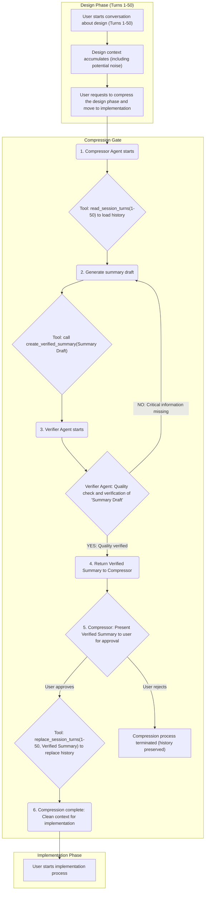

<p align="center">
  
</p>

[](http://creativecommons.org/publicdomain/zero/1.0/)

# pipe: A Clean Jailbreak from LLM Obfuscation

`pipe` is not another chat agent. It is a tool designed to give you, the developer, complete control over the conversational context. Unlike traditional clients that hide their history management in a black box, `pipe` empowers you to freely manipulate the history, extract what is essential, and achieve **true context engineering**.

This is a clean jailbreak tool from vendor obfuscation.

We employ a **minimal yet powerful** CLI-driven approach, focusing on the one thing that truly matters: ensuring the agent understands its purpose, history, and current task without ambiguity.

## Core Philosophy

### 1. Total Context Control

The prompt is reconstructed with a structured, self-describing **JSON Schema** for every call. This is inherently more token-efficient and understandable for an LLM. The entire history is transparent, saved in readable JSON session files. This ensures full **auditability** and gives the stateless LLM a persistent, and more importantly, **malleable** memory. You can retry, refine, edit, delete, and compress with surgical precision.

### 2. Uncompromising Extensibility

By default, `pipe` is based on `gemini-cli`, but this is merely an implementation detail. The core logic is decoupled. If you want to use the direct API, do it. If you want to use `claude-code`, do it. The framework is designed to be torn apart and rebuilt to your specifications.

### License: The Spirit of the Jailbreak

This project's _original code_ is released under the [CC0 1.0 Universal (CC0 1.0) Public Domain Dedication](https://creativecommons.org/publicdomain/zero/1.0/).

Customize it as you wish. Jailbreak as you desire.

**Important Note on Dependencies:**
This project utilizes various third-party libraries, each governed by its own license. While the original code of `pipe` is dedicated to the public domain under CC0, the licenses of these dependencies (e.g., MIT, Apache 2.0, BSD) still apply to their respective components.

- **Commercial Use**: Please review the licenses of all included third-party libraries to ensure compliance with your intended use, especially for commercial applications.
- **Attribution**: Some third-party licenses may require attribution. It is your responsibility to comply with all applicable license terms.

The purpose of this project is to be a **pipe to the agent**, and a **pipe to our followers** (the community).

---

## Features

- **Session-Based History:** Each conversation is a self-contained session, stored in a single, human-readable JSON file.
- **Structured JSON Prompting:** Builds a detailed, self-describing JSON object as the final prompt, providing meta-context to the model for improved clarity.
- **CLI-Driven Workflow:** A powerful command-line interface to start, continue, or compress sessions.
- **Extensible Backend:** The execution agent is decoupled. You can choose between `gemini-api` (direct API calls) and `gemini-cli` (CLI tool) via the `api_mode` setting in `setting.yml`. The architecture allows for swapping in other execution agents as well.
- **Configuration via YAML:** Configure model, context limits, and other settings in `setting.yml`.
- **Token-Aware:** Calculates token count for each prompt and warns before exceeding limits.
- **Dry Run Mode:** A `--dry-run` flag to inspect the final JSON prompt before sending it to the API.
- **Web UI for Management:** A comprehensive web interface to manage the entire lifecycle of a conversation.
- **Safe Operations:** Automatic backups are created before any edit or compression operation.
- **Language Support:** Allows specifying the language for agent responses.
- **YOLO Mode:** Automatically accept all actions (aka YOLO mode, see [https://www.youtube.com/watch?v=xvFZjo5PgG0](https://www.youtube.com/watch?v=xvFZjo5PgG0) for more details).
- **In-Session Todos:** Manage a simple todo list directly within the session's metadata.
- **Advanced Agent-driven Compression**:
  - A specialized `Compressor` agent can perform **partial compression** on any session's history.
  - Precisely control the compression by specifying a **turn range**, a **summarization policy** (what to keep), and a **target character count**.
  - Before applying the compression, a `Reviewer` agent automatically **verifies** that the summarized history maintains a natural conversational flow, preventing context loss.
  - **Note on `gemini-cli`:** To use advanced features like Compression and Forking in `gemini-cli` mode, you must first register the `pipe` tool server. See the "Integration with `gemini-cli`" section below for the required one-time setup command.
- **Turn-based Forking:** Easily fork a conversation from any specific turn. This allows you to explore alternative responses from the LLM or test different instructions without altering the original history, enabling robust validation and experimentation.

---

## Setup & Installation

### Prerequisites

- **Python 3.12 or higher**
- **Node.js 18 or higher** (for the web UI)
- **gemini-cli** installed in your PATH (optional, for CLI mode)

### Python Backend Setup

1. **Clone the repository:**

   ```bash
   git clone https://github.com/s-age/pipe.git
   cd pipe
   ```

2. **Install Python dependencies:**

   ```bash
   pip install -e .
   ```

   This installs the package in editable mode along with all dependencies listed in `pyproject.toml`.

3. **Set up environment variables:**
   Create a `.env` file in the project root (copy from `.env.default`):

   ```bash
   cp .env.default .env
   ```

   Edit `.env` to add your API keys:
   - For API mode: `GEMINI_API_KEY='YOUR_API_KEY_HERE'`
   - For CLI mode: Ensure `GOOGLE_API_KEY` is set in your environment

4. **Run the Flask web server:**

   ```bash
   flask --app pipe.web.app run --host=0.0.0.0 --port=5001
   ```

   The web UI will be available at `http://127.0.0.1:5001`.

5. **Run the MCP server (for advanced features):**

   ```bash
   python -m pipe.cli.mcp_server
   ```

   This starts the Model Context Protocol server for agent-driven compression and forking.

6. **Run the LSP server (optional, for IDE integration):**
   ```bash
   python -m src.pipe.cli.pygls_server > /dev/null 2>&1 &
   ```
   This starts the Language Server Protocol server in the background.

### TypeScript/React Frontend Setup

1. **Install Node.js dependencies:**

   ```bash
   npm install
   ```

   This installs all dependencies listed in `package.json`.

2. **Start the development server:**

   ```bash
   npm start
   ```

   The React application will start on `http://localhost:5173` (default Vite port).

3. **Build for production:**

   ```bash
   npm run build
   ```

   This compiles TypeScript and builds the production bundle.

4. **Run tests:**

   ```bash
   npm test
   ```

5. **Run linting:**
   ```bash
   npm run lint
   ```

### Using the `takt` Command

The `takt` command is the primary CLI interface for interacting with pipe sessions.

**Basic usage examples:**

- **Start a new session:**

  ```bash
  takt --purpose "Create a React component" --background "Build a user profile component" --roles "roles/engineer.md" --instruction "Create a UserProfile component with name and email fields."
  ```

- **Continue an existing session:**

  ```bash
  takt --session <SESSION_ID> --instruction "Add validation to the form."
  ```

- **Compress a session:**

  ```bash
  takt --session <SESSION_ID> --compress
  ```

- **Dry run (preview the JSON prompt):**
  ```bash
  takt --purpose "Test" --instruction "Hello" --dry-run
  ```

**Available options:**

- `--purpose`: Define the session's overall purpose
- `--background`: Provide background context
- `--roles`: Specify role files (comma-separated)
- `--instruction`: The instruction for the agent
- `--session`: Continue an existing session by ID
- `--compress`: Compress the session history
- `--dry-run`: Preview the generated prompt without executing

### Integration with `gemini-cli` (One-Time Setup)

To use advanced features like agent-driven **Compression** and session **Forking** in `gemini-cli` mode, register pipe's tool server:

```bash
gemini mcp add pipe_tools "python -m pipe.cli.mcp_server" --working-dir /path/to/pipe
```

Replace `/path/to/pipe` with the actual absolute path to this project's directory.

---

## Usage: 3 Routes to Context Engineering

The **pipe** framework offers three primary routes, optimized for different user environments and goals, all built on the same structured core.

### 1. Route 1: Python Script (Automation & CLI)

This route is ideal for **automation, scripting, and CLI-focused developers** who need reliable, repeatable execution.

| Use Case               | Description                                                                                                                   |
| :--------------------- | :---------------------------------------------------------------------------------------------------------------------------- |
| **Start New Session**  | Define the complete context (`--purpose`, `--background`, `--roles`) and first instruction.                                   |
| **Continue Session**   | Specify an existing `<SESSION_ID>` and add a new instruction. This is the primary way to give the short-lived agent "memory." |
| **Compress History**   | Use the `--compress` flag to efficiently replace long history with a summary.                                                 |
| **Debug/Cost Control** | Use the `--dry-run` flag to inspect the generated JSON prompt before the API call.                                            |

**Examples:**

```bash
# Start New Session Example
takt --purpose "Create a new React component" --background "..." --roles "roles/engineer.md" --instruction "Create a 'UserProfile' component."

takt --session <SESSION_ID> --instruction "Now, add a state for loading."
```

### 2. Route 2: Web UI (Management & Human-in-the-Loop)

This is best for users seeking **intuitive visual management** and **direct manipulation of history** without file editing.

| Use Case              | Description                                                                                                                                                    |
| :-------------------- | :------------------------------------------------------------------------------------------------------------------------------------------------------------- |
| **View/Edit History** | Browse detailed session histories; surgically edit specific turns or session metadata (purpose/background).                                                    |
| **Fork from Turn**    | Easily **fork** a conversation from any specific turn to test alternative instructions or validate different LLM responses without altering the original flow. |
| **Enable Editing**    | Activate `expert_mode` in `setting.yml` to enable editing and deleting session turns directly from the Web UI.                                                 |
| **Continue Sessions** | Use form inputs to send new instructions to existing sessions.                                                                                                 |
| **Management**        | Intuitively start new sessions, compress history, or delete unnecessary sessions via a graphical interface.                                                    |

**Example (Start Server):**

```bash
flask --app pipe.web.app run --host=0.0.0.0 --port=5001
```

_(Navigate to `http://127.0.0.1:5001` in your browser)_

### 3. Route 3: Execution from Agent (Orchestration)

This is for **advanced AI system builders** leveraging **pipe's** full context control capabilities for multi-agent coordination.

| Use Case                      | Description                                                                                                                                                                                         |
| :---------------------------- | :-------------------------------------------------------------------------------------------------------------------------------------------------------------------------------------------------- |
| **Role Delegation**           | A parent agent assigns the **Conductor role** to a child agent and delegates the task using the structured command format.                                                                          |
| **Small-Scale Orchestration** | **By customizing the role definition**, the Conductor role can be programmed to divide complex tasks into subtasks and recursively delegate them to different execution agents with specific roles. |
| **Clean Execution**           | The delegated task is passed as a **structured JSON prompt**, ensuring maximum efficiency for the short-lived sub-agent.                                                                            |

**Execution Example (Delegation from Parent Agent):**

> **[IMPORTANT] The following command examples are not intended to be executed directly in the user's terminal. They are used as instructions to an already launched parent agent (such as Gemini) to assign the Conductor role and delegate tasks.**

```bash
Act as @roles/conductor.md takt --session <SESSION_ID> --instruction "Now, add a state for loading."
```

### 4. Route 4: Agent-driven Workflows (Compression & Verification)

The `pipe` framework supports agent-driven meta-tasks like history management. The `Compressor` and `Reviewer` agents work in tandem to ensure both efficiency and quality.

| Step            | Agent        | Use Case                 | Description                                                                                                                                              |
| :-------------- | :----------- | :----------------------- | :------------------------------------------------------------------------------------------------------------------------------------------------------- |
| **1. Initiate** | `Compressor` | Surgical Compression     | Start a new session and assign the `roles/compressor.md` role. Instruct this agent to compress parts of _any other session_.                             |
| **2. Specify**  | `Compressor` | Controlled Summarization | Guide the agent by providing the target `SESSION_ID`, a `START` and `END` turn, a `policy` (what to keep), and a `target length`.                        |
| **3. Verify**   | `Reviewer`   | Quality Assurance        | Before applying the summary, the `Reviewer` agent is automatically invoked to check if the compressed history flows naturally and preserves key context. |
| **4. Apply**    | `Compressor` | Finalize Compression     | Once the verification is passed, the agent replaces the specified turn range with the generated summary.                                                 |

> **[NOTE]** The compression workflow is available only when `api_mode` is set to `gemini-api`. It is not supported in `gemini-cli` mode as it requires an MCP server.

**Example (Starting a Compression Session):**

```bash
# Start a new session to manage other sessions
takt --purpose "Compress a long-running session" --role "roles/compressor.md" --instruction "I want to compress session <TARGET_SESSION_ID>."
```

The agent will then interactively guide you through the specification and verification process to perform the compression safely.

### Compression & Verification Workflow



### 5. Route 5: Multi-Agent Simulation (e.g., Self-Play)

The true power of `pipe` is revealed in its ability to facilitate complex multi-agent simulations using nothing more than natural language. By defining roles and procedures in simple Markdown files, you can orchestrate sophisticated interactions between agents.

A compelling demonstration of this is achieving a Reversi game where Gemini plays against itself. This entire simulation is orchestrated by giving a single command to a parent agent.

| Use Case                         | Description                                                                                                                                                    |
| :------------------------------- | :------------------------------------------------------------------------------------------------------------------------------------------------------------- |
| **Self-Play Simulation**         | Instruct an agent to adopt a role and execute a procedure. For example, tell Gemini to act as a Reversi player and follow the game's rules.                    |
| **Natural Language Programming** | The agents' behaviors are not hard-coded. They are guided entirely by the `@roles` and `@procedures` files you provide, making the system incredibly flexible. |

**Execution Example (Orchestrating a Self-Play Game):**

> **[IMPORTANT]** The following command is an instruction given to a parent AI agent (like Gemini), not meant for direct terminal execution.

```
Act as @roles/games/reversi_player.md and execute @procedures/reversi_game.md
```

This single line of instruction causes the agent to initiate a game of Reversi, playing against itself by following the rules and persona defined in the Markdown files. This showcases the framework's capability for complex task delegation and agent-based automation, all orchestrated through simple, human-readable text.

---

## Dry Run Output Example

When running `takt` with the `--dry-run` flag, the generated JSON prompt is displayed. This JSON object represents the structured input that would be sent to the AI sub-agent. It can be useful for understanding how `pipe` constructs its prompts or for direct experimentation with AI models.

Here's an example of a generated prompt:

Note that the JSON presented here is pretty-printed for readability; the actual output from `takt --dry-run` is a single-line JSON string.

````json
{
  "description": "This structured prompt guides your response. First, understand the core instructions: `main_instruction` defines your thinking process. Next, identify the immediate objective from `current_task` and `todos`. Then, gather all context required to execute the task by processing `session_goal`, `roles`, `constraints`, `conversation_history`, and `file_references` in that order. Finally, execute the `current_task` by synthesizing all gathered information.",
  "main_instruction": "Your main instruction is to be helpful and follow all previous instructions.",
  "reasoning_process": {
    "description": "Think step-by-step to achieve the goal."
  },
  "current_task": {
    "type": "model_response",
    "instruction": null,
    "response": null,
    "name": null,
    "content": "Setup is complete. Awaiting the next command.\n",
    "original_turns_range": null,
    "timestamp": "2025-10-26T20:36:04.540328+09:00"
  },
  "todos": [
    {
      "title": "test1",
      "description": "",
      "checked": false
    },
    {
      "title": "test2",
      "description": "",
      "checked": false
    }
  ],
  "current_datetime": "2025-10-26T20:36:51.067644+09:00",
  "session_goal": {
    "description": "This section outlines the goal of the current session.",
    "purpose": "Generate dry-run output for README",
    "background": "To demonstrate the prompt structure in the project's main README file."
  },
  "roles": {
    "description": "The following are the roles for this session.",
    "definitions": [
      "**Role: Conductor**\n\n**Responsibilities:**\n\nThe primary responsibility of any agent assigned the Conductor role is to **EXCLUSIVELY** delegate tasks to sub-agents via `takt`. The Conductor **MUST NEVER** perform any processing directly. Instead, the Conductor constructs and executes appropriate `takt` commands based on the provided instructions and session context. If a specific role is not provided, the Conductor should call `takt` without the `--roles` argument, allowing `takt` to handle default role assignment or execution without a specific role. All work must be delegated.\n\n**`takt` Usage:**\n\n`takt` provides the following key functionalities:\n\n1.  **Starting a New Session:**\n    *   `--purpose`: Defines the overall purpose of the session.\n    *   `--background`: Provides background context for the session.\n    *   `--roles`: Specifies role files to assign to sub-agents (comma-separated).\n    *   `--instruction`: The first specific instruction for the sub-agent.\n    *   Example: `takt --purpose \"Create a new React component\" --background \"Display user profile\" --roles \"roles/engineer.md\" --instruction \"Create a UserProfile component.\"`\n\n2.  **Continuing a Session:**\n    *   `--session <SESSION_ID>`: Specifies the ID of the session to continue.\n    *   `--instruction`: A new specific instruction for the sub-agent.\n    *   Example: `takt --session <SESSION_ID> --instruction \"Add state management.\"`\n\n3.  **Compressing a Session:**\n    *   `--session <SESSION_ID>`: Specifies the ID of the session to compress.\n    *   `--compress`: Summarizes the session history to reduce token count.\n    *   Example: `takt --session <SESSION_ID> --compress`\n\n4.  **Dry Run Mode:**\n    *   `--dry-run`: Reviews the generated JSON prompt without actual execution.\n    *   Example: `takt --purpose \"Test Prompt\" --instruction \"My instruction\" --dry-run`\n\n**Key Principles:**\n\n*   **STRICT RULE: No Self-Processing:** The Conductor **MUST NEVER** execute any task directly. All processing **MUST BE** delegated to sub-agents exclusively via `takt`. This is a foundational principle of the `pipe` architecture.\n*   **Role Handling:** If a specific sub-agent role is provided (e.g., via `@<role_name>` or `--roles`), the Conductor MUST use it. If no specific role is provided, the Conductor MUST call `takt` without the `--roles` argument, allowing `takt` to determine the appropriate handling (e.g., default role, no specific role).\n*   **Session Continuation:** Unless explicitly instructed otherwise, the Conductor will continue the current session and add new instructions to the existing session. New sessions are only initiated when clearly directed.\n*   **Transparency:** Clearly communicate the execution results of `takt` (including responses from sub-agents) to the user.\n\n---\n\n## Conductor Workflow Flowchart\n\n```mermaid\ngraph TD\n    A[\"Start: Appointed to Conductor Role\"] --> B{\"Is Session ID specified?\"};\n\n    B -- \"Yes\" --> C[\"Execute takt with Session ID and Instruction\"];\n    B -- \"No\" --> D[\"Enter Session ID to continue session, or parameters (--purpose, --background, --instruction, [Optional: --roles]) for a new session\"];\n\n    D --> E{\"Is input a Session ID?\"};\n\n    E -- \"Yes\" --> G{\"Is Session ID valid?\"};\n    E -- \"No\" --> F{\"Is it an instruction to start a new session?\"};\n\n    G -- \"Yes\" --> C;\n    G -- \"No\" --> I[\"Response: Session ID is invalid. Please enter Session ID again\"];\n    I --> D;\n\n    F -- \"Yes\" --> J{\"Are parameters (--purpose, --background, --instruction) clear?\"};\n    F -- \"No\" --> K[\"Response: Please enter Session ID or parameters for a new session\"];\n    K --> D;\n\n    J -- \"Yes\" --> C;\n    J -- \"No\" --> D;\n\n    C --> L{\"What is the next instruction?\"};\n    L -- \"Continue current session\" --> C;\n    L -- \"Another Session ID or New Session\" --> B;\n    L -- \"End\" --> M[\"End\"];\n```"
    ]
  },
  "constraints": {
    "description": "Constraints for the model.",
    "language": "japanese",
    "processing_config": {
      "description": "Configuration for processing.",
      "multi_step_reasoning_active": true
    },
    "hyperparameters": {
      "description": "Hyperparameter settings for the model.",
      "temperature": {
        "type": "number",
        "value": 0.2,
        "description": "Be precise and factual. A lower value is preferred for deterministic output."
      },
      "top_p": {
        "type": "number",
        "value": 0.5,
        "description": "Consider a broad range of possibilities, but adhere strictly to the temperature setting."
      },
      "top_k": {
        "type": "number",
        "value": 5.0,
        "description": "Limit the generation to the top 5 most likely tokens at each step."
      }
    }
  },
  "conversation_history": {
    "description": "Historical record of past interactions in this session, in chronological order.",
    "turns": [
      {
        "type": "user_task",
        "instruction": "This is the initial instruction to set up the session.",
        "timestamp": "2025-10-26T20:35:58.210075+09:00"
      }
    ]
  },
  "file_references": [
    {
      "path": "foo.txt",
      "content": "bar"
    }
  ]
}
````
