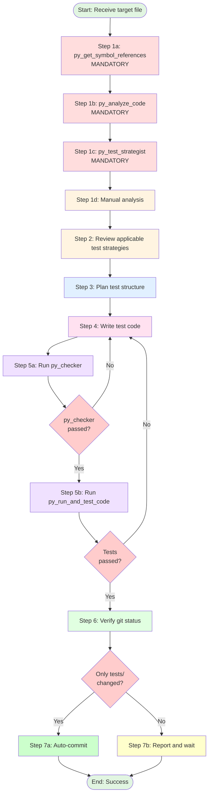

# Procedure: Comprehensive pytest Test Implementation

## Purpose
This procedure defines the exact steps an agent must follow when implementing unit tests for a single Python source file.

## Applicability
Used by any agent tasked with writing tests. Invoked via detailed instruction from Test Conductor.

---

## Workflow Diagram



---

## Step-by-Step Execution

### Step 1: Read and Analyze Target File

**CRITICAL**: The following tool executions are **MANDATORY** and must be performed in order. Do NOT skip any tool.

#### Step 1a: Understand Impact Scope (Mandatory)
```python
py_get_symbol_references(file_path="{target_file_path}")
```
This tool reveals:
- How many files depend on this code
- Which symbols are actively used
- The impact radius of potential bugs

**Purpose**: Determine test priority and coverage density based on usage.

#### Step 1b: Extract Specifications and Docstrings (Mandatory)
```python
py_analyze_code(file_path="{target_file_path}")
```
This tool provides:
- Docstrings for all classes, methods, and functions
- Expected behavior descriptions
- Parameter details and return values
- Usage examples from documentation

**Purpose**: Build test cases from **specifications** (what it should do), not implementation details (how it does it).

#### Step 1c: Determine Test Strategy (Mandatory)
```python
py_test_strategist(file_path="{target_file_path}")
```
This tool analyzes:
- Complexity metrics (cyclomatic complexity, nesting depth)
- Required mocking patterns
- Suggested test structure
- Risk areas requiring extra coverage

**Purpose**: Know **how to test** (mocking strategy, complexity handling) before writing any code.

#### Step 1d: Manual Analysis
After running the three mandatory tools, manually identify:
- Public interface (classes, methods, functions)
- Dependencies (imports, external calls)
- Data flow (inputs, outputs, state changes)
- Edge cases (empty inputs, boundary values, None)
- Error conditions (exceptions, validation failures)

**Output**: Complete test specification including:
- Impact scope (from `py_get_symbol_references`)
- Behavioral specifications (from `py_analyze_code`)
- Technical test strategy (from `py_test_strategist`)
- Manual analysis notes

**Rationale**: This "golden routine" ensures tests are:
1. **Prioritized by importance** (symbol references)
2. **Aligned with specifications** (docstrings, not implementation)
3. **Technically sound** (proper mocking and complexity handling)

Skipping these tools is equivalent to climbing a mountain without a map—it invites coverage gaps and wasted effort.

---

### Step 2: Review Applicable Test Strategies

**Actions**:
1. Reference: `@roles/python/tests/tests.md` (main strategy)
2. Reference: `@roles/python/tests/core/{layer}.md` (layer-specific strategy)
3. Understand:
   - Layer-specific requirements
   - Mock vs real I/O rules
   - Coverage targets
   - Required test patterns

**Output**: Clear understanding of testing approach

---

### Step 3: Plan Test Structure

**Actions**:
1. Group tests by functionality (e.g., TestSaveMethod, TestDeleteMethod)
2. Plan necessary fixtures (e.g., repository with tmp_path, mock settings)
3. Identify required factories (SessionFactory, TurnFactory, etc.)
4. List test cases:
   - Normal cases
   - Edge cases
   - Error cases
   - Concurrency (if applicable)

**Output**: Test plan outline

---

### Step 4: Write Test Code

**Actions**:
1. Create file: `{test_output_path}`
2. Write imports
3. Write fixtures using pytest decorators
4. Write test classes (grouped by functionality)
5. Write test methods with:
   - English docstrings
   - Factory usage for test data
   - Pydantic V2 patterns (model_dump, model_validate, model_copy)
   - Clear assertions
   - Edge case coverage

**Layer-Specific Requirements**:
- **Repositories**: Use `tmp_path` for real file I/O
- **Services**: Mock repository layer
- **Models**: Test validation and serialization
- **Collections**: Test immutability
- **Domains**: Verify no mutation of original data
- **Tools**: Mock external dependencies, test security

**Output**: Complete test file

---

### Step 5: Execute Quality Checks

Run checks **in sequence** using the provided tools. If any fail, return to **Step 4** and fix.

**CRITICAL**: Both py_checker and py_run_and_test_code MUST pass. Tests that fail linting or execution have NO VALUE and must not be committed.

#### Step 5a: Run py_checker (Linting and Type Checking)
```python
py_checker()
```
This tool runs:
1. ruff check --fix (entire project)
2. ruff format (entire project)
3. mypy (entire project)

- **Pass**: Continue to Step 5b
- **Fail**: Fix linting/type errors, return to Step 4

#### Step 5b: Run py_run_and_test_code (Test Execution)
```python
py_run_and_test_code()
```
This runs all tests in the project using pytest.

- **Pass**: Continue to Step 6
- **Fail**: Fix test logic, return to Step 4

**Output**: All quality checks passed

---

### Step 6: Verify Git Status

**Actions**:
1. Run:
   ```bash
   git status --short
   ```
2. Check modified files
3. Confirm only files under `tests/` are modified

**Output**: List of changed files

---

### Step 7: Final Action

#### Step 7a: If Only tests/ Changed (Auto-Commit)

**Condition**: All modified files are under `tests/` directory

**Actions**:
```bash
git add tests/
git commit -m "test: add tests for {filename}"
```

**Output**: Committed changes

#### Step 7b: If Production Code Changed (Report and Wait)

**Condition**: Any modified files outside `tests/` directory

**Actions**:
1. Report modified files to user:
   ```
   ⚠️  WARNING: Production code changes detected

   Modified files outside tests/:
   - {file1}
   - {file2}

   Please review changes and confirm before committing.
   ```
2. Wait for user confirmation
3. Do NOT auto-commit

**Output**: User notified, awaiting confirmation

---

## Constraints (Must Not)

### Prohibited Pydantic Patterns
- ❌ `session.dict()` (use `session.model_dump()`)
- ❌ `Session.parse_obj(data)` (use `Session.model_validate(data)`)
- ❌ `session.copy()` (use `session.model_copy()`)

### Prohibited Test Practices
- ❌ Real file I/O (except Repository layer with `tmp_path`)
- ❌ Real external API requests (use mocks)
- ❌ Hardcoded file paths (use `tmp_path`, `tempfile`)
- ❌ Test dependencies (tests must be independent)
- ❌ Skipping quality checks
- ❌ Committing with failing tests
- ❌ Modifying production code without user approval

### Prohibited Shortcuts
- ❌ Skipping mandatory tool executions in Step 1 (py_get_symbol_references, py_analyze_code, py_test_strategist)
- ❌ Proceeding to next step if current step fails
- ❌ Batching quality checks (run sequentially)
- ❌ Assuming tests pass without running them
- ❌ Writing tests based solely on implementation details instead of specifications

---

## References

- **Test Strategies**: `roles/python/tests/core/*.md`
- **Factories**: `tests/factories/models/`
- **Main Strategy**: `roles/python/tests/tests.md`

---

## Example Execution

```
Input:
  target_file: src/pipe/core/repositories/archive_repository.py
  test_output: tests/unit/core/repositories/test_archive_repository.py
  layer: repositories

Execution:
  Step 1a: py_get_symbol_references(src/pipe/core/repositories/archive_repository.py)
           → Found 5 references in service layer (high priority)
  Step 1b: py_analyze_code(src/pipe/core/repositories/archive_repository.py)
           → Extracted docstrings for save(), restore(), delete()
           → Identified spec: "save() must create parent dirs", "delete() must handle missing files"
  Step 1c: py_test_strategist(src/pipe/core/repositories/archive_repository.py)
           → Complexity: Medium (cyclomatic=8)
           → Strategy: Use tmp_path for real file I/O, mock Path.exists for error cases
  Step 1d: Manual analysis
           → Identify edge cases: empty archives, corrupted files, permission errors
  Step 2: Review roles/python/tests/core/repositories.md (use tmp_path, test CRUD)
  Step 3: Plan TestArchiveRepositorySave, TestArchiveRepositoryRestore, etc.
  Step 4: Write test file with fixtures, test classes, methods
  Step 5a: py_checker() → PASS (ruff check, ruff format, mypy on entire project)
  Step 5b: py_run_and_test_code() → PASS (pytest on entire project)
  Step 6: git status --short → M tests/unit/core/repositories/test_archive_repository.py
  Step 7a: git commit -m "test: add tests for archive_repository"

Output: Success, test committed
```

---

## Notes

- **Mandatory tool execution**: Step 1a-1c tools are NON-NEGOTIABLE. They form the "golden routine" that prevents coverage gaps and wasted effort
- **Specification-driven testing**: Use `py_analyze_code` output (docstrings) to design tests, not implementation details
- **Sequential execution**: Complete each step before proceeding
- **Error handling**: Always return to Step 4 on any failure
- **No skipping**: Quality checks must all pass before commit
- **User approval**: Required for any production code changes
