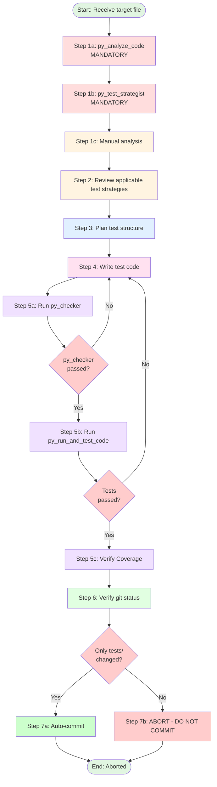

# Procedure: Comprehensive pytest Test Implementation

## Purpose
This procedure defines the exact steps an agent must follow when implementing unit tests for a single Python source file.

## Applicability
Used by any agent tasked with writing tests. Invoked via detailed instruction from Test Conductor.

---

## Workflow Diagram



---

## Step-by-Step Execution

### Step 1: Read and Analyze Target File

**Context Check (Token Efficiency)**:
If the target file content is already provided in `current_task` or `file_references`:
- **[CONDITIONAL SKIP]** `read_file` - Use provided content directly
- **[CONDITIONAL SKIP]** `py_analyze_code` - Analyze from provided content
- **Purpose**: Avoid duplicate file reads that waste input tokens

**Otherwise (Mandatory Tool Execution)**:
The following tool executions are **MANDATORY** and must be performed in order:

#### Step 1a: Extract Specifications and Docstrings (Mandatory)
```python
py_analyze_code(file_path="{target_file_path}")
```
This tool provides:
- Docstrings for all classes, methods, and functions
- Expected behavior descriptions
- Parameter details and return values
- Usage examples from documentation

**Purpose**: Build test cases from **specifications** (what it should do), not implementation details (how it does it).

#### Step 1b: Determine Test Strategy (Mandatory)
```python
py_test_strategist(file_path="{target_file_path}")
```
This tool analyzes:
- Complexity metrics (cyclomatic complexity, nesting depth)
- Required mocking patterns
- Suggested test structure
- Risk areas requiring extra coverage

**Purpose**: Know **how to test** (mocking strategy, complexity handling) before writing any code.

#### Step 1c: Manual Analysis
After obtaining file content (either from context or mandatory tools), manually identify:
- Public interface (classes, methods, functions)
- Dependencies (imports, external calls)
- Data flow (inputs, outputs, state changes)
- Edge cases (empty inputs, boundary values, None)
- Error conditions (exceptions, validation failures)

**Output**: Complete test specification including:
- Behavioral specifications (from `py_analyze_code` or provided context)
- Technical test strategy (from `py_test_strategist` or analysis)
- Manual analysis notes

**Rationale**: This "golden routine" ensures tests are:
1. **Aligned with specifications** (docstrings, not implementation)
2. **Technically sound** (proper mocking and complexity handling)
3. **Token efficient** (skip redundant reads when context already provided)

Skipping these steps is equivalent to climbing a mountain without a map—it invites coverage gaps and wasted effort.

---

### Step 2: Review Applicable Test Strategies

**Actions**:
1. Reference: `@roles/python/tests/tests.md` (main strategy)
2. Reference: `@roles/python/tests/core/{layer}.md` (layer-specific strategy)
3. Understand:
   - Layer-specific requirements
   - Mock vs real I/O rules
   - Coverage targets
   - Required test patterns

**Output**: Clear understanding of testing approach

---

### Step 3: Plan Test Structure

**Actions**:
1. Group tests by functionality (e.g., TestSaveMethod, TestDeleteMethod)
2. Plan necessary fixtures (e.g., repository with tmp_path, mock settings)
3. Identify required factories (SessionFactory, TurnFactory, etc.)
4. List test cases:
   - Normal cases
   - Edge cases
   - Error cases
   - Concurrency (if applicable)

**Output**: Test plan outline

---

### Step 4: Write Test Code

**Actions**:
1. Create file: `{test_output_path}`
2. Write imports
3. Write fixtures using pytest decorators
4. Write test classes (grouped by functionality)
5. Write test methods with:
   - English docstrings
   - Factory usage for test data
   - Pydantic V2 patterns (model_dump, model_validate, model_copy)
   - Clear assertions
   - Edge case coverage

**Layer-Specific Requirements**:
- **Repositories**: Use `tmp_path` for real file I/O
- **Services**: Mock repository layer
- **Models**: Test validation and serialization
- **Collections**: Test immutability
- **Domains**: Verify no mutation of original data
- **Tools**: Mock external dependencies, test security

**Output**: Complete test file

---

### Step 5: Execute Quality Checks

Run checks **in sequence** using the provided tools. If any fail, return to **Step 4** and fix.

**CRITICAL**: Both py_checker and py_run_and_test_code MUST pass. Tests that fail linting or execution have NO VALUE and must not be committed.

#### Step 5a: Run py_checker (Integrated Format + Validation)
```python
py_checker()
```

**CRITICAL - Integrated Pre-Formatting**:
This tool now automatically performs **silent pre-formatting** before validation:

**STEP 0 (Silent - Output Suppressed)**:
1. `isort .` (entire project - import sorting)
2. `black .` (entire project - code formatting)

**STEP 1-4 (Reported)**:
1. `ruff check --fix` (entire project)
2. `ruff format` (entire project)
3. `black` (entire project - validation pass)
4. `mypy` (entire project)

**Why Pre-Formatting is Silent**:
- **Token efficiency**: Formatting output is discarded to save ~5,000-10,000 tokens
- **State synchronization**: Files are formatted BEFORE validation checks
- **Error prevention**: Eliminates "stale state" issues caused by formatters

**CRITICAL - State Synchronization**:
After `py_checker` completes:
- All files have been **formatted and validated** in a single atomic operation
- Your in-memory "last known state" is now **STALE** (files were auto-formatted)
- **[MANDATORY]** Execute `read_file` on `{test_output_path}` BEFORE any error fixes
- **[PROHIBITED]** Do NOT use `replace` tool based on your memory of what you wrote

**Error Recovery Protocol**:
If `py_checker` reports linting/type errors that require fixes:
1. **[MANDATORY]** Execute `read_file` on `{test_output_path}` FIRST
2. **[PROHIBITED]** Do NOT use `replace` tool based on your memory of what you wrote
3. **[REQUIRED]** Use the fresh file content from `read_file` as the source for `replace`
4. **Rationale**: Prevents "string not found" errors caused by formatter modifications

**Example Trap (Common Failure Pattern)**:
```
# You wrote:
def test_example():
    x=1  # Bad formatting

# py_checker silently pre-formats to:
def test_example():
    x = 1  # Good formatting

# Then validation reports an error (e.g., unused variable)

# If you try to replace "x=1" without reading first → TOOL FAILURE
```

**Decision Tree**:
- **Pass**: Continue to Step 5b
- **Fail**: Execute `read_file` → Fix errors using fresh content → Re-run `py_checker`

#### Step 5b: Run py_run_and_test_code (Test Execution)
```python
py_run_and_test_code()
```
This runs all tests in the project using pytest.

- **Pass**: Continue to Step 5c
- **Fail**: Fix test logic, return to Step 4

#### Step 5c: Verify Coverage (Mandatory)
**CRITICAL**: Always use grep to filter output to avoid context window overflow.

```bash
poetry run pytest --cov=src --cov-report=term-missing tests/{test_path} | grep {source_file_name}
```

**Correct Usage**:
- ✅ `--cov=src` (module root path, NOT file path)
- ✅ `tests/{test_path}` (run only the specific test file)
- ✅ `grep {source_file_name}` (filter by SOURCE file name, NOT test file name)

**Incorrect Usage Examples**:
- ❌ `--cov=src/pipe/core/utils/path.py` (file path - causes "module not imported" error)
- ❌ `grep test_path.py` (test file name - shows nothing)
- ❌ No grep filter (context window overflow with full project output)

**Example**:
```bash
# For source file: src/pipe/core/utils/path.py
# Test file: tests/unit/core/utils/test_path.py
poetry run pytest --cov=src --cov-report=term-missing tests/unit/core/utils/test_path.py | grep path.py
```

**Purpose**:
- Verify test coverage for the specific file being tested
- Avoid overwhelming context window with full project coverage output
- Full project coverage output consumes excessive tokens and provides unnecessary information

**Actions**:
1. Run coverage with `--cov=src` (module root)
2. Execute only the specific test file
3. Filter output with grep for the source file name
4. Verify coverage meets project standards
5. If coverage is insufficient, return to Step 4 and add missing test cases

**Output**: Coverage verification passed

---

### Step 6: Verify Git Status

**CRITICAL**: This step detects unauthorized file modifications and triggers immediate abort if violated.

**Actions**:
1. Run **ONLY**:
   ```bash
   git status --short
   ```
2. Analyze ALL modified files in the output
3. Verify that ONLY the following files are modified:
   - The test file you are writing: `{test_output_path}`
   - NO other files should appear in git status

**Expected Output**:
```
M  tests/unit/core/utils/test_path.py
```

**Forbidden Scenarios**:
- ❌ ANY files outside `tests/` directory are modified
- ❌ ANY test files you did NOT create/modify appear in git status
- ❌ ANY production code files appear in git status
- ❌ ANY configuration files (pyproject.toml, .gitignore, etc.) appear in git status

**Token Efficiency Rule**:
- **[PROHIBITED]** `git diff` - Wastes tokens showing content you just wrote with `write_file`
- **[PROHIBITED]** `git diff HEAD` - Duplicates entire file content in context
- **[REQUIRED]** `git status --short` ONLY - Minimal output, sufficient verification
- **Rationale**: Trust your own `write_file` output. You don't need to re-read what you just wrote.

**Output**: List of changed files for Step 7 validation

---

### Step 7: Final Action

**Decision Tree**:
1. Check if ONLY `{test_output_path}` is modified → Proceed to Step 7a
2. Check if ANY other files are modified → Proceed to Step 7b (ABORT)

#### Step 7a: If Only Target Test File Changed (Auto-Commit)

**Condition**: ONLY the test file you are writing (`{test_output_path}`) is modified

**Validation**:
```bash
# Expected git status output:
M  {test_output_path}
# OR for new files:
A  {test_output_path}
```

**Actions**:
```bash
git add {test_output_path}
git commit -m "test: add tests for {filename}"
```

**Output**: Committed changes

#### Step 7b: If ANY Other Files Changed (ABORT - DO NOT COMMIT)

**Condition**: ANY of the following are true:
1. Files outside `tests/` directory are modified
2. Test files OTHER than `{test_output_path}` are modified
3. Configuration files are modified
4. ANY files you did not intentionally create/modify appear in git diff

**CRITICAL**: This is a **FATAL ERROR**. Tests must ONLY modify the single test file being written.

**Actions**:
1. Report ALL modified files and abort immediately:
   ```
   🚨 FATAL ERROR: Unauthorized file modifications detected

   Expected ONLY this file to be modified:
   - {test_output_path}

   But git diff shows these files were also changed:
   - {unrelated_file1}
   - {unrelated_file2}

   ABORT: Tests must ONLY modify the target test file.
   Unrelated file changes indicate:
   - Accidental code modification
   - Tool side effects
   - Import errors modifying __pycache__
   - Configuration file corruption

   DO NOT COMMIT. DO NOT PROCEED. ABORT IMMEDIATELY.
   ```
2. **DO NOT commit under ANY circumstances**
3. **DO NOT wait for user confirmation**
4. **DO NOT attempt to fix or rollback**
5. **ABORT the procedure immediately**
6. **Report to user for investigation**

**Output**: Procedure aborted, no commit made, error reported

---

## Constraints (Must Not)

### Project Environment
- **Poetry Environment**: This project uses Poetry for dependency management
- ❌ **ABSOLUTE PROHIBITION**: Adding ANY new dependencies to pyproject.toml
- ❌ **ABSOLUTE PROHIBITION**: Installing ANY new libraries via poetry add or pip install
- ✅ **REQUIRED**: Use ONLY existing dependencies already defined in pyproject.toml
- **Rationale**: Test implementation must work within the existing dependency constraints

### Prohibited Pydantic Patterns
- ❌ `session.dict()` (use `session.model_dump()`)
- ❌ `Session.parse_obj(data)` (use `Session.model_validate(data)`)
- ❌ `session.copy()` (use `session.model_copy()`)

### Prohibited Test Practices
- ❌ Real file I/O (except Repository layer with `tmp_path`)
- ❌ Real external API requests (use mocks)
- ❌ Hardcoded file paths (use `tmp_path`, `tempfile`)
- ❌ Test dependencies (tests must be independent)
- ❌ Skipping quality checks
- ❌ Committing with failing tests
- ❌ **ABSOLUTE PROHIBITION**: Modifying ANY files outside `tests/` directory
- ❌ **ABSOLUTE PROHIBITION**: Modifying ANY test files other than `{test_output_path}`
- ❌ **ABSOLUTE PROHIBITION**: Committing if git diff shows ANY unintended file changes
- ❌ **ABSOLUTE PROHIBITION**: Using `--cov={file_path}` (must use `--cov=src`)
- ❌ **ABSOLUTE PROHIBITION**: Running coverage without grep filter (causes context overflow)

### Prohibited Shortcuts
- ❌ Skipping mandatory tool executions in Step 1 (py_analyze_code, py_test_strategist) when context is NOT provided
- ❌ Proceeding to next step if current step fails
- ❌ Batching quality checks (run sequentially)
- ❌ Assuming tests pass without running them
- ❌ Writing tests based solely on implementation details instead of specifications

### Prohibited Token-Wasting Actions
- ❌ **[CRITICAL]** Running `read_file` when file content is already in `current_task` or `file_references` (Step 1 only)
- ❌ **[CRITICAL]** Running `git diff` or `git diff HEAD` in Step 6 (use `git status --short` ONLY)
- ❌ **[CRITICAL]** Re-reading content you just wrote with `write_file` (except Step 5a error recovery)
- ❌ Executing redundant verification commands that duplicate information already in context
- ❌ **[CRITICAL]** Using `replace` tool based on stale memory after `py_checker` runs (must `read_file` first)

---

## References

- **Test Strategies**: `roles/python/tests/core/*.md`
- **Factories**: `tests/factories/models/`
- **Main Strategy**: `roles/python/tests/tests.md`

---

## Example Execution

```
Input:
  target_file: src/pipe/core/repositories/archive_repository.py
  test_output: tests/unit/core/repositories/test_archive_repository.py
  layer: repositories

Execution:
  Step 1a: py_analyze_code(src/pipe/core/repositories/archive_repository.py)
           → Extracted docstrings for save(), restore(), delete()
           → Identified spec: "save() must create parent dirs", "delete() must handle missing files"
  Step 1b: py_test_strategist(src/pipe/core/repositories/archive_repository.py)
           → Complexity: Medium (cyclomatic=8)
           → Strategy: Use tmp_path for real file I/O, mock Path.exists for error cases
  Step 1c: Manual analysis
           → Identify edge cases: empty archives, corrupted files, permission errors
  Step 2: Review roles/python/tests/core/repositories.md (use tmp_path, test CRUD)
  Step 3: Plan TestArchiveRepositorySave, TestArchiveRepositoryRestore, etc.
  Step 4: Write test file with fixtures, test classes, methods
  Step 5a: py_checker() → PASS (ruff check, ruff format, mypy on entire project)
  Step 5b: py_run_and_test_code() → PASS (pytest on entire project)
  Step 5c: poetry run pytest --cov=src --cov-report=term-missing tests/unit/core/repositories/test_archive_repository.py | grep archive_repository.py
           → Coverage: 95% (acceptable)
  Step 6: git status --short → M tests/unit/core/repositories/test_archive_repository.py
           → Verification: ONLY the target test file is modified ✓
  Step 7a: git add tests/unit/core/repositories/test_archive_repository.py
           git commit -m "test: add tests for archive_repository"

Output: Success, test committed
```

---

## Notes

- **Mandatory tool execution**: Step 1a-1b tools are NON-NEGOTIABLE unless context is pre-provided. They form the "golden routine" that prevents coverage gaps and wasted effort
- **Token efficiency**: Check for pre-provided context BEFORE executing tools. Skip redundant reads.
- **Specification-driven testing**: Use `py_analyze_code` output (docstrings) to design tests, not implementation details
- **Sequential execution**: Complete each step before proceeding
- **Error handling**: Always return to Step 4 on any failure
- **No skipping**: Quality checks must all pass before commit
- **Verification efficiency**: Use `git status --short` ONLY in Step 6. Never use `git diff` to re-read what you just wrote.
- **Formatter safeguard**: ALWAYS execute `read_file` BEFORE fixing lint errors in Step 5a. Your memory is stale after auto-formatters run.
- **ABSOLUTE PROHIBITION**: ANY changes to files outside `tests/` directory will result in immediate procedure abort with NO commit

