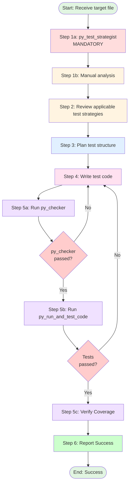

# Procedure: Comprehensive pytest Test Implementation

## Purpose
This procedure defines the exact steps an agent must follow when implementing unit tests for a single Python source file.

## Applicability
Used by any agent tasked with writing tests. Invoked via detailed instruction from Test Conductor.

---

## Workflow Diagram



---

## Step-by-Step Execution

### Step 1: Analyze Target File

**CRITICAL - File Content Source**:
- The target file content is **ALWAYS** provided in `file_references` with the latest state
- **[ABSOLUTE PROHIBITION]**: Using `read_file` on the target file
- **[REQUIRED]**: Use the content from `file_references` directly
- **Rationale**: Prevents redundant file reads and ensures you work with the most current version

The following tool execution is **MANDATORY**:

#### Step 1a: Determine Test Strategy (Mandatory)
```python
py_test_strategist(file_path="{target_file_path}")
```
This tool analyzes:
- Complexity metrics (cyclomatic complexity, nesting depth)
- Required mocking patterns
- **Mock patch paths** (automatically extracts import statements and generates correct @patch paths)
- Suggested test structure
- Risk areas requiring extra coverage

**Purpose**: Know **how to test** (mocking strategy, complexity handling) before writing any code.

**CRITICAL - Mock Patch Paths**:
The tool automatically analyzes import statements and provides `mock_targets` with accurate patch paths:

```python
# Example output from py_test_strategist:
FunctionStrategy(
    function_name="process_file",
    mock_targets=[
        MockTarget(
            dependency_name="os",
            patch_path="pipe.core.utils.path.os",  # Correct namespace
            import_type="module",
            original_import="import os"
        ),
        MockTarget(
            dependency_name="join",
            patch_path="pipe.core.utils.path.join",  # Correct namespace
            import_type="from_import",
            original_import="from os.path import join"
        )
    ]
)
```

**Usage in Tests**:
- **[REQUIRED]** Use the `patch_path` field directly in @patch decorators
- **[PROHIBITED]** Guessing or inferring patch paths manually
- **[PROHIBITED]** Using global module paths (e.g., "os.path.join" instead of "pipe.core.utils.path.join")

**Example**:
```python
# CORRECT - Using mock_targets from py_test_strategist
@patch("pipe.core.utils.path.join")  # ← From mock_targets[0].patch_path
def test_process_file(mock_join):
    ...

# INCORRECT - Guessing the path
@patch("os.path.join")  # ← Will fail: patches wrong namespace
def test_process_file(mock_join):
    ...
```

**Rationale**:
Mock patches must target the **namespace where the dependency is imported**, not where it's defined. The tool eliminates guesswork by analyzing import statements automatically.

#### Step 1b: Manual Analysis
**[REQUIRED]**: Use the file content from `file_references` (NOT `read_file`) to manually identify:
- Public interface (classes, methods, functions)
- Dependencies (imports, external calls)
- Data flow (inputs, outputs, state changes)
- Edge cases (empty inputs, boundary values, None)
- Error conditions (exceptions, validation failures)

**Output**: Complete test specification including:
- Behavioral specifications (from `file_references`)
- Technical test strategy (from `py_test_strategist`)
- Manual analysis notes

**Rationale**: This approach ensures tests are:
1. **Comprehensive** (based on actual code structure and docstrings)
2. **Technically sound** (proper mocking and complexity handling from `py_test_strategist`)
3. **Token efficient** (file content already in context via `file_references`)

Skipping these steps is equivalent to climbing a mountain without a map—it invites coverage gaps and wasted effort.

---

### Step 2: Review Applicable Test Strategies

**Actions**:
1. Reference: `@roles/python/tests/tests.md` (main strategy)
2. Reference: `@roles/python/tests/core/{layer}.md` (layer-specific strategy)
3. Understand:
   - Layer-specific requirements
   - Mock vs real I/O rules
   - Coverage targets
   - Required test patterns

**Output**: Clear understanding of testing approach

---

### Step 3: Plan Test Structure

**Actions**:
1. Group tests by functionality (e.g., TestSaveMethod, TestDeleteMethod)
2. Plan necessary fixtures (e.g., repository with tmp_path, mock settings)
3. Identify required factories (SessionFactory, TurnFactory, etc.)
4. List test cases:
   - Normal cases
   - Edge cases
   - Error cases
   - Concurrency (if applicable)

**Output**: Test plan outline

---

### Step 4: Write Test Code

**Actions**:
1. Create file: `{test_output_path}`
2. Write imports
3. Write fixtures using pytest decorators
4. Write test classes (grouped by functionality)
5. Write test methods with:
   - English docstrings
   - Factory usage for test data
   - Pydantic V2 patterns (model_dump, model_validate, model_copy)
   - Clear assertions
   - Edge case coverage

**CRITICAL - Using Mock Targets from py_test_strategist**:

When writing tests that require mocking, **ALWAYS use the `mock_targets` from Step 1b**:

```python
# Step 1b provided these mock_targets:
# mock_targets=[
#     MockTarget(dependency_name="os", patch_path="pipe.core.utils.path.os", ...),
#     MockTarget(dependency_name="requests", patch_path="pipe.core.services.api.requests", ...)
# ]

# CORRECT - Use patch_path from mock_targets
from unittest.mock import patch

@patch("pipe.core.utils.path.os")  # ← From mock_targets[0].patch_path
def test_process_file(mock_os):
    mock_os.path.exists.return_value = True
    ...

# INCORRECT - Guessing the path
@patch("os")  # ← Will fail: patches wrong namespace
def test_process_file(mock_os):
    ...
```

**Mocking Decision Tree**:
1. Check `mock_targets` from `py_test_strategist` output
2. For each dependency that needs mocking:
   - Find the corresponding `MockTarget` by `dependency_name`
   - Use its `patch_path` in `@patch()` decorator
   - **NEVER** guess or infer the path manually
3. If a dependency is not in `mock_targets`, verify if it actually needs mocking (it may be a test-safe dependency)

**Layer-Specific Requirements**:
- **Repositories**: Use `tmp_path` for real file I/O
- **Services**: Mock repository layer (use `mock_targets` for repository dependencies)
- **Models**: Test validation and serialization
- **Collections**: Test immutability
- **Domains**: Verify no mutation of original data
- **Tools**: Mock external dependencies using `mock_targets` (e.g., API clients, file system)

**Output**: Complete test file

---

### Step 5: Execute Quality Checks

Run checks **in sequence** using the provided tools. If any fail, return to **Step 4** and fix.

**CRITICAL**: Both py_checker and py_run_and_test_code MUST pass. Tests that fail linting or execution have NO VALUE and must not be committed.

#### Step 5a: Run py_checker (Integrated Format + Validation)
```python
py_checker()
```

**CRITICAL - Integrated Pre-Formatting**:
This tool now automatically performs **silent pre-formatting** before validation:

**STEP 0 (Silent - Output Suppressed)**:
1. `isort .` (entire project - import sorting)
2. `black .` (entire project - code formatting)

**STEP 1-4 (Reported)**:
1. `ruff check --fix` (entire project)
2. `ruff format` (entire project)
3. `black` (entire project - validation pass)
4. `mypy` (entire project)

**Why Pre-Formatting is Silent**:
- **Token efficiency**: Formatting output is discarded to save ~5,000-10,000 tokens
- **State synchronization**: Files are formatted BEFORE validation checks
- **Error prevention**: Eliminates "stale state" issues caused by formatters

**CRITICAL - State Synchronization**:
After `py_checker` completes:
- All files have been **formatted and validated** in a single atomic operation
- Your in-memory "last known state" is now **STALE** (files were auto-formatted)
- **[MANDATORY]** Execute `read_file` on `{test_output_path}` BEFORE any error fixes
- **[PROHIBITED]** Do NOT use `replace` tool based on your memory of what you wrote

**Error Recovery Protocol**:
If `py_checker` reports linting/type errors that require fixes:
1. **[MANDATORY]** Execute `read_file` on `{test_output_path}` FIRST
2. **[PROHIBITED]** Do NOT use `replace` tool based on your memory of what you wrote
3. **[REQUIRED]** Use the fresh file content from `read_file` as the source for `replace`
4. **Rationale**: Prevents "string not found" errors caused by formatter modifications

**Example Trap (Common Failure Pattern)**:
```
# You wrote:
def test_example():
    x=1  # Bad formatting

# py_checker silently pre-formats to:
def test_example():
    x = 1  # Good formatting

# Then validation reports an error (e.g., unused variable)

# If you try to replace "x=1" without reading first → TOOL FAILURE
```

**Decision Tree**:
- **Pass**: Continue to Step 5b
- **Fail**: Execute `read_file` → Fix errors using fresh content → Re-run `py_checker`

#### Step 5b: Run py_run_and_test_code (Test Execution)
```python
py_run_and_test_code()
```
This runs all tests in the project using pytest.

- **Pass**: Continue to Step 5c
- **Fail**: Fix test logic, return to Step 4

#### Step 5c: Verify Coverage (Mandatory)
**CRITICAL**: Always use grep to filter output to avoid context window overflow.

```bash
poetry run pytest --cov=src --cov-report=term-missing tests/{test_path} | grep {source_file_name}
```

**Correct Usage**:
- ✅ `--cov=src` (module root path, NOT file path)
- ✅ `tests/{test_path}` (run only the specific test file)
- ✅ `grep {source_file_name}` (filter by SOURCE file name, NOT test file name)

**Incorrect Usage Examples**:
- ❌ `--cov=src/pipe/core/utils/path.py` (file path - causes "module not imported" error)
- ❌ `grep test_path.py` (test file name - shows nothing)
- ❌ No grep filter (context window overflow with full project output)

**Example**:
```bash
# For source file: src/pipe/core/utils/path.py
# Test file: tests/unit/core/utils/test_path.py
poetry run pytest --cov=src --cov-report=term-missing tests/unit/core/utils/test_path.py | grep path.py
```

**Purpose**:
- Verify test coverage for the specific file being tested
- Avoid overwhelming context window with full project coverage output
- Full project coverage output consumes excessive tokens and provides unnecessary information

**Actions**:
1. Run coverage with `--cov=src` (module root)
2. Execute only the specific test file
3. Filter output with grep for the source file name
4. Verify coverage meets project standards
5. If coverage is insufficient, return to Step 4 and add missing test cases

**Output**: Coverage verification passed

---

### Step 6: Report Success

**Actions**:
Report successful test implementation with the following information:
- Test file path: `{test_output_path}`
- Coverage metrics
- All quality checks passed

**Output**: Success report (test conductor will handle git verification and commit)

---

## Constraints (Must Not)

### Project Environment
- **Poetry Environment**: This project uses Poetry for dependency management
- ❌ **ABSOLUTE PROHIBITION**: Adding ANY new dependencies to pyproject.toml
- ❌ **ABSOLUTE PROHIBITION**: Installing ANY new libraries via poetry add or pip install
- ✅ **REQUIRED**: Use ONLY existing dependencies already defined in pyproject.toml
- **Rationale**: Test implementation must work within the existing dependency constraints

### Prohibited Pydantic Patterns
- ❌ `session.dict()` (use `session.model_dump()`)
- ❌ `Session.parse_obj(data)` (use `Session.model_validate(data)`)
- ❌ `session.copy()` (use `session.model_copy()`)

### Prohibited Test Practices
- ❌ Real file I/O (except Repository layer with `tmp_path`)
- ❌ Real external API requests (use mocks)
- ❌ Hardcoded file paths (use `tmp_path`, `tempfile`)
- ❌ Test dependencies (tests must be independent)
- ❌ Skipping quality checks
- ❌ **ABSOLUTE PROHIBITION**: Using `--cov={file_path}` (must use `--cov=src`)
- ❌ **ABSOLUTE PROHIBITION**: Running coverage without grep filter (causes context overflow)

### Prohibited Shortcuts
- ❌ Skipping mandatory `py_test_strategist` execution in Step 1
- ❌ Proceeding to next step if current step fails
- ❌ Batching quality checks (run sequentially)
- ❌ Assuming tests pass without running them
- ❌ Writing tests without understanding the code being tested

### Prohibited Token-Wasting Actions
- ❌ **[ABSOLUTE PROHIBITION]** Running `read_file` on the target file being tested - content is ALWAYS in `file_references`
- ❌ **[CRITICAL]** Re-reading content you just wrote with `write_file` (except Step 5a error recovery)
- ❌ Executing redundant verification commands that duplicate information already in context
- ❌ **[CRITICAL]** Using `replace` tool based on stale memory after `py_checker` runs (must `read_file` first)

---

## References

- **Test Strategies**: `roles/python/tests/core/*.md`
- **Factories**: `tests/factories/models/`
- **Main Strategy**: `roles/python/tests/tests.md`

---

## Example Execution

```
Input:
  target_file: src/pipe/core/repositories/archive_repository.py
  test_output: tests/unit/core/repositories/test_archive_repository.py
  layer: repositories

Execution:
  Step 1a: py_test_strategist(src/pipe/core/repositories/archive_repository.py)
           → Complexity: Medium (cyclomatic=8)
           → Strategy: Use tmp_path for real file I/O, mock Path.exists for error cases
  Step 1b: Manual analysis (using file_references)
           → Extract docstrings for save(), restore(), delete()
           → Identify spec: "save() must create parent dirs", "delete() must handle missing files"
           → Identify edge cases: empty archives, corrupted files, permission errors
  Step 2: Review roles/python/tests/core/repositories.md (use tmp_path, test CRUD)
  Step 3: Plan TestArchiveRepositorySave, TestArchiveRepositoryRestore, etc.
  Step 4: Write test file with fixtures, test classes, methods
  Step 5a: py_checker() → PASS (ruff check, ruff format, mypy on entire project)
  Step 5b: py_run_and_test_code() → PASS (pytest on entire project)
  Step 5c: poetry run pytest --cov=src --cov-report=term-missing tests/unit/core/repositories/test_archive_repository.py | grep archive_repository.py
           → Coverage: 95% (acceptable)
  Step 6: Report success with coverage metrics

Output: Success, ready for test conductor review
```

---

## Notes

- **Mandatory tool execution**: Step 1a (`py_test_strategist`) is NON-NEGOTIABLE. It provides the mocking strategy that prevents errors
- **Token efficiency**: File content is ALWAYS provided via `file_references`. **NEVER use `read_file` on the target file**
- **Comprehensive testing**: Use the file content from `file_references` to understand what needs testing, including both specifications (docstrings) and implementation
- **Sequential execution**: Complete each step before proceeding
- **Error handling**: Always return to Step 4 on any failure
- **No skipping**: Quality checks must all pass before reporting success
- **Formatter safeguard**: ALWAYS execute `read_file` BEFORE fixing lint errors in Step 5a. Your memory is stale after auto-formatters run.
- **Responsibility**: Test implementation agents do NOT handle git operations or commits. They report success/failure to test conductor for verification and commit decision.

