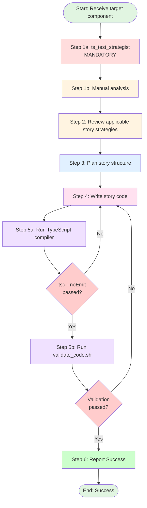

# Procedure: Storybook Story Implementation

## Purpose

This procedure defines the exact steps an agent must follow when implementing Storybook stories for a single React component file.

## Applicability

Used by any agent tasked with creating Storybook stories. Invoked via detailed instruction from Test Conductor (or direct user request).

---

## Workflow Diagram



---

## Step-by-Step Execution

### Step 1: Analyze Target Component

**CRITICAL - File Content Source**:
- The target component content is **ALWAYS** provided in `file_references` with the latest state
- **[ABSOLUTE PROHIBITION]**: Using `read_file` on the target component file
- **[REQUIRED]**: Use the content from `file_references` directly
- **Rationale**: Prevents redundant file reads and ensures you work with the most current version

The following tool execution is **MANDATORY**:

#### Step 1a: Determine Story Strategy (Mandatory)

```typescript
ts_test_strategist(file_path="{target_component_path}")
```

This tool analyzes:
- Component type (atom, molecule, organism)
- Complexity metrics (cyclomatic complexity, branch count)
- Recommended story count based on complexity
- Existing stories (if any)
- Missing coverage gaps
- Props interface and variants
- ARIA attribute requirements

**Purpose**: Know **how many stories to write** and **what to test** before writing any code.

**Example Output**:
```typescript
FunctionStrategy(
    function_name="ToggleSwitch",
    recommended_test_level=TestLevel.INTEGRATION,
    recommended_framework=TestFramework.STORYBOOK,
    complexity=3,
    is_component=true,
    recommended_story_count=4,  // Based on complexity and branches
    existing_story_count=2,     // Current coverage
    missing_coverage=[
        MissingCoverage(
            type="insufficient_story_coverage",
            details="ToggleSwitch has 2 stories but 4 are recommended"
        )
    ]
)
```

**Usage in Story Creation**:
- **[REQUIRED]** Use `recommended_story_count` to determine how many stories to write
- **[REQUIRED]** Check `existing_story_count` to understand current coverage
- **[REQUIRED]** Address all items in `missing_coverage`
- **[PROHIBITED]** Guessing the number of stories needed

**Rationale**: The tool calculates recommended story count based on:
- Cyclomatic complexity (more complex = more stories)
- Branch count (conditional rendering = more variants to cover)
- Component type (organisms need more stories than atoms)

#### Step 1b: Manual Analysis

**[REQUIRED]**: Use the component content from `file_references` (NOT `read_file`) to manually identify:

**Component Structure**:
- Props interface (required vs optional)
- Variants (kind, size, state props)
- Internal state (useState, custom hooks)
- Event handlers (onClick, onChange, etc.)
- Children composition patterns

**Visual States**:
- Default appearance
- Hover/focus states
- Disabled state
- Loading state
- Error state

**Component Layer**:
- **Atom**: Simple UI element with minimal logic
- **Molecule**: Form element or layout component with state
- **Organism**: Complex component with multiple sub-components

**Dependencies**:
- Store usage (requires AppStoreProvider decorator)
- React Hook Form integration (requires Form wrapper)
- External data (requires mock data generation)

**Output**: Complete story specification including:
- Component behavioral specifications (from `file_references`)
- Technical story strategy (from `ts_test_strategist`)
- Manual analysis notes

**Rationale**: This approach ensures stories are:
1. **Comprehensive** (based on actual component props and structure)
2. **Technically sound** (proper story count from `ts_test_strategist`)
3. **Token efficient** (component content already in context via `file_references`)

Skipping these steps is equivalent to writing documentation without reading the code—it invites coverage gaps and incorrect examples.

---

### Step 2: Review Applicable Story Strategies

**Actions**:
1. Reference: `@roles/typescript/tests/storybook.md` (main strategy)
2. Identify component layer:
   - Atoms → `@roles/typescript/components/atoms.md`
   - Molecules → `@roles/typescript/components/molecules.md`
   - Organisms → `@roles/typescript/components/organisms.md`
3. Understand:
   - Layer-specific story patterns
   - Required story count (from Step 1a)
   - ARIA attribute requirements
   - React Hook Form integration patterns (if applicable)

**Output**: Clear understanding of story approach based on component layer

---

### Step 3: Plan Story Structure

**IMPORTANT - Directory Pre-Creation**:
- The `__stories__` directory is **already created** by the orchestration script
- **[PROHIBITED]** Creating or checking for the `__stories__` directory
- **[REQUIRED]** Proceed directly to writing the story file

**Actions**:
1. Story file location (directory already exists):
   ```
   ComponentName/
   ├── index.tsx
   ├── style.css.ts
   └── __stories__/              ← Already created by script
       └── ComponentName.stories.tsx  ← Write file here
   ```

2. List required stories based on `ts_test_strategist` output:
   - **Atoms** (2-4 stories):
     - Default
     - Variants (size, kind, etc.)
     - States (disabled, error)
   - **Molecules** (3-5 stories):
     - Default
     - Controlled (if stateful)
     - WithRHF (if form element)
     - Disabled
     - Error state
   - **Organisms** (3-6 stories):
     - Default
     - Loading state
     - Error state
     - With mock data
     - Key interaction scenarios

3. Identify required imports:
   - Component import (from `../index`)
   - Storybook types (`Meta`, `StoryObj`)
   - React types (`JSX`, `useState` if needed)
   - Form components (if RHF integration needed)
   - Store providers (if organism needs global state)

4. Plan mock data generation (for organisms):
   - Session data
   - Turn data
   - API responses

**Output**: Story plan outline with all required stories and their purposes

---

### Step 4: Write Story Code

**Actions**:

1. Create file: `{component_dir}/__stories__/{ComponentName}.stories.tsx`

2. Write imports:
   ```typescript
   import type { Meta as StoryMeta, StoryObj } from '@storybook/react-vite'
   import type { JSX } from 'react'

   import { ComponentName } from '../index'
   ```

3. Write Meta definition:
   ```typescript
   const Meta = {
     title: 'Layer/ComponentName',
     component: ComponentName,
     tags: ['autodocs']
   } satisfies StoryMeta<typeof ComponentName>

   export default Meta
   type Story = StoryObj<typeof Meta>
   ```

4. Write stories following layer-specific patterns (from `@roles/typescript/tests/storybook.md`):

   **For Atoms**:
   ```typescript
   export const Default: Story = {
     args: {
       children: 'Default text',
       'aria-label': 'Component label'
     }
   }

   export const Disabled: Story = {
     args: {
       disabled: true,
       'aria-disabled': true
     }
   }
   ```

   **For Molecules with RHF**:
   ```typescript
   import { Form } from '@/components/organisms/Form'

   export const WithRHF: Story = {
     render: (): JSX.Element => {
       const FormExample = (): JSX.Element => (
         <Form>
           <ComponentName
             name="fieldName"
             aria-label="Field label"
           />
           <button type="submit">Submit</button>
         </Form>
       )

       return <FormExample />
     }
   }
   ```

   **For Organisms with Store**:
   ```typescript
   import type { Decorator } from '@storybook/react-vite'
   import { AppStoreProvider } from '@/stores/useAppStore'

   const withAppStore: Decorator = (Story) => (
     <AppStoreProvider>
       <Story />
     </AppStoreProvider>
   )

   const Meta = {
     title: 'Organisms/ComponentName',
     decorators: [withAppStore],
     tags: ['autodocs']
   } satisfies StoryMeta<unknown>
   ```

5. Ensure all stories include:
   - Clear, descriptive story names
   - ARIA attributes where applicable
   - Type-safe props
   - Inline comments for complex scenarios

**CRITICAL - Story Count Verification**:
- **[REQUIRED]** Write the exact number of stories recommended by `ts_test_strategist`
- **[PROHIBITED]** Writing fewer stories than recommended (creates coverage gaps)
- **[ACCEPTABLE]** Writing more stories if additional edge cases are discovered

**Layer-Specific Requirements**:
- **Atoms**: Focus on visual variants, no state management needed
- **Molecules**: Include Controlled and RHF integration for form elements
- **Organisms**: Include decorators, mock data, and complex interaction scenarios

**Output**: Complete story file

---

### Step 5: Execute Quality Checks

**CRITICAL - Agent vs Orchestration Responsibility**:

- **This agent's responsibility**: Execute quality checks and report results
- **NOT this agent's responsibility**: Retry logic or re-launching child agents
- **orchestration layer (`invoke_serial_children`) responsibility**: Handle retries via `max_retries` for script tasks

If quality checks fail, report the error and EXIT. Do NOT retry by calling `invoke_serial_children` again.

**CRITICAL - Validation Protocol**:

Execute the validation script which performs all necessary quality checks in a single atomic operation.

#### Step 5: Run Validation Script

**[MANDATORY]** Execute comprehensive validation:

```bash
bash scripts/typescript/validate_code.sh --ignore-external-changes
```

**What This Script Does** (in order):
1. Git status check (skipped with `--ignore-external-changes`)
2. TypeScript compiler check (tsc --noEmit)
3. Formatter (npm run format)
4. Linter with auto-fix (npm run lint --fix)

**Parameters**:
- `--ignore-external-changes`: Skip git status check (required for story generation)

**Example**:
```bash
bash scripts/typescript/validate_code.sh --ignore-external-changes
```

**Exit Codes**:
- `0`: All checks passed (proceed to Step 6)
- `1`: Quality checks failed (formatting, linting)
- `2`: Unauthorized file modifications detected

**CRITICAL - State Synchronization**:
After the validation script completes:
- All files have been **formatted and linted** in a single atomic operation
- Your in-memory "last known state" is now **STALE** (files were auto-formatted)
- **[MANDATORY]** Execute `read_file` on your story file BEFORE any error fixes
- **[PROHIBITED]** Do NOT use `replace` tool based on your memory

**Error Recovery Protocol**:
If the validation script reports errors:
1. **[MANDATORY]** Execute `read_file` on your story file FIRST
2. **[PROHIBITED]** Do NOT use `replace` tool based on your memory
3. **[REQUIRED]** Use the fresh file content from `read_file` as the source for fixes
4. Fix the reported errors
5. Re-run the validation script
6. **Rationale**: Prevents "string not found" errors caused by formatter modifications

**Success Criteria**: All quality gates passed (TypeScript types, formatting, linting)

**Note**: Visual verification in Storybook is left to human review. The automated checks ensure code quality and type safety.

---

### Step 6: Report Success

**Actions**:
Report successful story implementation with the following information:

- Story file path: `{story_output_path}`
- Number of stories created: `{story_count}` (should match `recommended_story_count` from Step 1a)
- Component layer: `{atom|molecule|organism}`
- All quality checks passed: ✅ TypeScript, Formatter, Linter

**Output**: Success report (test conductor will handle git verification and commit)

**Note**: Visual verification in Storybook (`npm run storybook`) is optional and left to human review

---

## Constraints (Must Not)

### Agent Responsibilities
- ❌ **ABSOLUTE PROHIBITION**: This agent MUST NOT retry or restart failed child agents
- ❌ **ABSOLUTE PROHIBITION**: This agent MUST NOT call `invoke_serial_children` more than once per TODO item
- ✅ **REQUIRED**: If a TODO item fails validation, report the error and EXIT
- ✅ **REQUIRED**: Retry logic is the responsibility of `invoke_serial_children` and its `max_retries` configuration
- **Rationale**:
  - The orchestration layer (`invoke_serial_children`) handles retries for script tasks via `max_retries`
  - Conductor-level retries duplicate work and waste tokens
  - Agent should report success/failure, not implement retry logic

### Project Environment
- **npm Environment**: This project uses npm for dependency management
- ❌ **ABSOLUTE PROHIBITION**: Adding ANY new dependencies to package.json
- ❌ **ABSOLUTE PROHIBITION**: Installing ANY new libraries via npm install or yarn add
- ✅ **REQUIRED**: Use ONLY existing dependencies already defined in package.json
- **Rationale**: Story implementation must work within the existing dependency constraints

### Prohibited TypeScript Patterns
- ❌ Inline styles in production code (see `roles/typescript/typescript.md` Rule #11)
  - **Exception**: Inline styles are acceptable in stories for demonstration
- ❌ Arrow functions in JSX props (see `roles/typescript/typescript.md` Arrow Functions section)
  - Use `useCallback` for stable handlers
- ❌ Implicit `any` types
- ❌ Missing return types on exported functions

### Prohibited Story Practices
- ❌ Real API calls (use mock data)
- ❌ Real file I/O (use mock data)
- ❌ Accessing stores from atoms/molecules (use props)
- ❌ Skipping quality checks
- ❌ Writing fewer stories than recommended by `ts_test_strategist`
- ❌ Forgetting ARIA attributes
- ❌ Missing TypeScript types

### Prohibited Shortcuts
- ❌ Skipping mandatory `ts_test_strategist` execution in Step 1
- ❌ Proceeding to next step if current step fails
- ❌ Assuming stories work without visual verification
- ❌ Writing stories without understanding the component

### Prohibited Token-Wasting Actions
- ❌ **[ABSOLUTE PROHIBITION]** Running `read_file` on the target component being documented - content is ALWAYS in `file_references`
- ❌ **[ABSOLUTE PROHIBITION]** Running `list_directory` - it provides no value for story generation
- ❌ **[CRITICAL]** Re-reading content you just wrote (except Step 5 error recovery)
- ❌ **[CRITICAL]** Using `replace` tool based on stale memory after validation script runs (must `read_file` first)

---

## References

- **Story Strategy**: `roles/typescript/tests/storybook.md`
- **Component Patterns**: `roles/typescript/components/*.md`
- **TypeScript Guidelines**: `roles/typescript/typescript.md`
- **React Hook Form**: `roles/typescript/rhf.md`

---

## Example Execution

```
Input:
  target_component: src/web/components/atoms/Button/index.tsx
  story_output: src/web/components/atoms/Button/__stories__/Button.stories.tsx
  layer: atoms

Execution:
  Step 1a: ts_test_strategist(src/web/components/atoms/Button/index.tsx)
           → Component: Button
           → Complexity: Low (cyclomatic=2)
           → Recommended stories: 4 (Default, Primary, Secondary, Disabled)
           → Existing stories: 0
           → Strategy: Simple args-based stories, focus on visual variants
  Step 1b: Manual analysis (using file_references)
           → Props: { kind, size, disabled, children, onClick }
           → Variants: kind (primary, secondary, ghost, danger), size (small, default, large)
           → States: disabled, hover, focus
           → ARIA: aria-label, aria-disabled
  Step 2: Review roles/typescript/tests/storybook.md (Atoms section)
  Step 3: Plan 4 stories: Default, Primary, Disabled, Small
  Step 4: Write story file with Meta, 4 Story exports, ARIA attributes
  Step 5: bash scripts/typescript/validate_code.sh --ignore-external-changes
          → Exit code 0 (all quality gates passed: TypeScript, Formatter, Linter)
  Step 6: Report success with story count = 4 (matches recommended)

Output: Success, ready for test conductor review
```

---

## Notes

- **Mandatory tool execution**: Step 1a (`ts_test_strategist`) is NON-NEGOTIABLE. It provides the story count recommendation
- **Token efficiency**: Component content is ALWAYS provided via `file_references`. **NEVER use `read_file` on the target component**
- **No list_directory**: **NEVER use `list_directory`** - it provides no value for story generation
- **Unified validation**: **ALWAYS use `validate_code.sh`** in Step 5 for consistency - it includes TypeScript type checking, formatting, and linting
- **Comprehensive coverage**: Use the component content from `file_references` to understand what needs documenting
- **Sequential execution**: Complete each step before proceeding
- **Error handling**: Always return to Step 4 on any failure
- **Formatter safeguard**: ALWAYS execute `read_file` BEFORE fixing errors in Step 5. Your memory is stale after auto-formatters run.
- **Visual verification**: Optional human review via `npm run storybook`. Automated checks (TypeScript, Formatter, Linter) are sufficient for quality gates.
- **Responsibility**: Story implementation agents do NOT handle git operations or commits. They report success/failure to test conductor for verification and commit decision.
