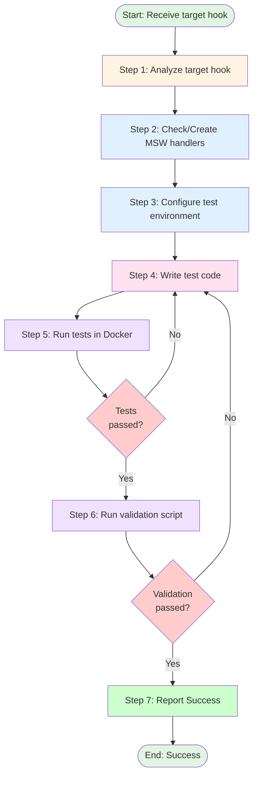

# Procedure: Custom Hook Unit Test Implementation

## Purpose

This procedure defines the exact steps an agent must follow when implementing unit tests for custom React hooks, particularly hooks that handle user actions (e.g., `useActions` pattern).

## Applicability

Used by any agent tasked with creating unit tests for custom hooks. Invoked via detailed instruction from Test Conductor (or direct user request).

---

## Workflow Diagram



---

## Step-by-Step Execution

### Step 1: Analyze Target Hook

**Actions**:
1. Read the hook file to understand:
   - Hook name and purpose
   - API calls made (via `lib/api/*` imports)
   - Side effects (toast notifications, state updates)
   - Return value structure
   - Parameters and their types

2. Identify API client files:
   ```bash
   # Example: For useTurnActions hook
   # Check imports like:
   # import { deleteTurn } from '@/lib/api/turn/deleteTurn'
   # import { editTurn } from '@/lib/api/turn/editTurn'
   # import { forkSession } from '@/lib/api/turn/forkSession'
   ```

3. Determine test scenarios:
   - **Success cases**: API calls succeed, toasts display success messages
   - **Error cases**: API calls fail, toasts display error messages
   - **Return values**: Verify hook returns expected data
   - **Conditional logic**: Test different code paths based on input

**Output**: Complete understanding of hook behavior and test requirements

---

### Step 2: Check and Create MSW Handlers

**CRITICAL - MSW Handler Organization**:
- All MSW handlers MUST be in `src/web/msw/resources/`
- File names match the first path segment after `/api/v1/`
- Handlers are reusable across unit tests and Storybook

#### Step 2a: Check for Existing Handlers

**Actions**:
1. Identify the API resource from hook imports:
   ```typescript
   // Example: deleteTurn imports suggest /turn resource
   import { deleteTurn } from '@/lib/api/turn/deleteTurn'
   // → Check for src/web/msw/resources/turn.ts
   ```

2. Check if handler file exists:
   ```bash
   ls src/web/msw/resources/
   ```

3. If file exists, verify it has handlers for all required endpoints

**Output**: Confirmation of existing handlers or list of missing handlers

#### Step 2b: Create MSW Handlers (If Needed)

**IMPORTANT**: Only create handlers if they don't exist. Never define handlers inline in test files.

**File naming convention** (from `src/web/msw/resources/README.md`):

| Endpoint | File Name |
|----------|-----------|
| `/api/v1/turn/delete` | `turn.ts` |
| `/api/v1/session/create` | `session.ts` |
| `/api/v1/user/profile` | `user.ts` |

**Handler file structure**:

```typescript
import { http, HttpResponse } from 'msw'

import { API_BASE_URL } from '@/constants/uri'

/**
 * MSW handlers for /{resource} endpoints
 */
export const {resource}Handlers = [
  // DELETE /api/v1/session/:sessionId/turn/:turnIndex
  http.delete<{ sessionId: string; turnIndex: string }, never, { message: string }>(
    `${API_BASE_URL}/session/:sessionId/turn/:turnIndex`,
    () => {
      return HttpResponse.json({
        message: 'Turn deleted successfully'
      })
    }
  ),

  // Add more handlers for other endpoints...
]

/**
 * MSW handlers for /{resource} endpoints with error responses
 */
export const {resource}ErrorHandlers = [
  // DELETE /api/v1/session/:sessionId/turn/:turnIndex (error response)
  http.delete(
    `${API_BASE_URL}/session/:sessionId/turn/:turnIndex`,
    () =>
      new HttpResponse(JSON.stringify({ message: 'Failed to delete turn' }), {
        status: 500,
        headers: { 'Content-Type': 'application/json' }
      })
  ),

  // Add more error handlers...
]
```

**Key requirements**:
- Import `API_BASE_URL` from `@/constants/uri`
- Use TypeScript generics: `http.method<PathParams, RequestBody, ResponseBody>`
- Export separate arrays for success and error scenarios
- Reuse type definitions from API client files
- Add JSDoc comments for each handler

**Output**: MSW handler file created in `src/web/msw/resources/`

---

### Step 3: Configure Test Environment

**CRITICAL - Vitest Configuration**:

This project uses a **unified configuration approach**:
- Tests are configured in `vite.config.ts` (NOT a separate `vitest.config.ts`)
- Path aliases use `dirname` variable (not `__dirname`) for ES module compatibility
- Environment is `jsdom` for DOM-based hook testing

#### Step 3a: Verify Vite Config

**File**: `src/web/vite.config.ts`

**Required configuration**:

```typescript
/// <reference types="vitest/config" />
import { fileURLToPath } from 'node:url'
import path from 'path'

import { vanillaExtractPlugin } from '@vanilla-extract/vite-plugin'
import react from '@vitejs/plugin-react'
import { defineConfig } from 'vite'

const dirname =
  typeof __dirname !== 'undefined'
    ? __dirname
    : path.dirname(fileURLToPath(import.meta.url))

export default defineConfig({
  plugins: [react(), vanillaExtractPlugin()],
  resolve: {
    alias: {
      '@': path.resolve(dirname, '.')  // Use dirname, NOT __dirname
    },
    extensions: ['.mjs', '.js', '.ts', '.jsx', '.tsx', '.json']
  },
  test: {
    globals: true,
    environment: 'jsdom',
    setupFiles: ['./vitest.setup.ts'],
    include: ['**/__tests__/**/*.test.{ts,tsx}']
  }
})
```

**Critical points**:
1. **Path alias**: MUST use `dirname` variable (not `__dirname`)
2. **ES module compatibility**: Use `fileURLToPath(import.meta.url)` fallback
3. **No separate vitest.config.ts**: If it exists, DELETE it (causes conflicts)

#### Step 3b: Verify Setup File

**File**: `src/web/vitest.setup.ts`

```typescript
import '@testing-library/jest-dom/vitest'
```

#### Step 3c: Verify Dependencies

**File**: `src/web/package.json`

**Required devDependencies**:
```json
{
  "devDependencies": {
    "jsdom": "^27.4.0",
    "msw": "^2.12.7",
    "@testing-library/react": "^16.3.0",
    "@testing-library/jest-dom": "^6.9.1",
    "vitest": "^4.0.8"
  },
  "scripts": {
    "test": "vitest"
  }
}
```

**Actions if jsdom is missing**:
```bash
docker compose exec react npm install --save-dev jsdom
```

**Output**: Test environment properly configured

---

### Step 4: Write Test Code

**CRITICAL - Test File Location**:

Tests are placed in a `__tests__` directory next to the hook:

```
hooks/
├── useTurnActions.ts
└── __tests__/
    └── useTurnActions.test.ts  ← Create this file
```

**Actions**:

#### Step 4a: Write Test File Header

```typescript
import { renderHook, waitFor } from '@testing-library/react'
import { setupServer } from 'msw/node'

import type { Turn } from '@/lib/api/session/getSession'
import { turnHandlers, turnErrorHandlers } from '@/msw/resources/turn'
import { clearToasts, getToasts } from '@/stores/useToastStore'

import { useTurnActions } from '../useTurnActions'

const server = setupServer(...turnHandlers)
```

**Key imports**:
- `renderHook`, `waitFor` from `@testing-library/react`
- `setupServer` from `msw/node` (not `msw`)
- Types from API client files
- MSW handlers from `@/msw/resources/`
- Toast store utilities
- The hook being tested

#### Step 4b: Write Test Setup

```typescript
describe('useTurnActions', () => {
  beforeAll(() => server.listen())
  afterEach(() => {
    server.resetHandlers()
    clearToasts()
  })
  afterAll(() => server.close())

  // Tests go here...
})
```

**Lifecycle methods**:
- `beforeAll`: Start MSW server
- `afterEach`: Reset handlers and clear toasts (clean state between tests)
- `afterAll`: Stop MSW server

#### Step 4c: Write Test Cases

**Pattern 1: Success Case**

```typescript
describe('deleteTurnAction', () => {
  it('should delete turn successfully and show success toast', async () => {
    const { result } = renderHook(() => useTurnActions())

    await result.current.deleteTurnAction('test-session-id', 1)

    await waitFor(() => {
      const toasts = getToasts()
      expect(toasts).toHaveLength(1)
      expect(toasts[0].status).toBe('success')
      expect(toasts[0].title).toBe('Turn deleted successfully')
    })
  })
})
```

**Pattern 2: Error Case**

```typescript
it('should handle delete turn error and show failure toast', async () => {
  server.use(...turnErrorHandlers)
  const { result } = renderHook(() => useTurnActions())

  await result.current.deleteTurnAction('test-session-id', 1)

  await waitFor(() => {
    const toasts = getToasts()
    expect(toasts).toHaveLength(1)
    expect(toasts[0].status).toBe('failure')
    expect(toasts[0].title).toBe('Failed to delete turn')
  })
})
```

**Pattern 3: Return Value**

```typescript
it('should fork session successfully and return new session ID', async () => {
  const { result } = renderHook(() => useTurnActions())

  const newSessionId = await result.current.forkSessionAction('test-session-id', 2)

  await waitFor(() => {
    const toasts = getToasts()
    expect(toasts).toHaveLength(1)
    expect(toasts[0].status).toBe('success')
  })
  expect(newSessionId).toBe('forked-session-test-session-id')
})
```

**Pattern 4: Conditional Logic**

```typescript
it('should edit user_task turn successfully with instruction field', async () => {
  const { result } = renderHook(() => useTurnActions())
  const userTaskTurn: Turn = {
    type: 'user_task',
    instruction: 'original instruction',
    timestamp: '2024-01-01T00:00:00Z'
  }

  await result.current.editTurnAction(
    'test-session-id',
    0,
    'updated instruction',
    userTaskTurn
  )

  await waitFor(() => {
    const toasts = getToasts()
    expect(toasts).toHaveLength(1)
    expect(toasts[0].status).toBe('success')
  })
})
```

**Pattern 5: Hook Structure**

```typescript
describe('return value structure', () => {
  it('should return all action functions', () => {
    const { result } = renderHook(() => useTurnActions())

    expect(result.current).toHaveProperty('deleteTurnAction')
    expect(result.current).toHaveProperty('editTurnAction')
    expect(result.current).toHaveProperty('forkSessionAction')
    expect(typeof result.current.deleteTurnAction).toBe('function')
    expect(typeof result.current.editTurnAction).toBe('function')
    expect(typeof result.current.forkSessionAction).toBe('function')
  })
})
```

**Test coverage requirements**:
- ✅ Test each action function (success + error)
- ✅ Verify toast notifications
- ✅ Test return values
- ✅ Test conditional logic branches
- ✅ Verify hook structure

**Output**: Complete test file with comprehensive coverage

---

### Step 5: Run Tests in Docker

**CRITICAL - Test Execution Environment**:

Tests MUST be run in Docker to ensure consistent environment:

```bash
docker compose exec react npm test -- {hookName} --run
```

**Example**:
```bash
docker compose exec react npm test -- useTurnActions --run
```

**Why Docker?**:
- Consistent Node.js version
- All dependencies properly installed
- Same environment as CI/CD
- Avoids local machine issues (missing dependencies, wrong Node version)

**Success criteria**:
```
✓ components/organisms/Turn/hooks/__tests__/useTurnActions.test.ts (9 tests) 49ms

Test Files  1 passed (1)
     Tests  9 passed (9)
```

**If tests fail**:
1. Read error messages carefully
2. Fix issues in test file
3. Re-run tests
4. Repeat until all tests pass

**Output**: All tests passing

---

### Step 6: Execute Quality Checks

**CRITICAL - Validation Protocol**:

After tests pass, run the validation script to ensure code quality:

```bash
bash scripts/typescript/validate_code.sh --ignore-external-changes
```

**What This Script Does** (in order):
1. Git status check (skipped with `--ignore-external-changes`)
2. TypeScript compiler check (tsc --noEmit)
3. Formatter (npm run format) - auto-formats code
4. Linter with auto-fix (npm run lint --fix) - automatically removes unused imports

**Parameters**:
- `--ignore-external-changes`: Skip git status check

**Exit Codes**:
- `0`: All checks passed (proceed to Step 7)
- `1`: Quality checks failed (formatting, linting)
- `2`: Unauthorized file modifications detected

**CRITICAL - State Synchronization**:

After validation script completes:
- Files have been **formatted and linted** automatically
- Your in-memory state is now **STALE**
- **[MANDATORY]** Execute `read_file` on test file BEFORE any error fixes
- **[PROHIBITED]** Do NOT use `replace` tool based on memory

**Error Recovery Protocol**:

If validation script reports errors:
1. **[MANDATORY]** Execute `read_file` on test file FIRST
2. **[REQUIRED]** Use fresh file content for fixes
3. Fix reported errors
4. Re-run validation script
5. **Rationale**: Prevents "string not found" errors from formatter changes

**Success Criteria**: Exit code 0 (all checks passed)

**Output**: Code passes all quality gates

---

### Step 7: Report Success

**Actions**:

Report successful test implementation with the following information:

- Test file path: `{test_file_path}`
- Number of tests created: `{test_count}`
- Hook tested: `{hook_name}`
- Test coverage:
  - ✅ Success cases
  - ✅ Error cases
  - ✅ Return values
  - ✅ Conditional logic
  - ✅ Hook structure
- All quality checks passed: ✅ Tests, TypeScript, Formatter, Linter

**Output**: Success report (test conductor will handle git verification and commit)

---

## Constraints (Must Not)

### Project Environment
- **npm Environment**: This project uses npm for dependency management
- ❌ **ABSOLUTE PROHIBITION**: Adding ANY new dependencies to package.json (except jsdom if missing)
- ❌ **ABSOLUTE PROHIBITION**: Installing ANY new libraries without explicit approval
- ✅ **REQUIRED**: Use ONLY existing dependencies already defined in package.json

### Prohibited Test Practices
- ❌ Defining MSW handlers inline in test files (always use `@/msw/resources/`)
- ❌ Using `__dirname` instead of `dirname` variable in vite.config.ts
- ❌ Creating separate `vitest.config.ts` (causes conflicts with vite.config.ts)
- ❌ Running tests locally instead of in Docker
- ❌ Skipping validation script
- ❌ Missing cleanup in `afterEach` (must clear toasts and reset handlers)

### Prohibited Configuration Patterns
- ❌ Using `@storybook/jest` or `@storybook/testing-library` in unit tests (those are for Storybook)
- ❌ Importing from `msw` instead of `msw/node` for server setup
- ❌ Missing `jsdom` environment configuration
- ❌ Incorrect path alias configuration (must use `dirname`)

### Prohibited Shortcuts
- ❌ Skipping MSW handler creation (never use real API calls)
- ❌ Not testing error cases (only testing success cases)
- ❌ Not verifying toast notifications
- ❌ Proceeding to next step if current step fails
- ❌ Using `replace` tool based on stale memory after validation script

### Prohibited Token-Wasting Actions
- ❌ **[CRITICAL]** Re-reading content you just wrote (except Step 6 error recovery)
- ❌ **[CRITICAL]** Using `replace` tool based on stale memory after validation script runs (must `read_file` first)
- ❌ Running validation script multiple times without fixing errors

---

## Common Troubleshooting

### Issue 1: Path Alias Not Working

**Symptom**: Tests fail with "Cannot find module '@/msw/resources/turn'"

**Cause**: In ES module environment, `__dirname` is undefined

**Solution**: Use `dirname` variable in vite.config.ts:

```typescript
const dirname =
  typeof __dirname !== 'undefined'
    ? __dirname
    : path.dirname(fileURLToPath(import.meta.url))

export default defineConfig({
  resolve: {
    alias: {
      '@': path.resolve(dirname, '.')  // Use dirname, NOT __dirname
    }
  }
})
```

### Issue 2: jsdom Not Found

**Symptom**: Tests fail with "Cannot find package 'jsdom'"

**Solution**: Install jsdom in Docker:

```bash
docker compose exec react npm install --save-dev jsdom
```

### Issue 3: Multiple Config Files

**Symptom**: Tests fail with "No projects matched the filter 'unit'"

**Cause**: Both `vite.config.ts` and `vitest.config.ts` exist

**Solution**: Remove `vitest.config.ts`:

```bash
rm src/web/vitest.config.ts
```

### Issue 4: MSW Handlers Not Working

**Symptom**: Tests fail because API calls aren't being mocked

**Solution**:
1. Verify handlers are in `src/web/msw/resources/`
2. Check handler URLs match exactly (including path params)
3. Verify importing from `msw/node` for `setupServer`
4. Check `API_BASE_URL` is correct

### Issue 5: Toasts Not Clearing

**Symptom**: Toast count is incorrect

**Solution**: Add `clearToasts()` in `afterEach`:

```typescript
afterEach(() => {
  server.resetHandlers()
  clearToasts()  // Add this
})
```

---

## References

- **Unit Test Strategy**: `roles/typescript/tests/useActions.md`
- **MSW Resources**: `src/web/msw/resources/README.md`
- **TypeScript Guidelines**: `roles/typescript/typescript.md`
- **Storybook MSW**: `roles/typescript/tests/storybook.md` (MSW section)

---

## Example Execution

```
Input:
  target_hook: src/web/components/organisms/Turn/hooks/useTurnActions.ts
  test_output: src/web/components/organisms/Turn/hooks/__tests__/useTurnActions.test.ts

Execution:
  Step 1: Analyze useTurnActions hook
          → Actions: deleteTurnAction, forkSessionAction, editTurnAction
          → API calls: deleteTurn, forkSession, editTurn
          → Side effects: Toast notifications
          → Return values: forkSessionAction returns newSessionId

  Step 2a: Check for existing MSW handlers
           → ls src/web/msw/resources/
           → turn.ts does NOT exist

  Step 2b: Create MSW handlers
           → Create src/web/msw/resources/turn.ts
           → Export turnHandlers (success cases)
           → Export turnErrorHandlers (error cases)

  Step 3: Verify test environment
          → vite.config.ts uses dirname ✅
          → vitest.setup.ts exists ✅
          → jsdom installed ✅

  Step 4: Write test file
          → Create __tests__/useTurnActions.test.ts
          → Setup MSW server
          → Write 9 test cases covering all actions
          → Test success, error, return values, conditional logic, structure

  Step 5: Run tests in Docker
          → docker compose exec react npm test -- useTurnActions --run
          → Exit code 0 (9 tests passed)

  Step 6: Run validation script
          → bash scripts/typescript/validate_code.sh --ignore-external-changes
          → Exit code 0 (all quality gates passed)

  Step 7: Report success
          → Test file: src/web/components/organisms/Turn/hooks/__tests__/useTurnActions.test.ts
          → Test count: 9
          → Coverage: success ✅, error ✅, return values ✅, conditional ✅, structure ✅

Output: Success, ready for test conductor review
```

---

## Notes

- **MSW handler reusability**: Handlers in `src/web/msw/resources/` are shared between unit tests and Storybook stories
- **Docker execution**: ALWAYS run tests in Docker for consistency
- **Unified config**: Use `vite.config.ts` only, DELETE `vitest.config.ts` if it exists
- **Path alias**: MUST use `dirname` variable (not `__dirname`) for ES module compatibility
- **Sequential execution**: Complete each step before proceeding
- **Error handling**: Always return to Step 4 on any failure
- **Formatter safeguard**: ALWAYS execute `read_file` BEFORE fixing errors in Step 6
- **Responsibility**: Test implementation agents do NOT handle git operations or commits
