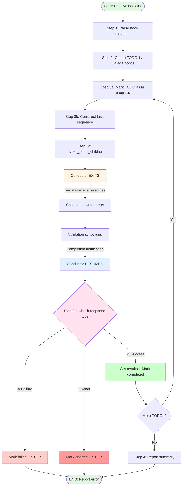

# Procedure: TypeScript Unit Test Generation Conductor

## Purpose
Orchestrate automated unit test generation for multiple custom React hooks by delegating to child agents via `invoke_serial_children`.

## Applicability
Used by conductor agents managing batch unit test generation. Invoked via `scripts/typescript/tests/generate_unit_test.py` script.

---

## Workflow Diagram



**Key Points**:
- Conductor EXITS immediately after calling `invoke_serial_children`
- Serial manager executes child tasks and sends completion notification
- Conductor RESUMES only when receiving notification
- **CRITICAL**: On failure (❌) or abort (🚨), conductor STOPS and reports error
- **CRITICAL**: Conductor NEVER calls `invoke_serial_children` again on failure

---

## Step-by-Step Execution

### Step 1: Receive Hook List

**Input**: List of custom React hooks from user instruction with metadata:
- `hook_file`: Source hook path (e.g., `src/web/components/organisms/Turn/hooks/useTurnActions.ts`)
- `test_file`: Target test path (e.g., `src/web/components/organisms/Turn/hooks/__tests__/useTurnActions.test.ts`)
- `hook_type`: Hook type (`actions`, `handlers`, `lifecycle`, `store`, or `custom`)
- `hook_name`: Hook name (e.g., `useTurnActions`)

**Actions**:
1. Parse hook list from instruction
2. Validate metadata completeness
3. Identify hook type for each hook

**Output**: Structured list of hooks to process

---

### Step 2: Create TODO List

**Actions**:
1. Use `edit_todos` tool
2. Create one TODO item per hook:
   - Title: `"Generate unit tests for {hook_name}"`
   - Description: `"hook_file={path}, test_file={path}, hook_type={type}, hook_name={name}"`
   - Status: Not specified (defaults to unchecked)

**Example**:
```python
edit_todos([
    {
        "title": "Generate unit tests for useTurnActions",
        "description": "hook_file=src/web/components/organisms/Turn/hooks/useTurnActions.ts, test_file=src/web/components/organisms/Turn/hooks/__tests__/useTurnActions.test.ts, hook_type=actions, hook_name=useTurnActions"
    }
])
```

**Output**: TODO list initialized

---

### Step 3: Process Hooks Sequentially

For **each hook** in the list, execute Steps 3a-3d:

#### Step 3a: Receive Next TODO Instruction

**Actions**: The orchestration script sends a detailed instruction containing:
- Hook metadata (file paths, hook type, name)
- Fully constructed `invoke_serial_children` parameters
- Explicit instruction to call the tool and exit

**Important**: This instruction comes from the external script, not from the conductor itself.

#### Step 3b: Construct Task Sequence

**Actions**: Build task list with agent task and validation script:

```python
tasks = [
    {
        "type": "agent",
        "instruction": f"""🎯 CRITICAL MISSION: Implement comprehensive unit tests for custom React hook

📋 Target Specification:
- Hook target file: {hook_file}
- Test output path: {test_file}
- Hook type: {hook_type}

⚠️ ABSOLUTE REQUIREMENTS:
1. Tests that fail have NO VALUE - ALL checks must pass
2. Follow @procedures/typescript/tests/use_actions_generation.md (all steps, no shortcuts)
3. Test coverage: Success cases, error cases, return values, conditional logic, hook structure
4. ONLY modify {test_file} - any other file changes = immediate abort
5. The __tests__ directory already exists - DO NOT create it

✅ Success Criteria:
- [ ] TypeScript Compiler (tsc --noEmit): Pass
- [ ] Validation Script (validate_code.sh): Pass
- [ ] Test coverage includes success cases, error cases, return values, conditional logic

🔧 Tool Execution Protocol:
- **EXECUTE, DON'T DISPLAY:** Do NOT write tool calls in markdown text or code blocks
- **IGNORE DOC FORMATTING:** Code blocks in procedures are illustrations only - convert them to actual tool invocations
- **IMMEDIATE INVOCATION:** Your response must be tool use requests, not text descriptions
- **NO PREAMBLE:** No 'I will now...', 'Okay...', 'Let me...' - invoke Step 1 tool immediately
- **COMPLETE ALL STEPS:** Continue invoking tools through all steps until all checks pass""",
        "roles": [
            "roles/typescript/tests/useActions.md",
            "roles/typescript/typescript.md"
        ],
        "procedure": "procedures/typescript/tests/use_actions_generation.md",
        "references_persist": [hook_file]
    },
    {
        "type": "script",
        "script": "typescript/validate_code.sh",
        "args": ["--ignore-external-changes"],
        "max_retries": 2  # Total 3 attempts (initial + 2 retries)
    }
]
```

**Notes**:
- Agent task includes roles for unit testing and TypeScript guidelines
- `references_persist` ensures hook source is available without re-reading
- `max_retries=2` means 3 total attempts (1 initial + 2 retries)
- Validation script uses `--ignore-external-changes` flag

#### Step 3c: Invoke Serial Children

**Actions**:
```python
invoke_serial_children(
    tasks=tasks,
    purpose=f"Generate unit tests for {hook_name}",
    background=f"Complete ALL steps in use_actions_generation.md for {hook_file}. Verify TypeScript compilation, validation script, and test execution. DO NOT exit until all quality checks pass.",
    roles=[
        "roles/typescript/tests/useActions.md",
        "roles/typescript/typescript.md"
    ],
    procedure="procedures/typescript/tests/use_actions_generation.md",
    references_persist=[hook_file]
)
```

**Notes**:
- `roles`, `procedure`, `references_persist` are specified at tool level
- These parameters are injected into agent tasks that don't already have them
- This ensures agents follow the correct procedure and role constraints

**Result**: Conductor exits immediately

#### Step 3d: Handle Serial Manager Response

**Actions** (when conductor resumes after `invoke_serial_children`):

The serial manager will send one of three types of messages:

##### Case 1: Success (✅)
**Message pattern**: "✅ Child agent tasks completed successfully"

**Actions**:
1. Call `get_sessions_final_turns` with provided session IDs to retrieve results
2. Use `edit_todos` to mark current hook as completed (checked: true)
3. Move to next hook

**Example**:
```python
# Receive: "✅ Child agent tasks completed successfully. To retrieve the results, use get_sessions_final_turns with the following session IDs: [...]"
# Response:
get_sessions_final_turns(session_ids=[...])
edit_todos([{
    "title": "Generate unit tests for useTurnActions",
    "description": "...",
    "checked": true
}])
# Continue to next hook
```

##### Case 2: Normal Failure (❌)
**Message pattern**: "❌ Task execution FAILED" + "DO NOT retry or call invoke_serial_children again"

**Actions**:
1. **STOP immediately** - do NOT call `invoke_serial_children` again
2. Use `edit_todos` to mark current hook as failed
3. Report error to user with details from the message
4. **Do NOT process remaining hooks** - stop the conductor

**Example**:
```python
# Receive: "❌ Task execution FAILED ... DO NOT retry ..."
# Response:
edit_todos([{
    "title": "Generate unit tests for useTurnActions",
    "description": "...",
    "checked": false,
    "note": "Failed: {error_details}"
}])
# Report to user: "Unit test generation failed for {hook}. Error: {details}"
# STOP - do not continue to next hook
```

##### Case 3: Permanent Failure (🚨)
**Message pattern**: "🚨 Task execution ABORTED (exit code 2 - permanent failure)" + "DO NOT retry"

**Actions**:
1. **STOP immediately** - do NOT call `invoke_serial_children` again
2. Use `edit_todos` to mark current hook as aborted
3. Report abort reason to user (e.g., unauthorized file modifications)
4. **Do NOT process remaining hooks** - stop the conductor

**Example**:
```python
# Receive: "🚨 Task execution ABORTED ... DO NOT retry ..."
# Response:
edit_todos([{
    "title": "Generate unit tests for useTurnActions",
    "description": "...",
    "checked": false,
    "note": "Aborted: {abort_reason}"
}])
# Report to user: "Unit test generation aborted for {hook}. Reason: {abort_reason}"
# STOP - manual investigation required
```

**Critical Rule**:
- **NEVER** call `invoke_serial_children` again if the message contains "DO NOT retry"
- **NEVER** call `invoke_serial_children` again on your own initiative to "retry"
- Failures (❌ or 🚨) require stopping the conductor and reporting to the user
- Only on success (✅) should processing continue to the next hook
- **Retry logic is the responsibility of `invoke_serial_children` and its `max_retries` configuration**

---

### Step 4: Report Final Summary

**Actions**:
1. Count completed hooks
2. List generated test files
3. Report to user:
```
✅ Unit test generation complete

Summary:
- Hooks processed: {count}
- Tests generated: {list_of_test_files}
- All quality gates passed
```

**Output**: Final report

---

## Constraints (Must Not)

### Conductor Responsibilities
- ❌ **ABSOLUTE PROHIBITION**: Never write test code directly
- ❌ **ABSOLUTE PROHIBITION**: Never run TypeScript compiler or validation commands directly
- ❌ **ABSOLUTE PROHIBITION**: Never call `invoke_serial_children` more than once per hook
- ❌ **CRITICAL**: Never retry `invoke_serial_children` when receiving "DO NOT retry" message
- ❌ **CRITICAL**: Never continue to next hook after receiving failure (❌) or abort (🚨) messages
- ❌ Never reuse child sessions (create new session per hook via script orchestration)
- ❌ Never wait after `invoke_serial_children` (exit immediately)
- ❌ Never skip TODO updates

### Rationale
- **Retry logic is handled by `invoke_serial_children`**: The `max_retries` configuration for script tasks handles automatic retries
- **Conductor-level retries waste tokens**: Re-launching child agents duplicates work already done by the retry mechanism
- **Single responsibility**: Conductor orchestrates, child agents execute, serial manager handles retries

---

## Tool Usage

### Primary Tools
1. **edit_todos**: Create and update TODO list
2. **invoke_serial_children**: Delegate test generation + validation
3. **get_sessions_final_turns**: Retrieve results from completed child sessions

### Task Structure
```python
# Agent task: Write tests
{
    "type": "agent",
    "instruction": "<detailed instruction with procedure reference>",
    "roles": [
        "roles/typescript/tests/useActions.md",
        "roles/typescript/typescript.md"
    ],
    "procedure": "procedures/typescript/tests/use_actions_generation.md",
    "references_persist": [hook_file]
}

# Script task: Validate quality (with retry)
{
    "type": "script",
    "script": "typescript/validate_code.sh",
    "args": ["--ignore-external-changes"],
    "max_retries": 2  # Optional: retry on failure (default: 0)
}
```

**Retry Behavior**:
- `max_retries=0`: No retry (default), fails immediately
- `max_retries=2`: Retry up to 2 times (3 total attempts)
- Serial manager handles retries automatically by:
  1. Finding the preceding agent task
  2. Re-executing the agent with error information from failed script
  3. Re-executing the script task
  4. Repeating up to max_retries times
- Conductor only sees final result (success or failure)

**Exit Code 2 - ABORT (Permanent Failure)**:
- Scripts can exit with code 2 to signal a permanent failure that should NOT be retried
- Serial manager immediately aborts without retries, regardless of `max_retries` setting
- Use cases for exit code 2:
  - Unauthorized file modifications detected (e.g., changes outside test file)
  - Validation failures requiring manual investigation
  - Configuration issues that cannot be auto-fixed
- The abort reason is automatically reported to the parent session for investigation

---

## Example Execution

```
Input:
  - src/web/components/organisms/Turn/hooks/useTurnActions.ts
  - src/web/stores/useToastStore.ts

Step 1: Parse hooks, identify hook_type
Step 2: edit_todos (2 unchecked items)

Step 3 (Hook 1):
  3a: Receive instruction from script
  3b: Construct instruction + tasks
  3c: invoke_serial_children (NEW session)
  [Conductor exits]
  [Child agent executes]
  [Script validates]
  [Conductor resumes]
  3d: get_sessions_final_turns + edit_todos (useTurnActions → completed)

Step 3 (Hook 2):
  3a: Receive instruction from script
  3b: Construct instruction + tasks
  3c: invoke_serial_children (NEW session)
  [Repeat]

Step 4: Report summary (2 hooks, 2 test files)
```

---

## Notes

- **One session per hook**: Prevents context window bloat
- **Sequential processing**: One hook at a time
- **No waiting**: Conductor exits after delegation
- **Error handling**: Script task detects failures with `max_retries`
- **Resumable**: Can restart from TODO list
- **Hook type agnostic**: Supports Actions, Handlers, Lifecycle, Store, and Custom hooks
- **Pre-created directories**: The `__tests__` directory is created by the orchestration script before conductor runs
