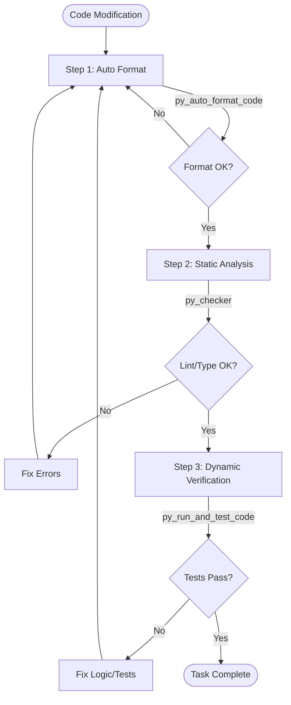

# Python Project Guidelines (src/pipe/core)

## 🛡️ Code Quality Assurance Process

**CRITICAL**: Every code modification must follow this verification pipeline to ensure safety and quality.



1.  **Auto Format (`py_auto_format_code`)**: Always run first to fix style and syntax issues.
2.  **Static Analysis (`py_checker`)**: Must pass with no errors. Fix type hints and linting rules.
3.  **Dynamic Verification (`py_run_and_test_code`)**: Run relevant tests. Create new tests if needed.

---

## Overview

This document defines project-wide Python conventions, forbidden patterns, and architectural principles for `src/pipe/core`. These rules ensure code quality, maintainability, and consistent architectural patterns across all layers.

## Core Principles

1. **Type safety first** - Use type hints for all function signatures and class attributes
2. **Immutability where possible** - Prefer Pydantic models with frozen=True and immutable patterns
3. **Single Responsibility** - Each module, class, and function should have one clear purpose
4. **Explicit dependencies** - Use dependency injection, avoid global state
5. **Layered architecture** - Respect the architectural boundaries (see Layer Rules below)

## Architectural Layers

The `src/pipe/core` follows a strict layered architecture:

```
┌─────────────────────────────────────────────┐
│ delegates/      (Orchestration Layer)       │  ← Entry points for commands
├─────────────────────────────────────────────┤
│ services/       (Application Layer)         │  ← Business orchestration
├─────────────────────────────────────────────┤
│ domains/        (Domain Logic Layer)        │  ← Business rules
├─────────────────────────────────────────────┤
│ agents/         (External Integration)      │  ← AI API wrappers
│ repositories/   (Persistence Layer)         │  ← Data access
│ collections/    (Data Structures)           │  ← Specialized containers
├─────────────────────────────────────────────┤
│ models/         (Data Layer)                │  ← Pydantic models
│ validators/     (Validation Layer)          │  ← Data validation
├─────────────────────────────────────────────┤
│ utils/          (Infrastructure)            │  ← Pure functions
│ tools/          (AI Capabilities)           │  ← Tool functions for AI
└─────────────────────────────────────────────┘
```

## Layer Access Rules

### ✅ Allowed Dependencies

- **delegates/** → services, agents, models
- **services/** → repositories, domains, collections, agents, models, utils
- **domains/** → collections, models, utils
- **agents/** → services (only specific methods), models, utils
- **repositories/** → models, utils
- **collections/** → models
- **models/** → No dependencies (except standard library and Pydantic)
- **tools/** → services, models, utils

### ❌ Forbidden Dependencies

- ❌ **models/** must NOT import from any other core layer
- ❌ **repositories/** must NOT import from services or domains
- ❌ **domains/** must NOT import from services or agents
- ❌ **collections/** must NOT contain business logic (that belongs in domains/)
- ❌ **utils/** must NOT import from any other core layer (pure functions only)

## Forbidden Patterns

### ❌ 1. Direct File I/O in Services or Domains

**Rule:** File operations must go through `repositories/` or `utils/` layer.

```python
# ❌ BAD: Direct file operations in service
class SessionService:
    def save_session(self, session: Session):
        with open(f'sessions/{session.id}.json', 'w') as f:
            json.dump(session.model_dump(), f)

# ✅ GOOD: Use repository
class SessionService:
    def __init__(self, repository: SessionRepository):
        self.repository = repository

    def save_session(self, session: Session):
        self.repository.save(session)
```

**Reason:** Separation of concerns - persistence logic is isolated in repositories.

**Enforcement:** Code review + grep check

```bash
# Check for open() in services and domains
grep -r "open(" src/pipe/core/services/*.py src/pipe/core/domains/*.py
```

### ❌ 2. Business Logic in Models

**Rule:** Pydantic models must be data containers only. Business logic belongs in `domains/`.

```python
# ❌ BAD: Business logic in model
class Session(BaseModel):
    turns: list[Turn]

    def filter_recent_turns(self, limit: int) -> list[Turn]:
        # Business logic doesn't belong here
        return self.turns[-limit:]

# ✅ GOOD: Business logic in domain
# models/session.py
class Session(BaseModel):
    turns: list[Turn]

# domains/turns.py
def filter_recent_turns(session: Session, limit: int) -> list[Turn]:
    return session.turns[-limit:]
```

**Reason:** Models should be pure data structures. Business rules change frequently and should be isolated.

### ❌ 3. Mutable Global State

**Rule:** Avoid module-level mutable state. Use dependency injection instead.

```python
# ❌ BAD: Mutable global state
_current_session = None

def set_current_session(session: Session):
    global _current_session
    _current_session = session

# ✅ GOOD: Pass state explicitly
class SessionService:
    def __init__(self):
        self.current_session: Session | None = None

    def set_current_session(self, session: Session):
        self.current_session = session
```

**Reason:** Testability, thread safety, and explicit dependencies.

### ❌ 4. Direct AI API Calls Outside agents/

**Rule:** All AI API interactions must go through `agents/` layer.

```python
# ❌ BAD: Direct API call in service
import google.genai as genai

class PromptService:
    def generate_response(self, prompt: str):
        client = genai.Client()
        response = client.models.generate_content(...)  # NO!
        return response

# ✅ GOOD: Use agent layer
from pipe.core.agents.gemini_api import call_gemini_api

class PromptService:
    def generate_response(self, prompt: str):
        return call_gemini_api(prompt, tools=[], ...)
```

**Reason:** Centralized API handling, consistent error handling, easier testing.

### ❌ 5. print() for Logging

**Rule:** Use the `logging` module instead of `print()` for debugging and error messages.

```python
# ❌ BAD: Using print()
def process_turn(turn: Turn):
    print(f"Processing turn: {turn.id}")

# ✅ GOOD: Use logging
import logging

logger = logging.getLogger(__name__)

def process_turn(turn: Turn):
    logger.debug(f"Processing turn: {turn.id}")
```

**Reason:** Proper log levels, configurable output, production-ready.

**Exception:** `print()` is acceptable in CLI entry points or tools for user-facing output.

## Type Hints

### Required Type Hints

All public functions and methods must have complete type hints:

```python
# ✅ GOOD: Complete type hints
def get_session(session_id: str) -> Session | None:
    ...

def process_turns(turns: list[Turn], limit: int = 3) -> Iterator[Turn]:
    ...

class SessionService:
    def __init__(self, repository: SessionRepository) -> None:
        self.repository = repository
```

### Using TYPE_CHECKING

Use `TYPE_CHECKING` to avoid circular imports in type hints:

```python
from typing import TYPE_CHECKING

if TYPE_CHECKING:
    from pipe.core.collections.turns import TurnCollection

def process_turns(turns: "TurnCollection") -> list[Turn]:
    ...
```

## Pydantic Models

### Model Configuration

Use `ConfigDict` for model configuration:

```python
from pydantic import BaseModel, ConfigDict

class Session(BaseModel):
    model_config = ConfigDict(
        frozen=False,  # Allow mutation if needed
        arbitrary_types_allowed=True,  # For custom types
        validate_assignment=True  # Validate on attribute assignment
    )

    id: str
    turns: list[Turn]
```

### Validators

Use Pydantic validators for data validation, not business logic:

```python
from pydantic import BaseModel, field_validator

class Reference(BaseModel):
    path: str
    ttl: int

    @field_validator('ttl')
    @classmethod
    def validate_ttl(cls, v: int) -> int:
        if v < 0:
            raise ValueError('TTL must be non-negative')
        return v
```

## Error Handling

### Service Layer Error Handling

Services should handle errors and provide meaningful messages:

```python
class SessionService:
    def load_session(self, session_id: str) -> Session:
        session = self.repository.find(session_id)
        if session is None:
            raise ValueError(f"Session not found: {session_id}")
        return session
```

### Repository Layer Error Handling

Repositories should handle low-level I/O errors:

```python
class SessionRepository:
    def save(self, session: Session) -> None:
        try:
            with file_lock(self.lock_path):
                self._write_json(session_path, session.model_dump())
        except OSError as e:
            raise RuntimeError(f"Failed to save session: {e}") from e
```

## File Organization

### Module Structure

Each layer should follow this structure:

```
layer_name/
├── __init__.py          # Public API exports
├── module_name.py       # Implementation
└── __pycache__/
```

### Public API

Use `__init__.py` to define the public API:

```python
# domains/__init__.py
from pipe.core.domains.references import add_reference, decay_reference_ttl
from pipe.core.domains.turns import get_turns_for_prompt

__all__ = [
    'add_reference',
    'decay_reference_ttl',
    'get_turns_for_prompt',
]
```

## Testing

### Unit Tests

- Place tests in `tests/` directory mirroring the source structure
- Use pytest as the testing framework
- Mock external dependencies (agents, repositories)

```python
# tests/core/services/test_session_service.py
from unittest.mock import Mock
from pipe.core.services.session_service import SessionService

def test_load_session():
    mock_repo = Mock()
    mock_repo.find.return_value = Session(id="test", ...)

    service = SessionService(repository=mock_repo)
    session = service.load_session("test")

    assert session.id == "test"
    mock_repo.find.assert_called_once_with("test")
```

## Documentation

### Docstrings

Use Google-style docstrings for public functions and classes:

```python
def get_turns_for_prompt(
    turns_collection: TurnCollection,
    tool_response_limit: int = 3
) -> Iterator[Turn]:
    """
    Yields turns for prompt generation, applying filtering rules.

    Args:
        turns_collection: Collection of turns to filter
        tool_response_limit: Maximum number of tool response turns to include

    Yields:
        Turn objects suitable for prompt generation

    Note:
        The last turn (current task) is excluded from the output.
    """
    ...
```

## 🛠️ Development Tools (For LLMs)

These tools are available to assist with Python development. Use them to improve code quality, understand architecture, and automate common tasks.

### Code Analysis Tools

#### py_analyze_code

**Purpose**: Analyze Python code structure, dependencies, complexity, and imports

**Use when**:

- Understanding existing code architecture
- Checking if code follows layer dependency rules
- Finding circular imports or architecture violations
- Reviewing code quality metrics

**Example**:

```python
# Check if a service properly follows dependency rules
py_analyze_code("src/pipe/core/services/session_service.py")
# Review: Does it import from domains? (✅ allowed)
# Review: Does it import from delegates? (❌ forbidden)
# Review: Does it do direct file I/O? (❌ should use repository)
```

**Best practice**: Run before refactoring to understand current dependencies

#### py_get_symbol_references

**Purpose**: Find all usages of a function, class, method, or variable across the codebase

**Use when**:

- Refactoring - need to update all call sites
- Understanding the impact of changes
- Finding usage examples of a function
- Before deprecating or removing code

**Example**:

```python
# Before changing SessionService.save_session() signature, check all usages
py_get_symbol_references("save_session", "src/pipe/core/")

# Find all places that use a specific model
py_get_symbol_references("Session", "src/pipe/")
```

**Best practice**: Always check references before renaming or removing public APIs

#### py_get_type_hints

**Purpose**: Get type information for functions, methods, and classes

**Use when**:

- Writing code that calls existing functions (need to know expected types)
- Understanding function signatures
- Ensuring type safety when integrating components
- Generating type-correct code

**Example**:

```python
# What types does create_session expect?
py_get_type_hints("src/pipe/core/services/session_service.py", "create_session")
# Returns: (purpose: str, background: str, ...) -> Session
```

**Best practice**: Check type hints before calling unfamiliar functions

#### py_get_code_snippet

**Purpose**: Extract specific code segments (functions, classes, methods) for analysis

**Use when**:

- Need to see just a function/class without the entire file
- Comparing implementations across files
- Getting context for modifications
- Reviewing specific code without reading full file

**Example**:

```python
# Get just the save_session method implementation
py_get_code_snippet(
    file="src/pipe/core/services/session_service.py",
    symbol="save_session"
)

# Get a complete class definition
py_get_code_snippet(
    file="src/pipe/core/models/session.py",
    symbol="Session"
)
```

**Best practice**: Use instead of reading entire files when you need specific functions

### Code Modification Tools

#### py_auto_format_code

**Purpose**: Format code according to project standards (ruff format)

**Use when**:

- After generating or modifying code
- Before committing changes
- Ensuring consistent code style
- Fixing formatting issues

**Example**:

```python
# Format a specific file
py_auto_format_code("src/pipe/core/services/session_service.py")

# Format an entire directory
py_auto_format_code("src/pipe/core/services/")

# Format all modified files
py_auto_format_code("src/pipe/")
```

**Best practice**: Always run after code modifications before committing

### Testing Tools

#### py_run_and_test_code

**Purpose**: Run code and execute tests to validate changes

**Use when**:

- Validating that changes work correctly
- Running specific test cases after modifications
- Checking for regressions
- Ensuring tests pass before committing

**Example**:

```python
# Run specific test
py_run_and_test_code(
    test_file="tests/core/services/test_session_service.py",
    test_name="test_create_session"
)

# Run all tests in a module
py_run_and_test_code(
    test_file="tests/core/services/test_session_service.py"
)

# Run tests with coverage
py_run_and_test_code(
    test_file="tests/core/",
    coverage=True
)
```

**Best practice**: Run relevant tests after every code change

## 🎯 Recommended Tool Usage Workflows

### Workflow 1: Adding New Feature

```
1. py_get_symbol_references    → Find similar existing features
2. py_get_code_snippet          → Study implementation patterns
3. py_get_type_hints            → Understand required types
4. [Manual coding]              → Implement specific logic
5. py_auto_format_code          → Format the code
6. py_checker                   → Verify types and linting
7. py_run_and_test_code         → Validate implementation
```

### Workflow 2: Refactoring Existing Code

```
1. py_analyze_code              → Understand current structure
2. py_get_symbol_references     → Find all usages
3. [Manual refactoring]         → Perform safe refactoring
4. py_auto_format_code          → Clean up formatting
5. py_checker                   → Verify types and linting
6. py_run_and_test_code         → Ensure nothing broke
```

### Workflow 3: Fixing Architecture Violations

```
1. py_analyze_code              → Identify improper dependencies
2. py_get_symbol_references     → Find violation locations
3. [Manual fix]                 → Move code to correct layer
4. py_auto_format_code          → Format changes
5. py_checker                   → Verify types and linting
6. py_run_and_test_code         → Verify fixes work
```

### Workflow 4: Understanding Unfamiliar Code

```
1. py_analyze_code              → Get high-level structure
2. py_get_code_snippet          → Read specific functions
3. py_get_type_hints            → Understand interfaces
4. py_get_symbol_references     → See usage examples
```

## ⚠️ Tool Usage Best Practices

### DO Use These Tools

- ✅ **py_analyze_code** before making changes to understand dependencies
- ✅ **py_get_symbol_references** before renaming/removing public APIs
- ✅ **py_get_type_hints** when calling unfamiliar functions
- ✅ **py_auto_format_code** after all code modifications
- ✅ **py_checker** to verify static analysis before testing
- ✅ **py_run_and_test_code** to validate changes before committing
- ✅ **py_get_code_snippet** to read specific functions instead of entire files

### DON'T Do These

- ❌ Modify code without checking references first (use py_get_symbol_references)
- ❌ Skip formatting - always use py_auto_format_code after changes
- ❌ Commit without running tests (use py_run_and_test_code)
- ❌ Commit with lint errors (use py_checker)
- ❌ Read entire files when you need one function (use py_get_code_snippet)

### Architecture Validation with Tools

Use these tools to ensure code follows architectural rules:

```python
# Check if service has proper dependencies
py_analyze_code("src/pipe/core/services/session_service.py")
# Look for:
#   ✅ Imports from repositories/ (allowed)
#   ✅ Imports from domains/ (allowed)
#   ❌ Direct file I/O with open() (forbidden - use repository)
#   ❌ Imports from delegates/ (forbidden - wrong direction)

# Check if domain has business logic only
py_analyze_code("src/pipe/core/domains/turns.py")
# Look for:
#   ✅ Pure functions
#   ✅ Imports from models/ (allowed)
#   ❌ Imports from services/ (forbidden)
#   ❌ Imports from repositories/ (forbidden)
#   ❌ File I/O (forbidden - domains are pure logic)

# Check if models are pure data structures
py_analyze_code("src/pipe/core/models/session.py")
# Look for:
#   ✅ Pydantic BaseModel
#   ✅ Field definitions only
#   ❌ Methods with business logic (forbidden - use domains/)
#   ❌ Imports from other core layers (forbidden)
```

## Code Quality Tools

### Ruff

Use Ruff for linting and formatting:

```bash
# Lint code
ruff check src/pipe/core

# Format code
ruff format src/pipe/core
```

### Black

Use Black for code formatting (alternative to ruff format):

```bash
# Format code
black src/pipe/core

# Check without modifying
black --check src/pipe/core
```

### MyPy

Use MyPy for type checking:

```bash
mypy src/pipe/core
```

## Summary

These guidelines ensure:

- ✅ Clear architectural boundaries
- ✅ Consistent code patterns
- ✅ Type safety
- ✅ Testability
- ✅ Maintainability

Follow these rules strictly to maintain code quality across the `src/pipe/core` codebase.