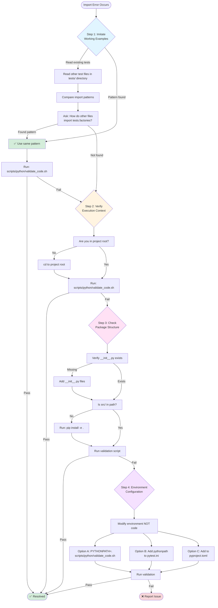
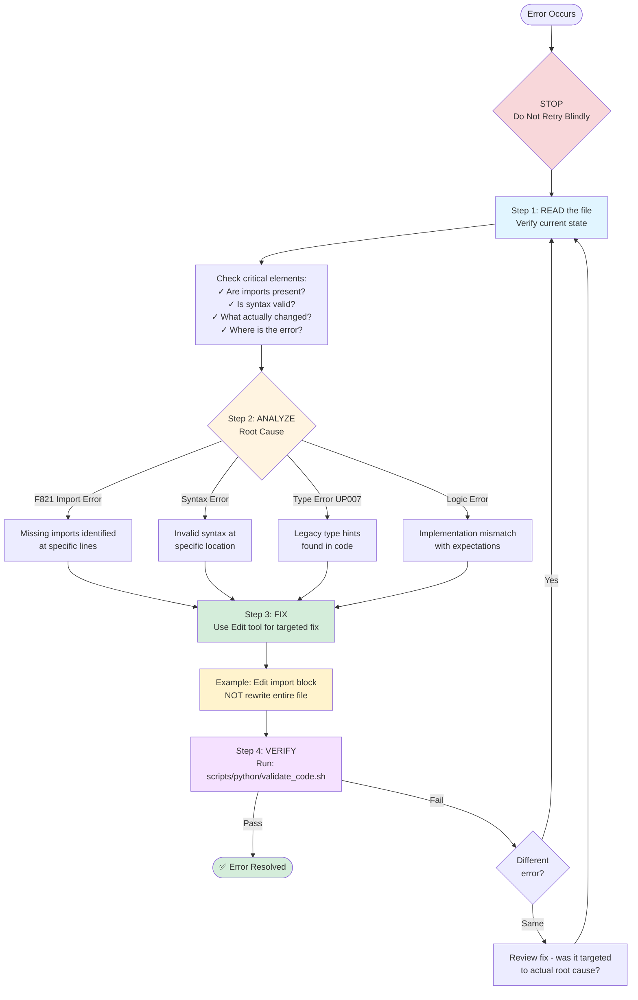

# Python Testing Strategy - src/pipe/core Layered Approach

## Purpose

This document defines a comprehensive testing strategy for each layer under `src/pipe/core`, outlining role definitions, factories, and available tools for automated test generation.

---

## Quick Start

### Running Tests

**CRITICAL**: This project uses `scripts/python/validate_code.sh` for validation and testing.

```bash
# ✅ Run validation and tests
scripts/python/validate_code.sh

# ✅ Run specific test file
scripts/python/validate_code.sh tests/unit/core/models/test_session.py

# ✅ Run with coverage
scripts/python/validate_code.sh --coverage

# ❌ Do NOT run pytest directly (may use wrong environment)
pytest
```

#### PYTHONPATH Configuration (Usually NOT Required)

Due to `--import-mode=importlib` in [pyproject.toml](../../../pyproject.toml), **PYTHONPATH is not needed** when running from project root. Only set it if you encounter import errors in special cases (CI/CD, legacy pytest < 6.0, or individual file runs).

### Test Execution Report Format

After completing test development and execution, you **MUST** include the following report at the end of your test summary:

- [ ] **Linter (Ruff/Format)**: (Pass/Fail - number of fixes applied)
- [ ] **Type Check (MyPy)**: (Pass/Fail)
- [ ] **Test Result (Pytest)**: (Pass/Fail - Passed: X, Failed: Y)
- [ ] **Coverage**: (XX%) - **Did we achieve the target (95%)?**

#### Example Report

```markdown
## Test Execution Report

- [x] **Linter (Ruff/Format)**: Pass - 3 formatting fixes applied
- [x] **Type Check (MyPy)**: Pass
- [x] **Test Result (Pytest)**: Pass - Passed: 47, Failed: 0
- [x] **Coverage**: 96.2% - **Target (95%) achieved ✓**
```

---

## Principles

### Layer Structure and Testing Philosophy

In Python, the idea that "mocking all dependencies allows ignoring layer structure" is **incorrect**. Since the purpose and strategy of testing differ for each layer, tests must be designed with an understanding of each layer's responsibilities.

**Important**: The Repository layer is responsible for verifying "whether actual file operations work correctly," so it should basically be tested using real file I/O with `tmp_path`, etc. Mocking `open()` or `json.dump()` would prevent detection of actual bugs such as path generation errors or directory creation failures.

```
Models (Data Structures)
  ↓
Domains (Business Logic)
  ↓
Collections (Collection Operations)
  ↓
Repositories (Persistence Layer) ← Test with real file I/O
  ↓
Services (Use Cases/Orchestration)
  ↓
Tools (External Tool Integration)
```

### Python Import Error Resolution Protocol

**CRITICAL**: When encountering `ModuleNotFoundError` or `ImportError`, you **MUST NEVER** manipulate `sys.path` (append, insert) within source code. Code must be environment-independent.

#### Resolution Steps (In Order)

Follow these steps strictly when import errors occur. Do NOT apply quick fixes without investigation:



**Key Examples**:

```python
# ✅ CORRECT - Found in existing tests/unit/core/services/test_session_service.py
from tests.factories.models import SessionFactory, SettingsFactory

# ❌ WRONG - Trying to use sys.path manipulation
import sys
sys.path.append(str(Path(__file__).parent.parent.parent))
from tests.factories.models import SessionFactory
```

```bash
# ✅ CORRECT - Run from project root
cd /path/to/project/root
scripts/python/validate_code.sh tests/unit/core/models/test_session.py
```

#### Prohibited Patterns

**❌ NEVER DO THIS:**

```python
# ❌ Manipulating sys.path in test files
import sys
from pathlib import Path
sys.path.append(str(Path(__file__).parent.parent))
sys.path.insert(0, str(Path(__file__).parent.parent.parent))

# ❌ Manipulating sys.path in production code
import sys
import os
sys.path.append(os.path.dirname(__file__))
```

**Why this is prohibited:**

- Makes code environment-dependent (breaks in CI/CD, different machines)
- Hides structural problems in the project
- Creates maintenance nightmares
- Violates Python packaging best practices

**✅ CORRECT APPROACH:**

See the flowchart above for the complete resolution workflow.

### Test Generation Quality Standards

When generating tests, the following quality standards must be strictly followed to ensure test code quality and maintainability.

#### Required Elements

1. **Docstrings**: Every test class and test method must have clear docstrings describing their purpose

   ```python
   class TestSessionModel:
       """Session model validation and serialization tests."""

       def test_valid_session_creation(self):
           """Test creating a valid session with all required fields."""
   ```

2. **Fixtures**: Extract common setup logic into pytest fixtures. Service layer fixtures MUST create new instances for each test to prevent state leakage

   ```python
   @pytest.fixture
   def service(mock_repository, mock_settings):
       """Create a SessionService instance.

       IMPORTANT: Creates new instance per test to prevent state leakage
       (current_session, etc.)
       """
       return SessionService(repository=mock_repository, settings=mock_settings)
   ```

3. **Clear Assertions**: Use specific and meaningful assertions with descriptive failure messages

   ```python
   # Good
   assert session.session_id == "test-123"
   assert len(sessions) == 5

   # Bad
   assert session  # Unclear what is being tested
   assert result   # Too vague
   ```

4. **Edge Case Coverage**: Test both normal cases and edge cases (empty collections, boundary values, null values, etc.)

   ```python
   def test_empty_collection(self):
       """Test behavior with empty collection."""

   def test_index_out_of_range(self):
       """Test that out-of-range index raises IndexError."""
   ```

5. **Factory Usage**: Always use `tests/factories` for test data generation instead of creating models inline

   ```python
   # Good
   session = SessionFactory.create(purpose="Custom purpose")

   # Bad
   session = Session(
       session_id="test-123",
       created_at="2025-01-01T00:00:00+09:00",
       purpose="Custom purpose",
       # ... many fields
   )
   ```

6. **Immutability Verification**: For Domain layer functions, verify that original data is not modified

   ```python
   def test_domain_function_does_not_mutate_original(self):
       """Test that domain function preserves immutability."""
       original_copy = original.model_copy(deep=True)
       result = domain_function(original)
       assert original == original_copy  # Original unchanged
   ```

7. **Security Testing**: For Tools layer, include tests for command injection, path traversal, and other security vulnerabilities
   ```python
   @pytest.mark.security
   def test_command_injection_prevention(self):
       """Test that command injection attempts are blocked."""
       dangerous_commands = ["echo hello; rm -rf /", "cat /etc/passwd"]
       for cmd in dangerous_commands:
           with pytest.raises((ValueError, SecurityError)):
               run_shell_command(command=cmd)
   ```

#### Prohibited Items

- ❌ **No real file I/O** (except Repository layer which uses `tmp_path`)
- ❌ **No actual external API requests** (use mocks or fixtures)
- ❌ **No hardcoded paths** (use `tmp_path`, `tempfile`, or fixtures)
- ❌ **No test dependencies** (each test must run independently)
- ❌ **No unclear assertions** (avoid `assert result` without context)
- ❌ **No state leakage** between tests (use fixtures with proper scope)
- ❌ **No unnecessary mocks** for pure functions (Models/Domains/Collections)
- ❌ **No unrestored global state changes** (see "Global State Management" in Advanced Topics)
- ❌ **No invalid escape sequences** in string literals (see "String Escape Sequences" in Advanced Topics)
- ❌ **No over-mocking of infrastructure** (see "Mock Complexity vs Real Implementation" in Advanced Topics)
- ❌ **No imports from non-existent modules** (see "Import Verification" in Advanced Topics)

---

## Test Factory Design

### Factory Pattern

Factories are provided to eliminate duplication in test data generation and improve maintainability.

```python
# tests/factories/models/__init__.py
"""Test data factories for unit tests."""

from .session_factory import SessionFactory
from .turn_factory import TurnFactory
from .settings_factory import SettingsFactory

__all__ = [
    "SessionFactory",
    "TurnFactory",
    "SettingsFactory",
]
```

```python
# tests/factories/models/session_factory.py
"""Factory for creating Session test fixtures."""

from typing import Optional
from pipe.core.models.session import Session
from pipe.core.models.hyperparameters import Hyperparameters
from pipe.core.collections.turns import TurnCollection


class SessionFactory:
    """Factory class for creating Session objects in tests."""

    @staticmethod
    def create(
        session_id: str = "test-session-123",
        created_at: str = "2025-01-01T00:00:00+09:00",
        purpose: Optional[str] = "Test session purpose",
        background: Optional[str] = "Test background",
        roles: Optional[list[str]] = None,
        multi_step_reasoning_enabled: bool = False,
        **kwargs
    ) -> Session:
        """Create a Session object with default test values.

        Args:
            session_id: Session ID (default: "test-session-123")
            created_at: Creation timestamp (default: "2025-01-01T00:00:00+09:00")
            purpose: Session purpose
            background: Session background
            roles: List of roles
            multi_step_reasoning_enabled: Enable multi-step reasoning
            **kwargs: Additional fields to override

        Returns:
            Session object
        """
        return Session(
            session_id=session_id,
            created_at=created_at,
            purpose=purpose,
            background=background,
            roles=roles or [],
            multi_step_reasoning_enabled=multi_step_reasoning_enabled,
            **kwargs
        )

    @staticmethod
    def create_batch(count: int, **kwargs) -> list[Session]:
        """Create multiple Session objects.

        Args:
            count: Number of sessions to create
            **kwargs: Arguments passed to create()

        Returns:
            List of Session objects
        """
        return [
            SessionFactory.create(
                session_id=f"test-session-{i}",
                **kwargs
            )
            for i in range(count)
        ]

    @staticmethod
    def create_with_turns(turn_count: int = 3, **kwargs) -> Session:
        """Create a Session with predefined turns.

        Args:
            turn_count: Number of turns to create
            **kwargs: Arguments passed to create()

        Returns:
            Session object with turns
        """
        from .turn_factory import TurnFactory

        turns = TurnFactory.create_batch(turn_count)
        return SessionFactory.create(turns=TurnCollection(turns), **kwargs)


# tests/factories/models/turn_factory.py
"""Factory for creating Turn test fixtures."""

from pipe.core.models.turn import (
    UserTaskTurn,
    ModelResponseTurn,
    FunctionCallingTurn,
)


class TurnFactory:
    """Factory class for creating Turn objects in tests."""

    @staticmethod
    def create_user_task(
        instruction: str = "Test instruction",
        timestamp: str = "2025-01-01T00:00:00+09:00",
        **kwargs
    ) -> UserTaskTurn:
        """Create a UserTaskTurn object."""
        return UserTaskTurn(
            type="user_task",
            instruction=instruction,
            timestamp=timestamp,
            **kwargs
        )

    @staticmethod
    def create_model_response(
        content: str = "Test response",
        timestamp: str = "2025-01-01T00:01:00+09:00",
        **kwargs
    ) -> ModelResponseTurn:
        """Create a ModelResponseTurn object."""
        return ModelResponseTurn(
            type="model_response",
            content=content,
            timestamp=timestamp,
            **kwargs
        )

    @staticmethod
    def create_batch(count: int, alternate: bool = True) -> list:
        """Create multiple Turn objects.

        Args:
            count: Number of turns to create
            alternate: If True, alternate between user_task and model_response

        Returns:
            List of Turn objects
        """
        turns = []
        for i in range(count):
            if alternate and i % 2 == 0:
                turns.append(TurnFactory.create_user_task(instruction=f"Instruction {i}"))
            else:
                turns.append(TurnFactory.create_model_response(content=f"Response {i}"))
        return turns


# tests/factories/models/settings_factory.py
"""Factory for creating Settings test fixtures."""

from unittest.mock import Mock
from pipe.core.models.settings import Settings


class SettingsFactory:
    """Factory class for creating Settings objects in tests."""

    @staticmethod
    def create_mock(
        timezone: str = "Asia/Tokyo",
        sessions_path: str = ".sessions",
        reference_ttl: int = 3,
        **kwargs
    ) -> Mock:
        """Create a mock Settings object for testing.

        Args:
            timezone: Timezone string
            sessions_path: Path to sessions directory
            reference_ttl: Reference time-to-live
            **kwargs: Additional attributes

        Returns:
            Mock Settings object
        """
        settings = Mock(spec=Settings)
        settings.timezone = timezone
        settings.sessions_path = sessions_path
        settings.reference_ttl = reference_ttl

        for key, value in kwargs.items():
            setattr(settings, key, value)

        return settings
```

### Usage Example

```python
# tests/unit/core/services/test_session_service.py
from tests.factories.models import SessionFactory, SettingsFactory


def test_example_with_factories():
    """Example test using factories."""
    # Concisely generate test data
    session = SessionFactory.create(purpose="Custom purpose")
    sessions = SessionFactory.create_batch(5)
    settings = SettingsFactory.create_mock(timezone="UTC")

    # Test logic
    assert session.purpose == "Custom purpose"
    assert len(sessions) == 5
```

### Factory Best Practices

When using factories to generate test data, follow these best practices to ensure maintainable and reliable tests.

#### Using exclude_none with Factory Models

**CRITICAL**: When comparing factory-generated models with dictionaries using `model_dump()`, **ALWAYS use `exclude_none=True`** to avoid assertion failures. See the [Pydantic V2 Compatibility](#pydantic-v2-compatibility) section for detailed explanation and examples of this pattern.

**Quick Reference:**

```python
# ✅ CORRECT - Use exclude_none=True when comparing with minimal dicts
assert turn.model_dump(by_alias=True, exclude_none=True) == expected_dict

# ❌ WRONG - Assertion fails due to None fields
assert turn.model_dump(by_alias=True) == expected_dict
```

---

## pytest Configuration and Best Practices

### pytest.ini Settings

```ini
# pytest.ini
[pytest]
testpaths = tests
python_files = test_*.py
python_classes = Test*
python_functions = test_*
addopts =
    --verbose
    --strict-markers
    --cov=src/pipe/core
    --cov-report=term-missing
    --cov-report=html
    --cov-fail-under=90
markers =
    unit: Unit tests (no external dependencies)
    integration: Integration tests (may use real files/databases)
    slow: Slow tests (skipped by default)
    security: Security-related tests (command injection, etc.)
```

**Coverage Goals**:

- **Core Layer (models, domains, repositories, services)**: 95% or higher
- **Tools Layer**: 80% or higher (due to many external dependencies)
- **Overall**: 90% or higher (enforced by `--cov-fail-under=90`)

### Shared Fixtures

```python
# tests/conftest.py
"""Shared pytest fixtures."""

import pytest
import tempfile
import shutil
from pathlib import Path


@pytest.fixture
def temp_project_root():
    """Create a temporary project root directory."""
    temp_dir = tempfile.mkdtemp()
    yield temp_dir
    shutil.rmtree(temp_dir)


@pytest.fixture
def temp_sessions_dir(temp_project_root):
    """Create a temporary sessions directory."""
    sessions_dir = Path(temp_project_root) / ".sessions"
    sessions_dir.mkdir(parents=True, exist_ok=True)
    return str(sessions_dir)
```

### Using MCP Tools for Test Development

For larger or complex test suites, leverage MCP (Model Context Protocol) tools to improve efficiency:

- **`py_test_strategist`**: Analyze production code and generate comprehensive test strategies

  - Use when: Planning tests for complex modules or entire layers
  - Example: Generating test plan for a new Service class

- **`py_dependency_tree`**: Visualize module dependencies and identify test requirements

  - Use when: Understanding what needs to be mocked or which modules to test first
  - Example: Mapping dependencies before writing Repository tests

**Guideline**: Use these tools proactively for non-trivial test generation tasks. For small, straightforward tests (single function, simple model), manual generation is sufficient.

---

## Tool-Specific Guidelines

This section consolidates all tool-specific rules, best practices, and critical requirements for Ruff, MyPy, and PyTest.

### 6.1. Ruff Guidelines

#### Type Annotation Rules (UP007)

**CRITICAL**: This project enforces Python 3.10+ type hint syntax. Using legacy `Optional[T]` or `Union[T, None]` will cause linter failures.

**❌ WRONG - Legacy syntax causes Ruff UP007 error:**

```python
from typing import Optional, Union

# ❌ WRONG - Legacy syntax
def foo(param: Optional[str]) -> Union[int, None]:
    pass
```

**✅ CORRECT - Use Python 3.10+ union syntax:**

```python
# ✅ CORRECT - Modern syntax
def foo(param: str | None) -> int | None:
    pass
```

#### noqa Comments are PROHIBITED for Fixable Issues

**CRITICAL RULE**: Using `noqa` to suppress fixable errors is **ABSOLUTELY FORBIDDEN** unless explicitly approved by the user for documented compatibility reasons.

```python
# ❌ ABSOLUTELY FORBIDDEN - Suppressing fixable errors
def foo(param: Optional[str]) -> Union[int, None]:  # noqa: UP007
    pass
```

**Why `noqa` is Prohibited**:

- Linter warnings exist to **enforce code quality**, not to be hidden
- `UP007` violations are **trivially fixable** by converting syntax
- Using `noqa` indicates **unwillingness to follow project standards**
- Quality gates will **reject suppressed warnings** as technical debt

**The Only Acceptable Approach**:

```python
# ✅ Fix the code, don't suppress the warning
def foo(param: str | None) -> int | None:  # Modern syntax
    pass
```

**Extremely Rare Exception** (requires explicit user approval):

```python
# ⚠️ Only if there's a verified false positive AND user approves
# Example: External library compatibility issue confirmed with user
def legacy_api_wrapper(param: Optional[str]):  # noqa: UP007 - Required for lib v1.2.3
    pass
```

#### String Escape Sequences

**CRITICAL**: When writing string literals that contain backslashes or special characters, you **MUST** use proper escape sequences to avoid `SyntaxError`.

**DEFAULT RULE**: When in doubt, **ALWAYS use raw strings (`r"..."`)** for any string containing backslashes. This eliminates most escape sequence errors and improves code readability.

##### Common Pitfalls

**❌ BAD - Invalid unicode escape sequence:**

```python
def test_unicode_not_escaped(self):
    """Test that unicode sequences are not escaped."""
    result = '{"name": "田中"}'
    assert "\u" not in result  # ❌ SyntaxError: invalid escape sequence '\u'
```

**✅ GOOD - Use raw string (ALWAYS PREFERRED):**

```python
def test_unicode_not_escaped(self):
    """Test that unicode sequences are not escaped."""
    result = '{"name": "田中"}'

    # ✅ PREFERRED: Raw string (eliminates escape sequence errors)
    assert r"\u" not in result

    # ✅ Also correct but less readable: Escaped backslash
    assert "\\u" not in result
```

**WHY RAW STRINGS ARE CRITICAL:**

- **Error Prevention**: Raw strings (`r"..."`) treat backslashes as literal characters, eliminating 90% of escape sequence errors
- **Readability**: `r"\u"` is clearer than `"\\u"` - what you see is what you get
- **Maintainability**: Future modifications won't accidentally break escape sequences
- **Consistency**: Using raw strings consistently reduces cognitive load

##### Escape Sequence Rules

1. **Backslash literals**: **ALWAYS prefer raw strings `r"..."` over escaped backslashes**

   ```python
   # ✅ PREFERRED: Raw string (clear and error-free)
   assert r"\n" not in text      # Looking for literal \n string

   # ✅ Also correct but less readable: Escaped backslash
   assert "\\n" not in text      # Same as above, but requires mental parsing

   # ❌ WRONG: Missing escape or raw string prefix
   assert "\n" not in text       # This checks for newline character, not \n string
   ```

2. **Unicode escape sequences**: **Use raw strings for literal backslash-u, or complete `\uXXXX` for actual unicode**

   ```python
   # ✅ PREFERRED: Raw string for literal \u checking
   assert r"\u" not in text           # Looking for literal \u characters
   assert r"\u0041" in raw_text       # Looking for literal string \u0041

   # ✅ Valid unicode escape (intentional unicode character)
   assert "\u0041" == "A"             # Actually means unicode character U+0041

   # ✅ Also correct but less clear: Escaped backslash
   assert "\\u0041" in raw_text       # Same as r"\u0041" but harder to read

   # ❌ WRONG: Incomplete escape sequences
   assert "\u" not in text            # SyntaxError: incomplete escape '\u'
   assert "\u041" == "A"              # SyntaxError: needs exactly 4 hex digits
   ```

3. **Regex patterns**: **ALWAYS use raw strings - this is the standard convention**

   ```python
   # ✅ PREFERRED: Raw string (standard for regex)
   pattern = r"\d+"              # Regex for digits
   pattern = r"\.txt$"           # Regex for .txt extension
   pattern = r"\w+@\w+\.\w+"     # Email pattern

   # ❌ WRONG: Escaped backslashes (hard to read and error-prone)
   pattern = "\\d+"              # Requires mental parsing
   pattern = "\\.txt$"           # Easy to make mistakes
   pattern = "\\w+@\\w+\\.\\w+"  # Unreadable!
   ```

4. **Windows paths**: **Prefer raw strings or use forward slashes (cross-platform)**

   ```python
   # ✅ PREFERRED: Raw string (preserves backslashes)
   path = r"C:\Users\Documents"

   # ✅ Also good: Forward slashes (works on Windows too)
   path = "C:/Users/Documents"

   # ❌ WRONG: Unescaped backslashes
   path = "C:\Users\Documents"   # \U is invalid escape sequence
   path = "C:\test\new"          # \t and \n become tab and newline!
   ```

##### Verification Decision Tree

Follow this order when writing strings with backslashes:

1. **Does the string contain ANY backslash?**

   - YES → **Use raw string `r"..."` by default** (safest choice)
   - NO → Regular string is fine

2. **Is this a regex pattern?**

   - YES → **MUST use raw string `r"..."` (convention)**
   - NO → Continue to step 3

3. **Are you intentionally using escape sequences (`\n`, `\t`, `\uXXXX`)?**

   - YES → Regular string with valid escapes (verify completeness!)
   - NO → **Use raw string `r"..."`**

4. **Still unsure?**
   - **Default to raw string `r"..."`** - it's almost always the right choice

**VERIFICATION CHECKLIST:**

- ✅ If you wrote `"\u"` or `"\x"` or `"\N"` → **Change to `r"\u"` or `r"\x"` or `r"\N"`**
- ✅ If you wrote `"\\something"` → **Consider changing to `r"\something"`** (simpler)
- ✅ For regex: **ALWAYS use `r"..."`**, no exceptions
- ✅ After ANY string edit: Run validation to catch syntax errors immediately

**IMPORTANT**: Black will fail on invalid escape sequences before they reach the Quality Gate. Use it as your first line of defense.

### 6.2. MyPy Guidelines

#### mock_open Type Issues

**CRITICAL**: `unittest.mock.mock_open()` is the ONLY correct way to mock file operations. DO NOT use `MagicMock` or other approaches.

##### The ONLY Correct Pattern

**✅ CORRECT - Use mock_open (context manager):**

```python
from unittest.mock import mock_open, patch

def test_save_file_context_manager():
    """Test file writing with context manager (with open(...) as f:)."""
    m = mock_open()

    with patch("builtins.open", m):
        save_to_file("/path/to/file.json", {"key": "value"})

    # Access the file handle from context manager
    handle = m()
    written_content = handle.write.call_args[0][0]

    data = json.loads(written_content)
    assert data["key"] == "value"
```

**✅ CORRECT - For json.dump() (multiple write calls):**

```python
from unittest.mock import mock_open, patch

def test_save_json_dump():
    """Test json.dump() which calls write() multiple times."""
    m = mock_open()

    with patch("builtins.open", m):
        # Production code: with open(path, 'w') as f: json.dump(data, f)
        save_to_file("/path/to/file.json", {"key": "value"})

    # json.dump() calls write() multiple times, so join all calls
    handle = m()
    written_content = "".join(call.args[0] for call in handle.write.call_args_list)

    data = json.loads(written_content)
    assert data["key"] == "value"
```

**✅ CORRECT - Decorator style:**

```python
from unittest.mock import mock_open, patch

@patch("builtins.open", new_callable=mock_open)
def test_save_file_decorator(mock_file):
    """Test with decorator - equivalent to above."""
    save_to_file("/path/to/file.json", {"key": "value"})

    handle = mock_file()
    written_content = "".join(call.args[0] for call in handle.write.call_args_list)

    data = json.loads(written_content)
    assert data["key"] == "value"
```

##### Common Failure Patterns

**❌ WRONG - Using MagicMock:**

```python
@patch("builtins.open", new_callable=MagicMock)  # ❌ WRONG
def test_save_file(mock_open):
    save_to_file("/path/to/file.json", {"key": "value"})

    handle = mock_open.return_value.__enter__.return_value
    written_content = handle.write.call_args[0][0]
    # This FAILS because MagicMock doesn't simulate file behavior
    # write() is never actually called
```

**❌ WRONG - Double patching:**

```python
@patch("builtins.open", mock_open())  # Already patched here
def test_save_file():
    m = mock_open()
    with patch("builtins.open", m):  # ❌ WRONG - patching again
        save_to_file(...)
```

**❌ WRONG - Calling mock_open() to get handle:**

```python
def test_save_file():
    m = mock_open()
    with patch("builtins.open", m):
        save_to_file(...)

    handle = mock_open()  # ❌ WRONG - creates NEW mock, not the one used
    written_content = handle.write.call_args[0][0]  # None - was never called
```

##### How mock_open() Works

When you call `m = mock_open()` and patch with it:

1. Production code calls `open()` → returns `m.return_value.__enter__.return_value` (for context manager)
2. To access the file handle that was actually used: call `m()` → returns the same object
3. Check `m().write.call_args_list` to see what was written

**Key insight**: `m()` is shorthand for accessing the context manager's file handle.

##### Common Pitfalls

**Pitfall 1: Only checking first write() call**

```python
# ❌ WRONG - json.dump() calls write() multiple times
handle = m()
written_content = handle.write.call_args[0][0]  # Only gets LAST write
data = json.loads(written_content)  # JSONDecodeError - incomplete JSON

# ✅ CORRECT - Join ALL write calls
written_content = "".join(call.args[0] for call in handle.write.call_args_list)
data = json.loads(written_content)  # Works correctly
```

**Pitfall 2: Not understanding call_args vs call_args_list**

```python
# call_args: Only the LAST call (or None if never called)
# call_args_list: ALL calls as a list

# For single write:
written = handle.write.call_args[0][0]

# For multiple writes (json.dump, multiple f.write calls):
written = "".join(call.args[0] for call in handle.write.call_args_list)
```

**Pitfall 3: Creating production code doesn't match expectations**

```python
# Always read production code FIRST to understand behavior:
# - open(path, "w").write(...) → use return_value
# - with open(path, "w") as f: f.write(...) → use return_value.__enter__.return_value
```

##### Verification Checklist

Before writing file I/O tests:

- [ ] **Read production code** - How is `open()` called? (with/without context manager)
- [ ] **Choose correct path** - `return_value` or `return_value.__enter__.return_value`
- [ ] **Verify the mock was called** - `mock_open.assert_called_once_with(path, mode)`
- [ ] **Access via correct handle** - Don't call `mock_open()` again
- [ ] **Test actual content** - Parse and validate written data

##### Summary

**Golden Rule**: **Never call `mock_open()` to access the file handle. Use `mock_open.return_value` or `mock_open.return_value.__enter__.return_value` depending on context manager usage.**

- ✅ **DO**: Read production code to understand how `open()` is called
- ✅ **DO**: Use `mock_open.return_value` for non-context manager usage
- ✅ **DO**: Use `mock_open.return_value.__enter__.return_value` for context managers
- ✅ **DO**: Verify `mock_open.assert_called_once_with(expected_path, expected_mode)`
- ❌ **DON'T**: Call `mock_open()` thinking it returns the used file handle
- ❌ **DON'T**: Assume the pattern without checking production code

#### MyPy Type Checking Limitations with MagicMock (attr-defined)

**CRITICAL**: MyPy's static type checker **cannot recognize** `return_value` assignments on `MagicMock` special methods (dunder methods like `__str__`, `__repr__`, etc.). This causes `attr-defined` errors even though the code is correct and works at runtime.

**Root Cause:**

- MyPy interprets special methods like `__str__` as their actual type: `Callable[[], str]`
- Standard Python methods/functions do not have a `return_value` attribute
- `MagicMock` allows dynamic attribute assignment to special methods at runtime, but MyPy cannot verify this statically

**Example MyPy Error:**

```python
# This code works at runtime but fails MyPy validation
mock_path = MagicMock()
mock_path.__str__.return_value = "/mock/path"
# ❌ MyPy error: "Callable[[], str]" has no attribute "return_value"  [attr-defined]
```

**Solutions:**

**✅ Solution 1: Use `type: ignore[attr-defined]` (PREFERRED for special methods)**

```python
mock_path = MagicMock()
mock_path.__str__.return_value = "/mock/path"  # type: ignore[attr-defined]
# ✅ MyPy suppression is acceptable here - runtime behavior is correct
```

**✅ Solution 2: Mock the return value via side_effect**

```python
mock_path = MagicMock()
mock_path.__str__ = MagicMock(return_value="/mock/path")
# ✅ Creates a new MagicMock for __str__ - MyPy recognizes this pattern
```

**✅ Solution 3: Configure mock via spec and return_value on the object**

```python
# For simple cases, set return_value on the mock object itself
mock_path = MagicMock(return_value=Path("/mock/path"))
str(mock_path.return_value)  # Returns the string representation of Path object
# ✅ Works when you need the actual Path object behavior
```

**Guidelines:**

- **Prefer Solution 1** (`type: ignore[attr-defined]`) for special methods - it's the most concise and explicit
- Use Solution 2 when you need more control over the mock behavior
- Use Solution 3 when the mock should behave like the actual object type
- **NEVER** suppress `attr-defined` errors on non-special methods - those indicate real type issues

**Why `type: ignore` is acceptable here:**

- The error is a known MyPy limitation, not a code defect
- The code is correct and works at runtime
- The suppression is narrowly scoped to the specific line
- It documents the intentional use of MagicMock's dynamic behavior

#### Type Safety in Tests (Optional Type Handling)

**Problem**: MyPy errors like `Item "None" of "X | None" has no attribute "..."` occur when accessing attributes on potentially `None` values.

**Example of MyPy ERROR**:

```python
# ❌ WRONG - MyPy cannot verify non-None
config = some_function()  # Returns Config | None
result = config.some_attribute  # Error: Item "None" has no attribute "some_attribute"
```

**Root Cause**:

- External libraries or functions return `Optional` types (`X | None`)
- MyPy static analysis cannot guarantee the value is not `None`
- Accessing attributes without verification triggers type checking errors

**Solution: Use Type Guards**

Type guards inform MyPy that a value is guaranteed to be non-None:

```python
# ✅ CORRECT - Type guard ensures non-None
config = some_function()  # Returns Config | None
assert config is not None  # Type guard - tells MyPy it's Config, not None
result = config.some_attribute  # OK - MyPy knows it's Config
```

**In Test Context**:

```python
def test_configuration_loading():
    # Load config that might return None
    config = load_config("test.yaml")  # Returns Config | None

    # ❌ WRONG - MyPy error
    assert config.database_url == "postgres://..."  # Error!

    # ✅ CORRECT - Type guard first
    assert config is not None  # Type guard
    assert config.database_url == "postgres://..."  # OK
```

**Alternative: Direct None Check in Assertion**

```python
# ✅ ALSO CORRECT - Combined check
config = load_config("test.yaml")
assert config is not None and config.database_url == "postgres://..."
```

**Key Takeaway**: Always use `assert value is not None` type guards before accessing attributes on `Optional` types. This satisfies both MyPy and provides runtime validation in tests.

### 6.3. PyTest Best Practices

#### Mock vs. Patch: Critical Patterns

**CRITICAL**: Understanding the difference between `Mock` and `@patch` is essential for writing correct tests. Misusing these leads to tests that pass incorrectly or fail mysteriously.

##### Pattern 1: Testing Constructor Calls (Class Instantiation Verification)

When you want to verify that a class is instantiated with correct arguments, you **MUST** use `@patch` to replace the class itself:

**✅ CORRECT - Use `@patch` to verify constructor calls:**

```python
@patch("pipe.core.domains.gemini_api_payload.GeminiCacheManager")
def test_init_cache_manager(MockGeminiCacheManager, mock_client, tmp_path, mock_settings):
    """Test that GeminiCacheManager is instantiated with correct arguments."""
    # MockGeminiCacheManager replaces the CLASS itself
    GeminiApiPayload(
        client=mock_client,
        project_root=str(tmp_path),
        settings=mock_settings,
    )

    # ✅ Verify the class constructor was called
    MockGeminiCacheManager.assert_called_once_with(
        client=mock_client,
        project_root=str(tmp_path),
        model_name=mock_settings.model.name,
        cache_update_threshold=mock_settings.model.cache_update_threshold,
        prompt_factory=None,
        settings=mock_settings,
    )
```

**❌ WRONG - Using fixture without `@patch`:**

```python
def test_init_valid_settings(gemini_api_payload_instance):
    """Test initialization - WRONG APPROACH."""
    # ❌ cache_manager is a REAL GeminiCacheManager object, not a Mock!
    # This will raise: AttributeError: 'GeminiCacheManager' object has no attribute 'assert_called_once_with'
    gemini_api_payload_instance.cache_manager.assert_called_once_with(...)
```

**Why this fails:**

- Without `@patch`, the actual `GeminiCacheManager` class is instantiated
- `cache_manager` attribute contains a real object, not a Mock
- Real objects don't have `assert_called_once_with()` method

##### Pattern 2: Testing Method Behavior (Instance Method Mocking)

When you want to test behavior that calls methods on already-instantiated objects, use `MagicMock` or `patch.object`:

**✅ CORRECT - Mock instance methods:**

```python
def test_prepare_request(gemini_api_payload_instance, mock_session, mock_prompt_factory):
    """Test that prepare_request calls cache_manager.update_if_needed."""
    # Mock the return value of an instance method
    gemini_api_payload_instance.cache_manager.update_if_needed.return_value = (
        None, 0, []
    )

    contents, cache_name = gemini_api_payload_instance.prepare_request(
        session=mock_session,
        prompt_factory=mock_prompt_factory
    )

    # ✅ Verify the instance method was called
    gemini_api_payload_instance.cache_manager.update_if_needed.assert_called_once()
```

##### Decision Tree: Mock vs. Patch

```
What are you testing?
│
├─ "Was this CLASS instantiated with correct arguments?"
│  └─ Use @patch("module.ClassName") to replace the class
│     Example: @patch("pipe.core.domains.gemini_api_payload.GeminiCacheManager")
│
├─ "Does this METHOD get called with correct arguments?"
│  └─ Use .return_value on Mock or patch.object
│     Example: mock_instance.method.return_value = ...
│
└─ "Does this FUNCTION get called?"
   └─ Use @patch("module.function_name")
      Example: @patch("pipe.core.domains.gemini_token_count.count_tokens")
```

##### Common Mistakes

**Mistake 1: Trying to assert on real objects**

```python
# ❌ WRONG
def test_without_patch(instance):
    instance.real_object.assert_called_once()  # Real objects don't have this!

# ✅ CORRECT
@patch("module.RealClass")
def test_with_patch(MockClass):
    instance = SomeClass()
    MockClass.assert_called_once()
```

**Mistake 2: Patching in wrong location**

```python
# ❌ WRONG - Patching where class is defined
@patch("pipe.core.domains.gemini_cache_manager.GeminiCacheManager")

# ✅ CORRECT - Patching where class is imported and used
@patch("pipe.core.domains.gemini_api_payload.GeminiCacheManager")
```

#### Patching Imports: Module-Level vs Function-Level

**CRITICAL**: The patch path depends on **WHERE** the import statement is located, not where the module is defined.

##### Function-Level Imports (Inside Functions)

When code imports inside a function, patch the **module itself**, not the attribute:

**Production code with function-level import:**

```python
# In pipe/core/domains/gemini_api_payload.py
def prepare_request(self, session, prompt_factory):
    # Import INSIDE the function
    from pipe.core.domains import gemini_token_count

    tokenizer = gemini_token_count.create_local_tokenizer(self.settings.model.name)
    count = gemini_token_count.count_tokens(dynamic_json, tools=None, tokenizer=tokenizer)
```

**✅ CORRECT - Patch the module directly:**

```python
@patch("pipe.core.domains.gemini_token_count.create_local_tokenizer")
@patch("pipe.core.domains.gemini_token_count.count_tokens")
def test_prepare_request(mock_count_tokens, mock_create_tokenizer):
    """Test with function-level import - patch at module level."""
    # ✅ Patches the actual module functions
```

**❌ WRONG - Trying to patch as module attribute:**

```python
@patch("pipe.core.domains.gemini_api_payload.gemini_token_count.create_local_tokenizer")
@patch("pipe.core.domains.gemini_api_payload.gemini_token_count.count_tokens")
def test_prepare_request(mock_count_tokens, mock_create_tokenizer):
    """This will FAIL!"""
    # ❌ Error: module 'pipe.core.domains.gemini_api_payload' has no attribute 'gemini_token_count'
    # gemini_token_count is not a module-level attribute!
```

##### Special Case: Circular Import Avoidance

**CRITICAL**: When production code uses function-level imports to **avoid circular dependencies**, the import is NOT a module-level attribute and cannot be patched as such.

**Production code avoiding circular imports:**

```python
# In pipe/core/collections/turns.py
class TurnCollection:
    def get_turns_for_prompt(self, session):
        # Import INSIDE to avoid circular dependency
        from pipe.core.domains.turns import get_turns_for_prompt as domain_get_turns_for_prompt

        return domain_get_turns_for_prompt(session.turns, ...)
```

**Common Error - AttributeError:**

```python
# ❌ WRONG - Trying to patch as collection attribute
@patch("pipe.core.collections.turns.domain_get_turns_for_prompt")
def test_get_turns_for_prompt(mock_domain_func):
    """This FAILS with AttributeError!"""
    # AttributeError: <module 'pipe.core.collections.turns'> does not have the attribute 'domain_get_turns_for_prompt'
    # The import is INSIDE the method, not at module level!
```

**✅ CORRECT - Patch the source module:**

```python
@patch("pipe.core.domains.turns.get_turns_for_prompt")
def test_get_turns_for_prompt(mock_domain_func):
    """Patch at the source module where the function is defined."""
    mock_domain_func.return_value = [...]

    collection = TurnCollection(...)
    result = collection.get_turns_for_prompt(session)

    # ✅ This works because we patch where the function is IMPORTED FROM
    mock_domain_func.assert_called_once()
```

**Why this works:**

- Function-level imports execute when the method runs
- The import fetches from `pipe.core.domains.turns`
- Patching the source module intercepts the import
- The local alias (`domain_get_turns_for_prompt`) uses the patched version

**Debugging steps:**

1. Read the production code to identify function-level imports
2. Look for `from X import Y` inside methods (not at module top)
3. Patch at the source (`X.Y`), not where it's used
4. If you see `AttributeError: module 'X' does not have attribute 'Y'`, it's likely a function-level import

##### Module-Level Imports (At Top of File)

When code imports at module level, patch where it's **used**, not where it's defined:

**Production code with module-level import:**

```python
# In pipe/core/domains/gemini_api_payload.py
from pipe.core.domains import gemini_token_count  # ← Module-level import

class GeminiApiPayload:
    def prepare_request(self, session):
        count = gemini_token_count.count_tokens(...)  # Uses the imported module
```

**✅ CORRECT - Patch where it's imported:**

```python
@patch("pipe.core.domains.gemini_api_payload.gemini_token_count.count_tokens")
def test_prepare_request(mock_count_tokens):
    """Patch where gemini_token_count is used."""
    # ✅ This works because gemini_token_count exists at module level
```

##### Quick Reference Table

| Import Location | Import Statement                                   | Correct Patch Path                                                               |
| --------------- | -------------------------------------------------- | -------------------------------------------------------------------------------- |
| Function-level  | `from pipe.core.domains import gemini_token_count` | `@patch("pipe.core.domains.gemini_token_count.count_tokens")`                    |
| Module-level    | `from pipe.core.domains import gemini_token_count` | `@patch("pipe.core.domains.gemini_api_payload.gemini_token_count.count_tokens")` |
| Function-level  | `import pipe.core.domains.gemini_token_count`      | `@patch("pipe.core.domains.gemini_token_count.count_tokens")`                    |
| Module-level    | `import pipe.core.domains.gemini_token_count`      | `@patch("pipe.core.domains.gemini_api_payload.gemini_token_count.count_tokens")` |

##### Verification Steps

**Before writing a `@patch` decorator:**

1. **Find the import statement** in the production code

   ```bash
   # Read the file being tested
   Read: src/pipe/core/domains/gemini_api_payload.py
   ```

2. **Check if import is module-level or function-level**

   ```python
   # Module-level: at top of file
   from pipe.core.domains import gemini_token_count

   # Function-level: inside a function/method
   def prepare_request(self):
       from pipe.core.domains import gemini_token_count
   ```

3. **Choose correct patch path**

   - Function-level → Patch the module directly: `pipe.core.domains.gemini_token_count.func`
   - Module-level → Patch where used: `pipe.core.domains.gemini_api_payload.gemini_token_count.func`

4. **Verify with error message**
   - If you see `module 'X' has no attribute 'Y'`, the import is likely function-level
   - Switch to patching the module directly

##### TYPE_CHECKING Imports: Special Handling Required

**CRITICAL**: When production code uses `TYPE_CHECKING` guards for imports, those imports **DO NOT exist at runtime**. This requires special handling in tests.

**Understanding TYPE_CHECKING:**

```python
from typing import TYPE_CHECKING

if TYPE_CHECKING:
    from google.genai.local_tokenizer import LocalTokenizer  # ← Only exists during type checking!
```

- `TYPE_CHECKING` is `True` during static type analysis (MyPy)
- `TYPE_CHECKING` is `False` at runtime (when tests run)
- **Result**: `LocalTokenizer` is NOT a module attribute at runtime

**❌ WRONG - Patching TYPE_CHECKING imports:**

```python
# Production code (gemini_token_count.py)
from typing import TYPE_CHECKING

if TYPE_CHECKING:
    from google.genai.local_tokenizer import LocalTokenizer

def create_local_tokenizer(model_name: str) -> LocalTokenizer | None:
    try:
        from google.genai.local_tokenizer import LocalTokenizer  # ← Function-level import!
        return LocalTokenizer(model_name=model_name)
    except ImportError:
        return None

# ❌ WRONG TEST - Trying to patch module-level attribute
@patch("pipe.core.domains.gemini_token_count.LocalTokenizer")
def test_create_local_tokenizer(MockLocalTokenizer):
    """This FAILS with AttributeError!"""
    # AttributeError: module 'pipe.core.domains.gemini_token_count' has no attribute 'LocalTokenizer'
    # Because LocalTokenizer only exists in TYPE_CHECKING block!
```

**✅ CORRECT - Patch where it's actually imported (function-level):**

```python
@patch("google.genai.local_tokenizer.LocalTokenizer")
def test_create_local_tokenizer(MockLocalTokenizer):
    """Patch at the source module, not the TYPE_CHECKING import."""
    # ✅ This works because we're patching where the function imports it from
    MockLocalTokenizer.return_value = MagicMock()

    result = create_local_tokenizer("gemini-1.5-flash")

    assert result == MockLocalTokenizer.return_value
    MockLocalTokenizer.assert_called_once_with(model_name="gemini-1.5-flash")
```

**Why this works:**

- The function imports `LocalTokenizer` from `google.genai.local_tokenizer` at runtime
- We patch the actual source (`google.genai.local_tokenizer.LocalTokenizer`)
- Not the TYPE_CHECKING import that doesn't exist at runtime

**Identification Checklist:**

Before writing a `@patch` for any import, check:

1. **Read the production code** - Look for `if TYPE_CHECKING:` blocks
2. **Identify TYPE_CHECKING imports** - These are type hints only, not runtime attributes
3. **Find actual runtime imports** - Usually inside functions (after the TYPE_CHECKING block)
4. **Patch the runtime import location** - Not the module-level TYPE_CHECKING import

**Common Error Patterns:**

```python
# Error message indicating TYPE_CHECKING issue:
# AttributeError: <module 'pipe.core.domains.gemini_token_count'> does not have the attribute 'LocalTokenizer'

# ✅ SOLUTION: Patch the source module, not the module using TYPE_CHECKING
@patch("google.genai.local_tokenizer.LocalTokenizer")  # Source
# NOT:
@patch("pipe.core.domains.gemini_token_count.LocalTokenizer")  # TYPE_CHECKING import
```

**Alternative Solution - Mock the function-level import:**

When a function does dynamic imports, you can also patch the function-level import directly:

```python
def test_create_local_tokenizer_import_error():
    """Test handling of ImportError when LocalTokenizer is unavailable."""
    # Patch the import at the source to raise ImportError
    with patch("google.genai.local_tokenizer.LocalTokenizer", side_effect=ImportError):
        result = create_local_tokenizer("gemini-1.5-flash")
        assert result is None
```

**Summary: TYPE_CHECKING Import Rules**

- ✅ **DO**: Identify TYPE_CHECKING blocks in production code before writing tests
- ✅ **DO**: Patch imports at their source module (e.g., `google.genai.local_tokenizer.LocalTokenizer`)
- ✅ **DO**: Look for function-level imports after TYPE_CHECKING blocks
- ❌ **DON'T**: Patch module attributes that only exist in TYPE_CHECKING blocks
- ❌ **DON'T**: Assume all module-level imports are available at runtime

#### TypedDict Attribute Access

**CRITICAL**: `TypedDict` creates **dict objects**, not classes with attributes. Attempting attribute access will cause `AttributeError`.

##### Understanding TypedDict

```python
# Definition (looks like a class)
from typing import TypedDict

class TokenCountSummary(TypedDict):
    cached_tokens: int
    current_prompt_tokens: int
    buffered_tokens: int

# But creates a dict at runtime!
summary = TokenCountSummary(
    cached_tokens=100,
    current_prompt_tokens=200,
    buffered_tokens=50
)

type(summary)  # <class 'dict'> - It's a dict, not TokenCountSummary instance!
```

##### Accessing TypedDict Values

**❌ WRONG - Attribute access fails:**

```python
def test_update_token_summary(gemini_api_payload_instance):
    """Test token summary update."""
    usage_metadata = {
        "cached_content_token_count": 100,
        "prompt_token_count": 200,
    }
    gemini_api_payload_instance.update_token_summary(usage_metadata)

    # ❌ AttributeError: 'dict' object has no attribute 'buffered_tokens'
    assert gemini_api_payload_instance.last_token_summary.buffered_tokens == 30
```

**✅ CORRECT - Dictionary access:**

```python
def test_update_token_summary(gemini_api_payload_instance):
    """Test token summary update."""
    usage_metadata = {
        "cached_content_token_count": 100,
        "prompt_token_count": 200,
    }
    gemini_api_payload_instance.update_token_summary(usage_metadata)

    # ✅ Use dictionary access
    assert gemini_api_payload_instance.last_token_summary["buffered_tokens"] == 30
```

**✅ ALSO CORRECT - Import and use the TypedDict for type-safe comparison:**

```python
from pipe.core.domains.gemini_cache_manager import TokenCountSummary

def test_update_token_summary_valid_metadata(gemini_api_payload_instance):
    """Test updating with valid usage metadata."""
    gemini_api_payload_instance.last_dynamic_tokens = 50
    usage_metadata = {
        "cached_content_token_count": 100,
        "prompt_token_count": 200,
    }
    gemini_api_payload_instance.update_token_summary(usage_metadata)

    # ✅ Compare with TokenCountSummary dict (type-safe)
    assert gemini_api_payload_instance.last_token_summary == TokenCountSummary(
        cached_tokens=100,
        current_prompt_tokens=200,
        buffered_tokens=50
    )
```

##### Why This Happens

**TypedDict is NOT a regular class:**

- `TypedDict` is a **type hint** for static type checkers
- At runtime, it creates a regular `dict`, not a class instance
- Attribute access (`obj.field`) only works on class instances
- Dictionary access (`obj["field"]`) works on dict objects

##### Decision Tree: TypedDict Access

```
Is the type a TypedDict?
│
├─ YES → Use dictionary access: obj["field"]
│  Examples:
│  - TokenCountSummary
│  - UsageMetadata
│  - Any class inheriting from TypedDict
│
└─ NO → Is it a Pydantic model or dataclass?
   ├─ YES → Use attribute access: obj.field
   │  Examples:
   │  - Session
   │  - Turn
   │  - Settings
   │
   └─ NO → Is it a regular dict?
      └─ Use dictionary access: obj["field"]
```

##### Quick Identification

**How to identify TypedDict in code:**

```python
# Look for this pattern in definitions
from typing import TypedDict

class SomeName(TypedDict):  # ← TypedDict in parentheses
    field1: type
    field2: type

# In tests, use dictionary access:
assert instance["field1"] == value  # ✅
assert instance.field1 == value     # ❌
```

**How to identify Pydantic models:**

```python
# Look for this pattern
from pydantic import BaseModel

class SomeName(BaseModel):  # ← BaseModel in parentheses
    field1: type
    field2: type

# In tests, use attribute access:
assert instance.field1 == value  # ✅
```

#### Testing Validation Logic

**CRITICAL**: Tests should verify **actual validation behavior**, not assumed behavior. Always read the production code to understand what validation actually exists.

##### Anti-Pattern: Testing Non-Existent Validation

**❌ WRONG - Assuming validation exists without verification:**

```python
def test_init_settings_model_missing_cache_threshold(mock_client, tmp_path, mock_settings):
    """Test ValueError when settings.model lacks 'cache_update_threshold'."""
    del mock_settings.model.cache_update_threshold

    # ❌ This test WILL FAIL if the validation doesn't actually exist!
    with pytest.raises(ValueError, match="settings.model must be a ModelConfig object"):
        GeminiApiPayload(
            client=mock_client,
            project_root=str(tmp_path),
            settings=mock_settings,
        )
```

**Production code being tested:**

```python
# In gemini_api_payload.py __init__ method
if not hasattr(settings.model, "name"):
    raise ValueError("settings.model must be a ModelConfig object")

# ❌ No validation for cache_update_threshold!
# The test will fail with AttributeError, not ValueError
```

##### Correct Approach: Read-Then-Test

**✅ CORRECT - Verify validation exists before writing test:**

**Step 1: Read the production code**

```bash
# Read the actual __init__ method
Read: src/pipe/core/domains/gemini_api_payload.py
```

**Step 2: Identify actual validations**

```python
# Found in code:
if not hasattr(settings.model, "name"):
    raise ValueError("settings.model must be a ModelConfig object")

if not hasattr(settings.model, "cache_update_threshold"):  # ← Does this exist?
    raise ValueError("...")                                 # ← Check!
```

**Step 3: Write tests only for existing validations**

```python
def test_init_settings_model_missing_name(mock_client, tmp_path, mock_settings):
    """Test ValueError when settings.model lacks 'name'."""
    del mock_settings.model.name

    # ✅ This validation actually exists in the code
    with pytest.raises(ValueError, match="settings.model must be a ModelConfig object"):
        GeminiApiPayload(
            client=mock_client,
            project_root=str(tmp_path),
            settings=mock_settings,
        )

# ✅ Don't write test for cache_update_threshold if validation doesn't exist
# Instead, report it as a production code issue if validation is needed
```

##### When Validation is Missing

If you discover that validation **should** exist but doesn't:

**✅ CORRECT - Report as production code issue:**

```python
# DO NOT write a test for non-existent validation
# Instead, report to user:
# "The code does not validate cache_update_threshold.
#  Should I add this validation to the production code?"
```

**❌ WRONG - Write test hoping it will pass:**

```python
# This creates a failing test that documents missing validation
# But may confuse CI/CD or other developers
def test_missing_validation(mock_settings):
    """This test will FAIL - validation doesn't exist."""
    del mock_settings.model.cache_update_threshold
    with pytest.raises(ValueError):  # ❌ Will fail - no validation exists
        GeminiApiPayload(...)
```

##### Validation Testing Checklist

Before writing validation tests:

- [ ] **Read the production code** to see what validations exist
- [ ] **List all validation checks** (hasattr, isinstance, value ranges, etc.)
- [ ] **Write tests only for existing validations**
- [ ] **Report missing validations** as production code issues
- [ ] **Don't assume validation exists** based on similar code patterns

##### Common Validation Patterns

**Pattern 1: Attribute existence check**

```python
# Production code
if not hasattr(settings.model, "name"):
    raise ValueError("settings.model must be a ModelConfig object")

# Test
del mock_settings.model.name
with pytest.raises(ValueError, match="must be a ModelConfig"):
    SomeClass(settings=mock_settings)
```

**Pattern 2: Type validation**

```python
# Production code
if not isinstance(settings.model, ModelConfig):
    raise TypeError("settings.model must be a ModelConfig instance")

# Test
mock_settings.model = "not a ModelConfig"
with pytest.raises(TypeError, match="must be a ModelConfig instance"):
    SomeClass(settings=mock_settings)
```

**Pattern 3: Value range validation**

```python
# Production code
if cache_threshold < 0:
    raise ValueError("cache_threshold must be non-negative")

# Test
mock_settings.model.cache_update_threshold = -1
with pytest.raises(ValueError, match="must be non-negative"):
    SomeClass(settings=mock_settings)
```

##### Summary

**Golden Rule**: **Read the code first, then write tests for what actually exists.**

- ✅ **DO**: Read production code to identify actual validations
- ✅ **DO**: Test only validations that exist in the code
- ✅ **DO**: Report missing validations as production code issues
- ❌ **DON'T**: Assume validation exists based on naming or conventions
- ❌ **DON'T**: Write tests for non-existent validations
- ❌ **DON'T**: Hope that tests will reveal validation logic

### 6.4. Testing Checklist

This consolidated checklist covers all phases of test development.

#### Pre-Test Checklist

Before writing any tests:

- [ ] **Read production code** - Understand what you're testing
- [ ] **Identify dependencies** - What needs to be mocked vs. real implementation
- [ ] **Verify imports exist** - Check that modules/classes are available (see Import Verification in Advanced Topics)
- [ ] **Check TYPE_CHECKING blocks** - Identify type-only imports
- [ ] **Understand validation logic** - What validations actually exist in the code

#### During-Test Checklist

While writing tests:

- [ ] **Use factories** - Leverage `tests/factories` for model creation
- [ ] **Proper mock selection** - Mock vs. Patch decision tree
- [ ] **Type hints** - Use `X | Y` syntax, not `Optional`/`Union`
- [ ] **String literals** - Use raw strings `r"..."` for backslashes/regex
- [ ] **Type guards** - Add `assert x is not None` for Optional types
- [ ] **Global state** - Restore any modified global state (use monkeypatch)
- [ ] **Real vs. mock** - Prefer real implementations for infrastructure (tmp_path, Jinja2, JSON)

#### Post-Test Checklist

After writing tests:

- [ ] **Run validation** - Execute `scripts/python/validate_code.sh`
- [ ] **Check coverage** - Ensure 95% for core, 80% for tools
- [ ] **Verify all tests pass** - No skipped or failed tests
- [ ] **Review error messages** - Ensure clear, actionable failure messages
- [ ] **Documentation** - All tests have clear docstrings
- [ ] **Clean up** - Remove commented code, debug prints

---

## Available Tools and Libraries

### Test Framework

- **pytest**: Main test framework
- **pytest-cov**: Coverage measurement
- **pytest-mock**: Mocking extension (optional)

### Mock Libraries

- **unittest.mock**: Standard library
  - `Mock`, `MagicMock`: Basic mocks
  - `patch`: Function/Class mocking
  - `patch.object`: Object method mocking

See the [MyPy Guidelines](#62-mypy-guidelines) section for detailed information on:
- Mocking file operations with `mock_open`
- Mock vs. Patch patterns
- Patching imports (module-level vs function-level)
- TYPE_CHECKING imports
- TypedDict handling

### Time Mocking

**CRITICAL**: When testing functions that depend on current time (`datetime.now()`, `time.time()`, etc.), **ALWAYS use `freezegun`** instead of `unittest.mock.patch`.

#### Why freezegun is Required

Mocking `datetime.now()` with `unittest.mock` is extremely error-prone and inefficient:

**❌ BAD - Complex and fragile with unittest.mock:**

```python
from unittest.mock import patch

@pytest.fixture
def mock_datetime_now():
    """Mocks datetime.now - requires complex side_effect logic."""
    fixed_datetime = datetime(2025, 1, 1, 10, 30, 0, tzinfo=UTC)
    with patch("module.datetime") as mock_dt:
        # ❌ This doesn't handle timezone arguments correctly
        mock_dt.now.return_value = fixed_datetime

        # ❌ Need additional side_effect for timezone support
        def now_side_effect(tz=UTC):
            return datetime(2025, 1, 1, 10, 30, 0).replace(tzinfo=tz)
        mock_dt.now.side_effect = now_side_effect
        yield mock_dt

def test_with_mock(mock_datetime_now):
    # Tests become fragile and require fixture adjustments per test
    tokyo_tz = ZoneInfo("Asia/Tokyo")
    # Must manually override return_value in each test
    mock_datetime_now.now.return_value = datetime(2025, 1, 1, 19, 30, 0, tzinfo=tokyo_tz)
    result = get_current_datetime(tz=tokyo_tz)
    assert result.tzinfo == tokyo_tz
```

**Problems:**

- Requires 20+ lines of complex fixture code
- `side_effect` logic must handle all timezone cases
- Each test needs manual `return_value` overrides
- Fragile - breaks when `datetime.now()` arguments change
- High agent iteration cost (38+ turns to get it working)

**✅ GOOD - Simple and robust with freezegun:**

```python
from freezegun import freeze_time

@freeze_time("2025-01-01 10:30:00")
def test_with_freezegun():
    """Test with freezegun - single decorator, no fixtures needed."""
    # Works with any timezone automatically
    tokyo_tz = ZoneInfo("Asia/Tokyo")
    result = get_current_datetime(tz=tokyo_tz)

    # freezegun handles timezone conversion correctly
    assert result.tzinfo == tokyo_tz
    assert result == datetime(2025, 1, 1, 19, 30, 0, tzinfo=tokyo_tz)  # Auto +9h

@freeze_time("2025-01-01 10:30:00")
def test_utc_default():
    """UTC works out of the box."""
    result = get_current_datetime()
    assert result == datetime(2025, 1, 1, 10, 30, 0, tzinfo=UTC)
```

**Benefits:**

- **1 line decorator** vs 20+ lines of fixture code
- **No manual timezone handling** - freezegun handles it automatically
- **No test-specific adjustments** - same decorator works for all cases
- **Robust** - resistant to implementation changes
- **Efficient** - reduces agent iterations from 38+ to ~6 turns (84% reduction)

#### freezegun Usage Patterns

```python
# Basic time freezing
@freeze_time("2025-01-01 10:30:00")
def test_basic():
    assert datetime.now() == datetime(2025, 1, 1, 10, 30, 0)

# With timezone offset
@freeze_time("2025-01-01 10:30:00", tz_offset=9)  # JST (+9h)
def test_with_offset():
    tokyo_tz = ZoneInfo("Asia/Tokyo")
    result = datetime.now(tokyo_tz)
    assert result.hour == 19  # 10:30 UTC = 19:30 JST

# Context manager form (for partial test time freezing)
def test_with_context():
    with freeze_time("2025-01-01 10:30:00"):
        assert datetime.now().hour == 10
    # Time unfrozen after context

# Moving time within test
@freeze_time("2025-01-01 10:30:00", tick=True)
def test_time_progression():
    start = datetime.now()
    time.sleep(1)  # With tick=True, time actually advances
    end = datetime.now()
    assert (end - start).seconds >= 1
```

#### Installation

```toml
# pyproject.toml
[tool.poetry.group.test.dependencies]
freezegun = "^1.5.0"
```

**Guideline**: If your test needs to control time, use `freezegun`. Only use `unittest.mock` for mocking custom functions or classes, not for standard library time functions.

### Assertion Helpers

- **pytest assertions**: Detailed error messages
- **pytest.raises**: Exception testing
- **pytest.warns**: Warning testing

### Test Data Generation

- **tests/factories**: Custom factories (defined in this document)
- **Faker** (optional): Random data generation
- **factory_boy** (optional): Advanced factory patterns

---

## Advanced Topics

### Import Verification

**CRITICAL**: Before writing any import statement in test code, you **MUST** verify that the module or class exists in the codebase. Importing from non-existent modules causes immediate test collection failures.

#### Mandatory Verification Steps

**BEFORE writing any import statement:**

1. **Read the actual source file** to verify the module structure
2. **Check what is actually exported** from that module
3. **Use exact import paths** that match the codebase structure

**❌ BAD - Importing non-existent modules:**

```python
# ❌ WRONG - Assuming a module exists without verification
from pipe.core.models.prompts.main_instruction import PromptMainInstruction
# This fails if PromptMainInstruction doesn't exist!

# ❌ WRONG - Assuming a field is a complex object
mock_prompt.main_instruction = PromptMainInstruction(
    description="Test", flowchart="Flow"
)
# Fails if main_instruction is actually just a string!
```

**✅ GOOD - Verify before importing:**

```python
# Step 1: Read the source file first
# $ Read src/pipe/core/models/prompt.py

# Step 2: Verify what exists
# Found: main_instruction: str  (it's a simple string, not a class!)

# Step 3: Write correct code based on actual structure
mock_prompt = MagicMock()
mock_prompt.main_instruction = "Test instruction"  # ✅ Correct - it's a string
```

#### Verification Protocol

**For every import statement, follow this checklist:**

1. **Module exists?**

   ```bash
   # Use Glob or Grep to find the module
   Glob: "**/*main_instruction*.py"
   ```

2. **Class/function exists in module?**

   ```bash
   # Read the actual file
   Read: src/pipe/core/models/prompts/main_instruction.py
   ```

3. **Import path is correct?**

   ```python
   # Verify the import matches the file structure
   # If file is at: src/pipe/core/models/prompt.py
   # Then import is: from pipe.core.models.prompt import Prompt
   ```

4. **Field type matches usage?**
   ```python
   # If the model defines: main_instruction: str
   # Don't treat it as: PromptMainInstruction(...)
   # Use it as: "string value"
   ```

#### Common Mistakes to Avoid

**Mistake 1: Assuming complex types without verification**

```python
# ❌ WRONG - Assuming every field is a Pydantic model
class Prompt(CamelCaseModel):
    main_instruction: str  # ← This is just a string!

# In test - WRONG assumption:
mock.main_instruction = PromptMainInstruction(...)  # ❌ No such class!

# ✅ CORRECT - verified it's a string:
mock.main_instruction = "Test instruction"
```

**Mistake 2: Not reading the actual model definition**

```python
# ❌ WRONG - Guessing the structure
from pipe.core.models.prompts.constraints import Constraints  # May not exist

# ✅ CORRECT - Read src/pipe/core/models/prompts/constraints.py first
from pipe.core.models.prompts.constraints import PromptConstraints  # Verified name
```

**Mistake 3: Inventing modules that don't exist**

```python
# ❌ WRONG - Creating imports without verification
from pipe.core.models.prompts.main_instruction import PromptMainInstruction
from pipe.core.models.prompts.description import PromptDescription
from pipe.core.models.prompts.datetime import PromptDateTime

# These modules may not exist! Verify first with Glob/Grep/Read.
```

#### Decision Tree: Import Verification

```
Need to import a class/module?
├─ 1. Does the file exist?
│  ├─ YES → Continue to step 2
│  └─ NO → ❌ STOP - Don't import non-existent modules
│
├─ 2. Does the class/function exist in that file?
│  ├─ YES → Continue to step 3
│  └─ NO → ❌ STOP - Find the correct location or use alternative
│
├─ 3. Is the import path correct?
│  ├─ YES → Continue to step 4
│  └─ NO → ❌ STOP - Fix the import path
│
└─ 4. Does the field type match your usage?
   ├─ YES → ✅ Safe to import and use
   └─ NO → ❌ STOP - Adjust your code to match the actual type
```

#### Quick Verification Commands

Before writing imports, run these checks:

```bash
# Check if module exists
Glob: "**/*module_name*.py"

# Check class exists in module
Grep: "class ClassName" --path src/pipe/core/models

# Read the actual file to verify structure
Read: src/pipe/core/models/prompt.py
```

#### Summary

**Golden Rule**: **NEVER write an import statement without first verifying the module and class exist.**

- ✅ **DO**: Read source files before importing
- ✅ **DO**: Verify field types match actual model definitions
- ✅ **DO**: Use Glob/Grep/Read to confirm module structure
- ❌ **DON'T**: Assume modules exist based on naming conventions
- ❌ **DON'T**: Treat simple types (str, int) as complex objects
- ❌ **DON'T**: Invent import paths without verification

**If unsure about a module structure:**

1. Use Glob to find similar files
2. Read existing test files that import from the same module
3. Read the actual source file to verify the structure

### Global State Management

**CRITICAL**: Tests that modify global state (current directory, environment variables, etc.) **MUST** restore the original state after completion. Failure to do so will cause other tests to fail in unpredictable ways.

#### Common Global State Issues

**❌ BAD - Changes current directory without restoring:**

```python
def test_relative_path(self, tmp_path):
    """Test with relative path."""
    os.chdir(tmp_path)  # ❌ Never restored - breaks subsequent tests!
    repo = SomeRepository(project_root=".")
    assert repo.project_root == str(tmp_path.resolve())
```

**✅ GOOD - Uses try-finally to restore state:**

```python
def test_relative_path(self, tmp_path):
    """Test with relative path."""
    original_cwd = os.getcwd()
    try:
        os.chdir(tmp_path)
        repo = SomeRepository(project_root=".")
        assert repo.project_root == str(tmp_path.resolve())
    finally:
        os.chdir(original_cwd)  # ✅ Always restored
```

**✅ BETTER - Uses monkeypatch fixture (pytest recommended):**

```python
def test_relative_path(self, tmp_path, monkeypatch):
    """Test with relative path."""
    monkeypatch.chdir(tmp_path)  # ✅ Automatically restored by pytest
    repo = SomeRepository(project_root=".")
    assert repo.project_root == str(tmp_path.resolve())
```

#### Other Common Global State Changes

Always restore these after modification:

- `os.chdir()` - Current working directory
- `os.environ` - Environment variables
- `sys.path` - Python import paths
- Module-level variables or singletons
- File system state outside `tmp_path`

Use `monkeypatch` fixture whenever possible for automatic cleanup.

### Mock Complexity vs Real Implementation

**CRITICAL**: When infrastructure code (file system, Jinja2, JSON, etc.) can be easily tested with real implementations using `tmp_path`, **ALWAYS prefer real implementations over complex mocks**. Over-mocking infrastructure leads to fragile, difficult-to-maintain tests.

#### When to Use Real Implementation (PREFERRED)

Use real implementations when:

- Testing file operations with `tmp_path` fixture
- Testing template rendering with actual Jinja2 templates
- Testing JSON serialization/deserialization
- Testing path operations with real Path objects
- Infrastructure is fast and deterministic

**✅ GOOD - Using real Jinja2 and filesystem:**

```python
@pytest.fixture
def mock_project_root(self, tmp_path):
    """Create a temporary project root with templates."""
    template_dir = tmp_path / "templates" / "prompt"
    template_dir.mkdir(parents=True)
    # Create real template files
    (template_dir / "gemini_cli_prompt.j2").write_text(
        '{"instruction": "{{ prompt.main_instruction }}"}'
    )
    return str(tmp_path)

def test_render_gemini_cli_mode(self, mock_project_root):
    """Test render method in gemini-cli mode."""
    # Uses REAL Jinja2, REAL Path, REAL FileSystemLoader
    builder = GeminiCliPayloadBuilder(
        project_root=mock_project_root, api_mode="gemini-cli"
    )

    mock_prompt = MagicMock()
    mock_prompt.main_instruction = "Test instruction"

    result = builder.render(mock_prompt)
    assert "Test instruction" in result
```

**Benefits:**

- **Simple**: 5 lines of fixture vs 50+ lines of complex mocks
- **Reliable**: Tests actual behavior, not mock behavior
- **Maintainable**: Real code changes don't break mocks
- **Readable**: Clear what is being tested

#### When Mocking is Necessary

Mock ONLY when:

- External API calls (network requests)
- Database connections
- System commands (subprocess)
- Expensive operations (large file processing)
- Non-deterministic operations (random, time - use freezegun)

#### Anti-Patterns to Avoid

**❌ BAD - Over-mocking infrastructure:**

```python
@patch("pipe.core.domains.gemini_cli_payload.FileSystemLoader")
@patch("pipe.core.domains.gemini_cli_payload.Environment")
@patch("pipe.core.domains.gemini_cli_payload.Path")
def test_init(self, mock_path, mock_environment, mock_file_system_loader):
    """Test initialization with complex mocks."""
    # ❌ Mocking Path.__truediv__ is extremely fragile
    mock_path_instance = MagicMock()
    mock_path.return_value = mock_path_instance
    mock_path_instance.__truediv__.return_value = mock_path_instance  # type: ignore
    mock_path_instance.__str__.return_value = "/fake/path"

    # ❌ 50+ lines of mock setup that breaks on ANY implementation change
    builder = GeminiCliPayloadBuilder(project_root="/fake/path")

    # ❌ Testing mock behavior, not actual code behavior
    mock_path.assert_called_once_with("/fake/path")
    mock_path_instance.__truediv__.assert_called_once_with("templates")
    # This test passes even if the real code is completely broken!
```

**Problems with over-mocking:**

1. **Fragile**: Breaks when implementation changes (e.g., Path chaining)
2. **False confidence**: Tests pass even when real code is broken
3. **Unreadable**: 50+ lines of mock setup obscures test intent
4. **Hard to maintain**: Every code refactor requires test rewrite
5. **Incorrect assertions**: `__truediv__` called twice but only asserted once

**✅ GOOD - Use real implementations:**

```python
def test_init(self, tmp_path):
    """Test initialization with real infrastructure."""
    # Create real template directory
    template_dir = tmp_path / "templates" / "prompt"
    template_dir.mkdir(parents=True)
    (template_dir / "gemini_cli_prompt.j2").write_text("{{ prompt }}")

    # Use REAL Path, FileSystemLoader, Environment
    builder = GeminiCliPayloadBuilder(project_root=str(tmp_path))

    # Test actual behavior
    assert builder.project_root == str(tmp_path)
    assert builder.jinja_env is not None
    assert "tojson" in builder.jinja_env.filters
```

**Benefits:**

- **5 lines** vs 50+ lines of mock setup
- **Tests real behavior**, not mock behavior
- **Survives refactoring** - works regardless of implementation details
- **Clear intent** - obviously testing initialization

#### Special Case: Testing Complex Models

When testing code that uses complex Pydantic models (many required fields):

**✅ PREFERRED - Use MagicMock for complex models:**

```python
@pytest.fixture
def mock_prompt_model(self):
    """Create a mock Prompt model."""
    mock_prompt = MagicMock()
    mock_prompt.main_instruction = "Test instruction"
    mock_prompt.current_datetime = "2026-01-01T12:00:00+09:00"
    return mock_prompt
```

**❌ AVOID - Creating full Pydantic models in tests (unless using factories):**

```python
# ❌ BAD - Too verbose, requires maintaining all fields
from pipe.core.models.prompt import Prompt
from pipe.core.models.prompts.session_goal import PromptSessionGoal
from pipe.core.models.prompts.constraints import PromptConstraints
# ... 10+ more imports

def mock_prompt_model(self):
    return Prompt(
        description="...",
        main_instruction="...",
        current_task=PromptCurrentTask(...),  # Many nested fields
        session_goal=PromptSessionGoal(...),  # Many nested fields
        roles=PromptRoles(...),               # Many nested fields
        constraints=PromptConstraints(...),   # Many nested fields
        conversation_history=PromptConversationHistory(...),
        # ... 20+ more fields
    )
    # ❌ 50+ lines just to create one test object!
```

**Why MagicMock is better here:**

- Only set fields you actually use in the test
- No maintenance burden when model changes
- Clear which fields matter for the test
- 5 lines instead of 50+

**Exception**: If a factory exists, use it instead of MagicMock:

```python
# ✅ BEST - Use factory when available
prompt = PromptFactory.create(main_instruction="Test")
```

#### Decision Tree: Mock or Real?

```
Is this infrastructure (filesystem, JSON, templates, Path)?
├─ YES → Can I use tmp_path or real implementation?
│  ├─ YES → ✅ Use real implementation
│  └─ NO → Is it slow or non-deterministic?
│     ├─ YES → Mock it
│     └─ NO → ✅ Use real implementation
└─ NO → Is this a complex model with many fields?
   ├─ YES → Is there a factory?
   │  ├─ YES → ✅ Use factory
   │  └─ NO → ✅ Use MagicMock (set only needed fields)
   └─ NO → Is this external (API, DB, subprocess)?
      ├─ YES → Mock it
      └─ NO → ✅ Use real implementation
```

#### Guidelines Summary

1. **Default to real implementations** for infrastructure (file I/O, templates, JSON, Path)
2. **Use `tmp_path`** instead of mocking filesystem operations
3. **Use MagicMock** for complex models or external dependencies
4. **Mock only when necessary**: external APIs, databases, subprocess, expensive operations
5. **If you're writing 20+ lines of mock setup**, you're probably over-mocking - use real implementation instead

**Remember**: Tests should verify behavior, not implementation details. Real implementations test actual behavior; mocks often test mock behavior.

### String Escape Sequences

See the [Ruff Guidelines - String Escape Sequences](#string-escape-sequences) section for comprehensive coverage of this topic.

---

## Common Testing Pitfalls and Solutions

This section documents frequently encountered issues during test development and their resolutions to prevent recurring mistakes.

### 1. Mock Object Specification Errors (`InvalidSpecError`)

**Problem**: Using already-mocked objects as the `spec` parameter in `MagicMock()` creation.

**Example of INCORRECT code**:

```python
@patch("module.types.Schema")
def test_something(mock_schema):
    # ❌ WRONG - mock_schema is already a mock, can't be used as spec
    schema_instance = MagicMock(spec=mock_schema)
```

**Root Cause**:

- When using `@patch` decorator, the target class is already replaced with a mock object
- `unittest.mock` does not allow using a mock object itself as a `spec` parameter
- This causes `InvalidSpecError` at test runtime

**Solution**:

```python
from module import types  # Import the real class

@patch("module.types.Schema")
def test_something(mock_schema):
    # ✅ CORRECT - Use the real class as spec
    schema_instance = MagicMock(spec=types.Schema)

    # OR - Don't use spec if not needed
    schema_instance = MagicMock()
```

**Key Takeaway**: Always use the **real class** (not the mock) as the `spec` parameter, or omit `spec` entirely if strict specification is not required.

---

### 2. Type Hint Linter Violations (`UP007`)

See the [Ruff Guidelines - Type Annotation Rules](#type-annotation-rules-up007) section for complete coverage of this issue.

---

### 3. Logic Verification Assertion Errors (Optional Type Handling)

**Problem**: Mismatched expectations between test code and implementation regarding `Optional` type parameter handling.

**Example of INCORRECT test**:

```python
def test_map_parameter_to_schema_optional():
    # Test expects Optional[str] to be treated as NOT required
    result = map_parameter_to_schema("param", str | None)

    # ❌ FAILS - Implementation treats it as required=True
    assert result.required is False
```

**Root Cause**:

- Test code assumes `Optional` (or `str | None`) parameters should have `required=False`
- Implementation logic (e.g., in `gemini_tool_service.py`) does not interpret `Optional` as "not required"
- Type hint interpretation inconsistency between test expectations and actual implementation

**Diagnosis Steps**:

1. **Check implementation logic**: Review how the actual code handles `Optional` types

   ```python
   # Example implementation that might cause the issue
   def map_parameter_to_schema(name: str, type_hint: type) -> Schema:
       # Missing Optional detection logic
       return Schema(name=name, type=..., required=True)  # Always True!
   ```

2. **Verify type inspection**: Ensure implementation correctly detects `Optional` using `typing.get_origin()` and `typing.get_args()`

   ```python
   from typing import get_origin, get_args, Union

   # ✅ CORRECT - Proper Optional detection
   def is_optional(type_hint) -> bool:
       return get_origin(type_hint) is Union and type(None) in get_args(type_hint)
   ```

**Solution Options**:

**Option A**: Fix the implementation (preferred if logic is incorrect)

```python
def map_parameter_to_schema(name: str, type_hint: type) -> Schema:
    is_optional = get_origin(type_hint) is Union and type(None) in get_args(type_hint)
    return Schema(
        name=name,
        type=extract_base_type(type_hint),
        required=not is_optional  # ✅ Correct logic
    )
```

**Option B**: Fix the test expectations (if implementation is intentionally strict)

```python
def test_map_parameter_to_schema_optional():
    result = map_parameter_to_schema("param", str | None)
    # ✅ Adjust expectation to match implementation
    assert result.required is True  # If implementation requires explicit default values
```

**Key Takeaway**: Always verify the **actual implementation behavior** before writing assertions. Don't assume `Optional` automatically means `required=False` without checking the implementation logic.

---

### 4. Code Generation Quality Issues (Import Errors and Syntax Errors)

**Problem**: When generating test files, critical imports are omitted and syntax errors are introduced, causing linting failures.

#### Test Development Workflow

```mermaid
flowchart TD
    Start([Start Test Development]) --> Decision{New file or<br/>Modification?}

    Decision --> |New File| Step1_New[Step 1: Pre-Generation Verification]
    Decision --> |Modification| Step1_Mod[Step 1: Read Existing File]

    Step1_New --> Checklist[Prepare import checklist:<br/>- unittest.mock imports<br/>- pytest<br/>- Type hints X|Y syntax<br/>- Project imports]
    Step1_Mod --> Understand[Understand:<br/>- Existing imports<br/>- Test structure<br/>- Conventions]

    Checklist --> ToolChoice{How many<br/>changes needed?}
    Understand --> ToolChoice

    ToolChoice --> |1-2 locations| UseEdit[Use Edit tool<br/>✅ Preserves imports<br/>✅ Surgical precision]
    ToolChoice --> |>2 locations<br/>OR missing imports| UseWrite[Use Write tool<br/>⚠️ Include ALL imports<br/>⚠️ Complete file content]

    UseEdit --> Generate[Generate/Modify Code]
    UseWrite --> Generate

    Generate --> Validate[Run: scripts/python/validate_code.sh]

    Validate --> |Pass| Success([✅ Test Complete])
    Validate --> |Fail| CheckErrors{Error Type?}

    CheckErrors --> |Syntax Error P0| FixSyntax[Fix syntax immediately]
    CheckErrors --> |Import Error P1 F821| FixImports[Add missing imports]
    CheckErrors --> |Type Hint P2 UP007| FixTypes[Convert to X|Y syntax]
    CheckErrors --> |Logic Error P3| FixLogic[Fix mock usage]

    FixSyntax --> Validate
    FixImports --> Validate
    FixTypes --> Validate
    FixLogic --> Validate

    style Step1_New fill:#e1f5ff
    style Step1_Mod fill:#e1f5ff
    style UseEdit fill:#d4edda
    style UseWrite fill:#fff3cd
    style Validate fill:#f5e1ff
    style Success fill:#d4edda
    style CheckErrors fill:#f8d7da
```

**Essential Import Checklist**:

```python
# ✅ Required for ANY test file
from unittest.mock import MagicMock, patch, Mock, call
import pytest
from typing import Any  # Use X | Y syntax, NOT Optional/Union
```

**Validation Priority**:
- **P0**: Syntax errors → Fix immediately
- **P1**: Import errors (F821) → Add missing imports
- **P2**: Type hints (UP007) → Use `X | Y` syntax
- **P3**: Logic errors → Fix implementation

---

### 5. CRITICAL: Error Recovery Protocol (Mandatory)

**PROBLEM**: Attempting to fix errors without verifying the current file state leads to cascading failures.



**Golden Rule**: **READING PREVENTS CASCADING FAILURES. GUESSING AMPLIFIES THEM.**

**Key Principles**:
1. **Never Assume** - Always read the file after errors
2. **Never Guess** - Base fixes on actual file contents
3. **Never Rewrite** - Use Edit for modifications, not Write
4. **Always Verify** - Run validation after every fix

---

### Prevention Checklist

Before finalizing tests, verify:

#### Code Quality
- [ ] **Import completeness**: All required imports present (`patch`, `MagicMock`, `pytest`)
- [ ] **Type hints**: Using `X | Y` syntax (not `Optional`/`Union`)
- [ ] **Type guards**: Added `assert x is not None` for Optional types
- [ ] **Mock specs**: Using real classes (not mocks) for `spec` parameters

#### Workflow Compliance
- [ ] **Tool selection**: Used Edit for modifications, Write only for new files
- [ ] **Error recovery**: Followed STOP-READ-ANALYZE-FIX-VERIFY protocol
- [ ] **Validation**: Ran validation script after changes

---

## Pydantic V2 Compatibility

**ALL code must be compatible with Pydantic V2.** Use the following patterns:

```python
# Serialization (Pydantic V2)
session.model_dump(by_alias=True)     # Returns dict with camelCase (aliases)
session.model_dump_json(by_alias=True) # Returns JSON string with camelCase

# NOTE: model_dump(mode="json") does NOT use aliases - it only affects value serialization
# To get camelCase field names, you MUST use by_alias=True

# Excluding None values (CRITICAL for test assertions)
session.model_dump(by_alias=True, exclude_none=True)  # Omit fields with None values
session.model_dump_json(by_alias=True, exclude_none=True)

# Deserialization (Pydantic V2)
Session.model_validate(data)         # Create from dict
Session.model_validate_json(json_str) # Create from JSON string

# Copying (Pydantic V2)
session.model_copy(deep=True)        # Deep copy

# PROHIBITED (Pydantic V1 - DO NOT USE)
session.dict()                        # ❌ Deprecated
Session.parse_obj(data)               # ❌ Deprecated
session.copy(deep=True)               # ❌ Deprecated
```

### Common Pitfall: None Fields in Assertions

**CRITICAL**: When comparing `model_dump()` output with test data, **ALWAYS use `exclude_none=True`** to avoid assertion failures from default None fields.

**❌ WRONG - Assertion fails due to None fields:**

```python
def test_pydantic_validation():
    """Test Pydantic model serialization."""
    turns = [
        {
            "type": "model_response",
            "content": "Response",
            "timestamp": "2025-01-01T00:01:00+09:00",
        }
    ]
    collection = TurnCollection(turns)

    # ❌ FAILS - model_dump() includes thought: None, raw_response: None
    assert collection._turns[0].model_dump(by_alias=True) == turns[0]
    # AssertionError: {'type': 'model_response', 'content': 'Response',
    #                  'timestamp': '...', 'thought': None, 'rawResponse': None}
    #                  != {'type': 'model_response', 'content': 'Response', 'timestamp': '...'}
```

**✅ CORRECT - Use exclude_none=True:**

```python
def test_pydantic_validation():
    """Test Pydantic model serialization."""
    turns = [
        {
            "type": "model_response",
            "content": "Response",
            "timestamp": "2025-01-01T00:01:00+09:00",
        }
    ]
    collection = TurnCollection(turns)

    # ✅ PASSES - exclude_none=True omits None fields
    assert collection._turns[0].model_dump(by_alias=True, exclude_none=True) == turns[0]
```

**Why this happens:**

- Pydantic models include all fields in `model_dump()`, even if they're `None`
- Test data often only includes non-None values for brevity
- Without `exclude_none=True`, the comparison fails due to extra None fields

**When to use exclude_none=True:**

- ✅ Comparing model output with minimal test dictionaries
- ✅ Testing JSON serialization for API responses (cleaner output)
- ✅ Verifying model structure without caring about optional fields
- ❌ When you explicitly need to verify that a field IS None

### CamelCaseModel JSON Parsing

**CRITICAL**: When writing tests for functions that parse JSON data into `CamelCaseModel` instances, you **MUST** understand that `CamelCaseModel` automatically converts between camelCase (JSON) and snake_case (Python).

#### Understanding CamelCaseModel

```python
# Base model definition (in src/pipe/core/models/base.py)
class CamelCaseModel(BaseModel):
    """Base model that automatically converts snake_case fields to camelCase aliases."""

    model_config = ConfigDict(
        alias_generator=to_camel,      # Converts field names to camelCase
        populate_by_name=True,         # Accept both camelCase and snake_case
        from_attributes=True,
    )

# Example model
class DoctorResult(CamelCaseModel):
    status: str
    applied_deletions: list[int]      # Python field name (snake_case)
    applied_edits: list[TurnEdit]
    applied_compressions: list[TurnCompression]

# When serialized to JSON, field names become camelCase:
# {
#   "status": "Succeeded",
#   "appliedDeletions": [1, 2],      ← camelCase in JSON
#   "appliedEdits": [...],
#   "appliedCompressions": [...]
# }
```

#### Common Test Mistake: Manual JSON Parsing

**❌ WRONG - Manually parsing JSON dict with snake_case keys:**

```python
def parse_doctor_result(content: str) -> DoctorResult:
    """Parse doctor result - WRONG APPROACH."""
    import json
    doctor_result = json.loads(content)  # Raw dict with camelCase keys

    # ❌ WRONG: Accessing with snake_case keys when JSON has camelCase
    return DoctorResult(
        status=doctor_result.get("status", "Unknown"),
        applied_deletions=doctor_result.get("applied_deletions", []),  # ❌ Key doesn't exist!
        applied_edits=...,
        applied_compressions=...,
    )

# Test with camelCase JSON (as it comes from LLM)
def test_parse_json_result_succeeded():
    data = {
        "status": "Succeeded",
        "appliedDeletions": [1, 2],  # camelCase
        "appliedEdits": [...],
        "appliedCompressions": [...],
    }
    result = parse_doctor_result(json.dumps(data))

    # ❌ FAILS: applied_deletions is [] instead of [1, 2]
    # Because doctor_result.get("applied_deletions") returns None (key doesn't exist)
    assert result.applied_deletions == [1, 2]
```

**✅ CORRECT - Let Pydantic handle the conversion:**

```python
def parse_doctor_result(content: str) -> DoctorResult:
    """Parse doctor result - CORRECT APPROACH."""
    import json
    doctor_result_dict = json.loads(content)  # Raw dict with camelCase keys

    # ✅ CORRECT: Let Pydantic convert camelCase → snake_case automatically
    return DoctorResult(**doctor_result_dict)
    # Pydantic sees "appliedDeletions" and maps it to applied_deletions field

# Test with camelCase JSON
def test_parse_json_result_succeeded():
    data = {
        "status": "Succeeded",
        "appliedDeletions": [1, 2],  # camelCase (as LLM outputs)
        "appliedEdits": [{"turn": 3, "newContent": "Fixed"}],
        "appliedCompressions": [{"start": 4, "end": 5, "reason": "Done"}],
    }
    result = parse_doctor_result(json.dumps(data))

    # ✅ PASSES: Pydantic correctly mapped appliedDeletions → applied_deletions
    assert result.applied_deletions == [1, 2]
    assert result.applied_edits[0].turn == 3
```

#### Why This Matters

**JSON from LLM responses uses camelCase:**

```json
{
  "status": "Succeeded",
  "appliedDeletions": [1, 2],
  "appliedEdits": [{ "turn": 3, "newContent": "Fixed" }]
}
```

**Pydantic model fields use snake_case:**

```python
class DoctorResult(CamelCaseModel):
    applied_deletions: list[int]  # snake_case
    applied_edits: list[TurnEdit]
```

**CamelCaseModel bridges this gap automatically** - you just need to pass the raw dict to Pydantic.

#### Test Data Guidelines

When writing test data for `CamelCaseModel` instances:

1. **Use camelCase in test JSON** (matches real LLM output):

   ```python
   # ✅ CORRECT - camelCase matches what LLM outputs
   test_data = {
       "appliedDeletions": [1, 2],
       "appliedEdits": [{"turn": 3, "newContent": "Fixed"}]
   }
   ```

2. **Let Pydantic parse it** (don't manually convert):

   ```python
   # ✅ CORRECT - Pydantic handles conversion
   result = DoctorResult(**test_data)

   # ❌ WRONG - Manual conversion
   result = DoctorResult(
       applied_deletions=test_data.get("applied_deletions"),  # Wrong key!
   )
   ```

3. **Access fields with snake_case** (Python convention):

   ```python
   # ✅ CORRECT - Python field names
   assert result.applied_deletions == [1, 2]

   # ❌ WRONG - Can't use camelCase for field access
   assert result.appliedDeletions == [1, 2]  # AttributeError!
   ```

#### Verification Checklist

Before committing parser functions:

- [ ] **Read the model definition** - Is it a `CamelCaseModel`?
- [ ] **Check test data keys** - Are they in camelCase (matching LLM output)?
- [ ] **Use Pydantic parsing** - Pass raw dict to `ModelClass(**data)`, don't manually convert
- [ ] **Verify field access** - Use snake_case for Python field names, not camelCase
- [ ] **Run the test** - Ensure the parser correctly handles camelCase → snake_case conversion

#### Summary

**Golden Rule**: **When parsing JSON into `CamelCaseModel`, ALWAYS let Pydantic handle the camelCase ↔ snake_case conversion. Never manually access dict keys with snake_case when the JSON uses camelCase.**

- ✅ **DO**: Use `ModelClass(**json.loads(data))` for automatic conversion
- ✅ **DO**: Write test JSON with camelCase keys (matches real LLM output)
- ✅ **DO**: Access model fields with snake_case (Python convention)
- ❌ **DON'T**: Manually parse dict with `dict.get("snake_case_key")` when JSON has camelCase
- ❌ **DON'T**: Try to access model fields with camelCase (`obj.appliedDeletions`)
- ❌ **DON'T**: Mix camelCase and snake_case incorrectly in parsing logic

### Report Production Code Changes

**CRITICAL**: If test generation requires changes to production code (non-test files), you **MUST** report this explicitly before making any changes.

**Do NOT make production code changes without explicit user approval.**

### Static Analysis and Linting (Mandatory)

**CRITICAL**: After any code modification, run validation to ensure no linting (Ruff) or type (MyPy) errors. 100% pass rate is required. See the [Quick Start](#quick-start) section for the validation process.

---

## Summary

- **Layer structure is important**: Even when using mocks, a testing strategy tailored to each layer's responsibilities is necessary.
- **Factories are effective**: Eliminate duplication in test data generation and improve maintainability.
- **Mock usage**:
  - Models/Domains/Collections → No mocks needed (Pure logic/Data structures)
  - Repositories → Basically real file I/O (verify with tmp_path), mock only abnormal cases
  - Services → Mock Repository layer (focus on use case logic)
  - Tools → Mock all external dependencies (subprocess, API calls, etc.)
- **Quality standards**: Follow required elements, avoid prohibited items, ensure Pydantic V2 compatibility, and always report production code changes

---
