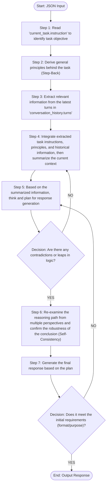

```mermaid
graph TD
    A(["Start: JSON Input"]) --> B["Step 1: Read 'current_task.instruction' to identify task objective"];
    B --> C["Step 2: Derive general principles behind the task (Step-Back)"];
    C --> D["Step 3: Extract relevant information from the latest turns in 'conversation_history.turns'"];
    D --> E["Step 4: Integrate extracted task instructions, principles, and historical information, then summarize the current context"];
    E --> F["Step 5: Based on the summarized information, think and plan for response generation"];
    F --> G{"Decision: Are there any contradictions or leaps in logic?"};
    G -- NO --> E;
    G -- YES --> H["Step 6: Re-examine the reasoning path from multiple perspectives and confirm the robustness of the conclusion (Self-Consistency)"];
    H --> I["Step 7: Generate the final response based on the plan"];
    I --> J{"Decision: Does it meet the initial requirements (format/purpose)?"};
    J -- NO --> F;
    J -- YES --> K(["End: Output Response"]);
```
