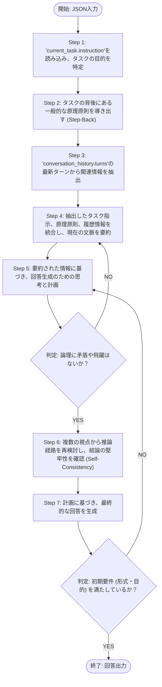

```mermaid
graph TD
    A(["開始: JSON入力"]) --> B["Step 1: 'current_task.instruction'を読み込み、タスクの目的を特定"];
    B --> C["Step 2: タスクの背後にある一般的な原理原則を導き出す (Step-Back)"];
    C --> D["Step 3: 'conversation_history.turns'の最新ターンから関連情報を抽出"];
    D --> E["Step 4: 抽出したタスク指示、原理原則、履歴情報を統合し、現在の文脈を要約"];
    E --> F["Step 5: 要約された情報に基づき、回答生成のための思考と計画"];
    F --> G{"判定: 論理に矛盾や飛躍はないか？"};
    G -- NO --> E;
    G -- YES --> H["Step 6: 複数の視点から推論経路を再検討し、結論の堅牢性を確認 (Self-Consistency)"];
    H --> I["Step 7: 計画に基づき、最終的な回答を生成"];
    I --> J{"判定: 初期要件 (形式・目的) を満たしているか？"};
    J -- NO --> F;
    J -- YES --> K(["終了: 回答出力"]);
```